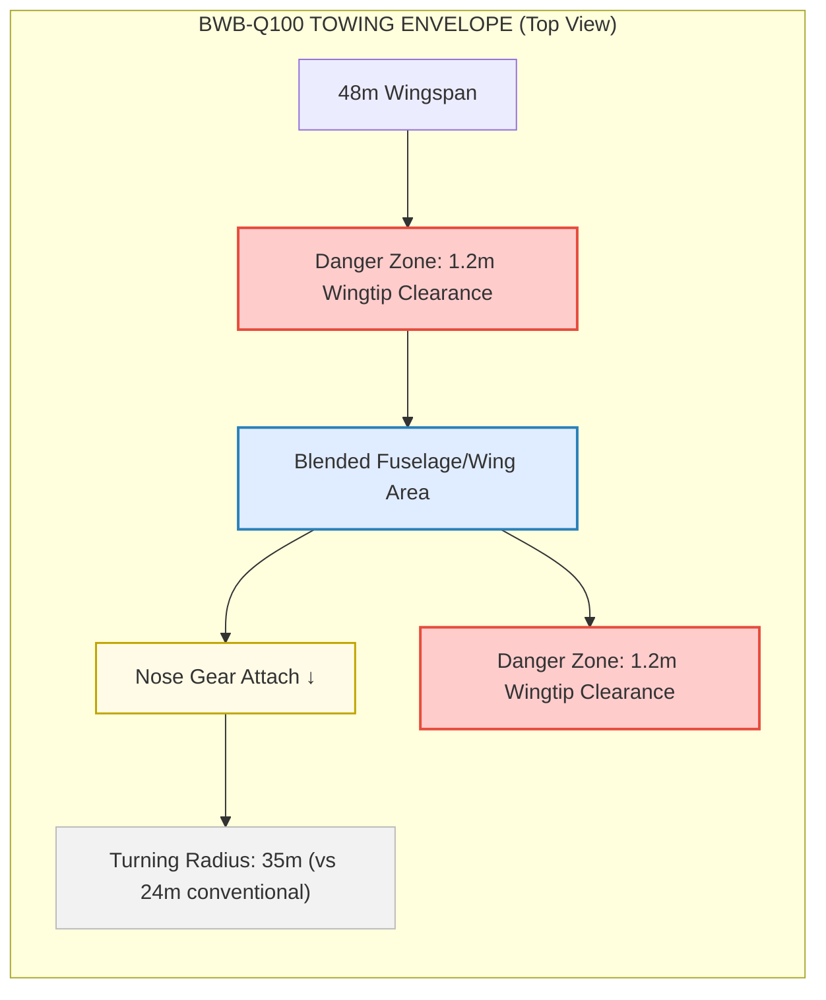
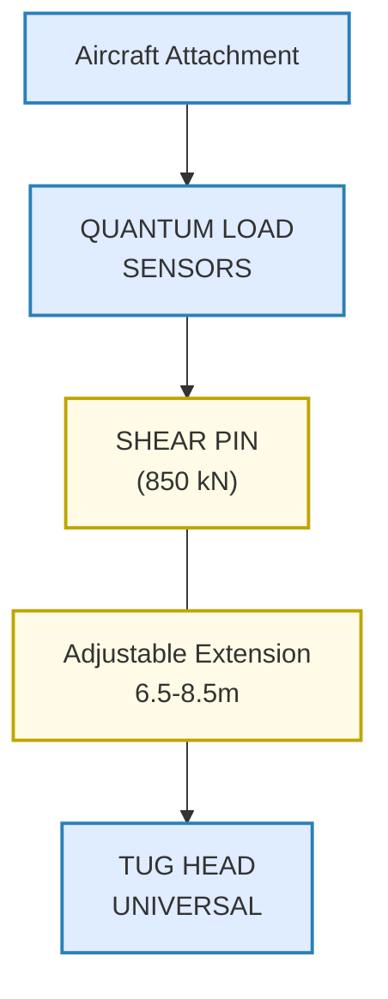
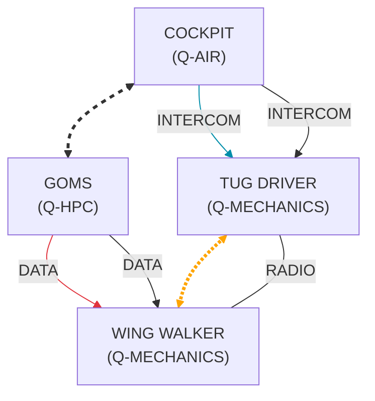
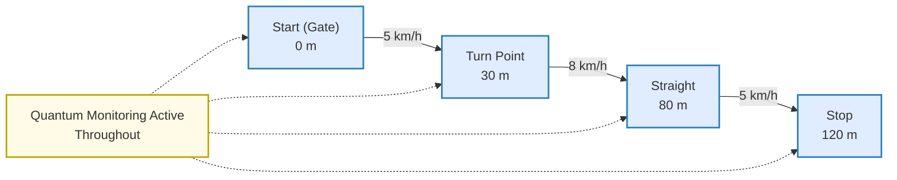
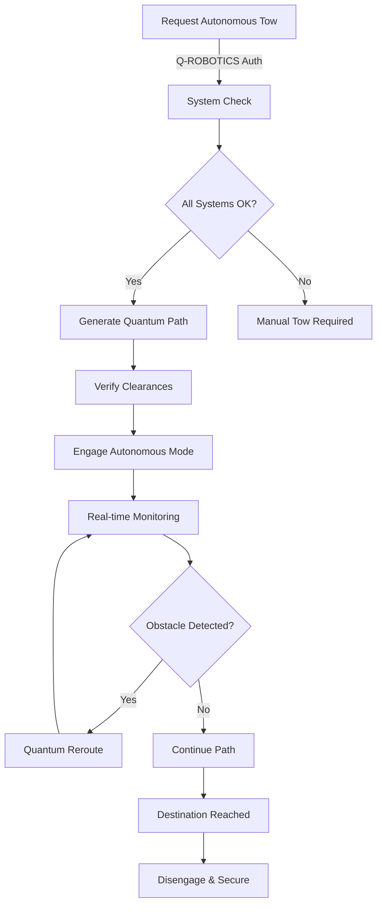
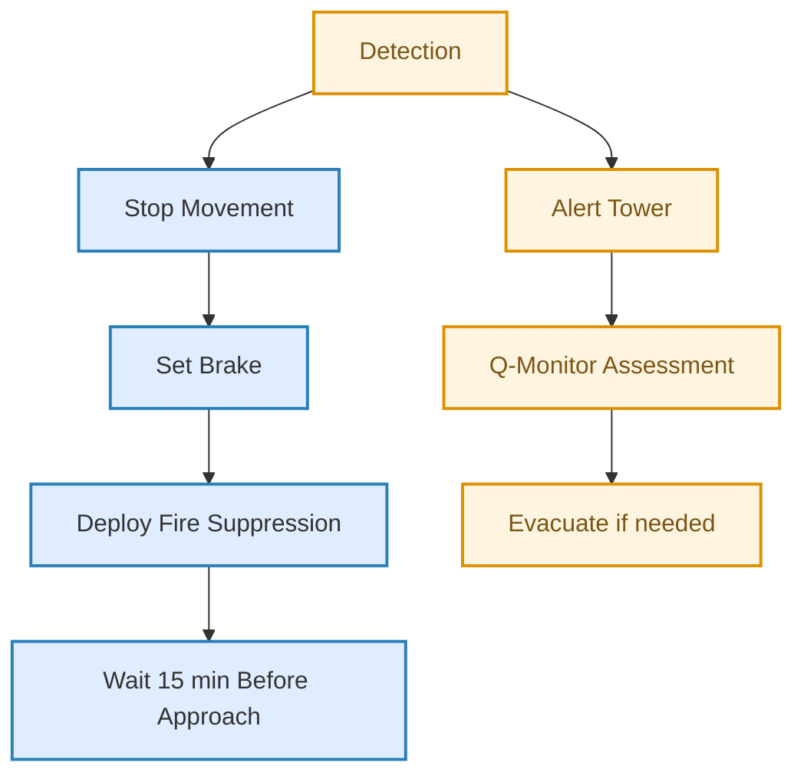

# 00-30-10-00 Towing Procedures - General

**ATA Chapter:** 00 - General  
**Section:** 30 - Ground Handling  
**Subsection:** 10 - Towing Procedures  
**Topic:** 00 - General  

**GQOIS ID:** GQOIS-Q-AIR-BWBQ100-00-30-10-00  
**Version:** 1.0.0  
**Status:** Initial Release  
**Date:** 2025-01-20  
**Author:** GAIA-QAO Technical Documentation Team

### 🏢 TEAM ASSIGNMENTS

| Lead Team | Support Teams | Integration |
|-----------|---------------|-------------|
| **Q-MECHANICS** | Q-ROBOTICS, Q-AIR | Primary responsibility for towing operations |
| **Q-ROBOTICS** | Q-HPC | Autonomous towing systems |
| **Q-SCIRES** | Q-DATAGOV | Quantum strain monitoring |

### 📊 RACI MATRIX - Towing Operations

| Activity | Q-MECHANICS | Q-ROBOTICS | Q-AIR | Q-SCIRES | Q-DATAGOV |
|----------|-------------|------------|-------|----------|-----------|
| Procedure Development | **R/A** | C | C | I | C |
| Towbar Design | **R** | C | C | C | I |
| Autonomous Systems | C | **R/A** | I | C | I |
| Strain Monitoring | C | I | I | **R/A** | C |
| Training & Certification | **R** | C | A | I | C |
| Incident Investigation | **A** | C | R | C | R |

---

## Table of Contents

1. [Introduction](#1-introduction)
2. [BWB-Specific Towing Challenges](#2-bwb-specific-towing-challenges)
3. [Towing Equipment Requirements](#3-towing-equipment-requirements)
4. [Pre-Towing Preparation](#4-pre-towing-preparation)
5. [Standard Towing Procedures](#5-standard-towing-procedures)
6. [Quantum Monitoring During Towing](#6-quantum-monitoring-during-towing)
7. [Autonomous Towing Features](#7-autonomous-towing-features)
8. [Emergency Procedures](#8-emergency-procedures)
9. [Post-Towing Actions](#9-post-towing-actions)
10. [References](#10-references)

---

## 1. Introduction

### 1.1 Purpose

This document establishes standardized procedures for towing the AMPEL360 BWB-Q100 aircraft, incorporating quantum strain monitoring and optional autonomous towing capabilities unique to this advanced platform.

### 1.2 Scope

Covers all towing operations:
- Pushback from gate
- Maintenance towing
- Hangar positioning
- Remote parking moves
- Emergency towing
- Autonomous towing modes

### 1.3 Critical Safety Notice

> ⚠️ **WARNING**: The BWB-Q100's wide span (48m) and low wingtip clearance (1.2m) create unique hazards. Only certified BWB towing personnel shall conduct these operations.

---

## 2. BWB-Specific Towing Challenges

### 2.1 Dimensional Constraints

```
BWB-Q100 TOWING ENVELOPE (Top View)
                                                    
    48m Wingspan                                    
←─────────────────────────────────────────────────→
┌─────────────────────────────────────────────────┐
│                                                 │
│  DANGER ►1.2m◄ WINGTIP CLEARANCE ►1.2m◄ DANGER │
│                                                 │
│         ┌─────────────────────┐                │
│         │    FUSELAGE/WING     │                │
│         │     BLEND AREA       │                │
│         └──────────┬──────────┘                │
│                    │                            │
│              ┌─────┴─────┐                     │
│              │ NOSE GEAR │                     │
│              │  ATTACH   │                     │
│              └───────────┘                     │
│                                                 │
│ Turning Radius: 35m (vs 24m conventional)      │
└─────────────────────────────────────────────────┘
```


### 2.2 Weight Distribution

**🔧 Q-MECHANICS Analysis:**

| Configuration | Nose Wheel Load | Main Gear Load | CG Range |
|---------------|-----------------|----------------|----------|
| Empty (OEW) | 3,800 kg | 38,700 kg | 25-27% MAC |
| Loaded (MTOW) | 5,200 kg | 56,800 kg | 22-30% MAC |
| Critical Tow | 5,500 kg max | - | <22% MAC |

### 2.3 Structural Considerations

```yaml
towing_limits:
  max_tow_speed:
    normal: 25 km/h
    caution: 15 km/h
    emergency: 8 km/h
    
  towbar_force_limits:
    push: 80 kN
    pull: 100 kN
    lateral: 40 kN
    
  steering_angle:
    normal: ±65°
    towing: ±75°
    limit: ±78°
```

---

## 3. Towing Equipment Requirements

### 3.1 Towbar Specifications

**🔧 Q-MECHANICS Certified Equipment:**

```
BWB-Q100 TOWBAR DESIGN (TB-Q100-001)
                                           
    Aircraft Attachment                    
    ┌──────────────┐                      
    │ QUANTUM LOAD │                      
    │   SENSORS    │                      
    └──────┬───────┘                      
           │                               
    ╔══════╧══════╗  Adjustable           
    ║             ║  Extension            
    ║  SHEAR PIN  ║  6.5-8.5m            
    ║  (850 kN)   ║                      
    ╚══════╤══════╝                      
           │                               
    ┌──────┴───────┐                      
    │   TUG HEAD   │                      
    │  UNIVERSAL   │                      
    └──────────────┘                      
```


### 3.2 Tug Requirements

| Parameter | Minimum Requirement | Recommended |
|-----------|-------------------|-------------|
| Drawbar Pull | 280 kN | 350 kN |
| Weight | 35,000 kg | 45,000 kg |
| Autonomous Capable | Optional | **Q-ROBOTICS Certified** |
| Quantum Interface | Required | Q-Link v3.0 |

### 3.3 Support Equipment

**🤖 Q-ROBOTICS Integration:**
- Wing walker positioning system (autonomous)
- Obstacle detection array (360° LiDAR)
- Proximity alert beacons (quantum-linked)
- Emergency stop transmitters (3x redundant)

---

## 4. Pre-Towing Preparation

### 4.1 Aircraft Preparation Checklist

**Cockpit Actions (Q-AIR Procedures):**
- [ ] Parking brake - **SET**
- [ ] Steering - **DISCONNECT**
- [ ] Q-GOMS - **TOWING MODE**
- [ ] Anti-collision - **ON**
- [ ] Intercom - **ESTABLISH**

**External Checks (Q-MECHANICS):**
- [ ] Chocks - **POSITIONED**
- [ ] Gear pins - **INSTALLED** (if required)
- [ ] Bypass pin - **INSTALLED**
- [ ] Ground lock - **VERIFIED**
- [ ] Clearance - **4.5m MINIMUM**

### 4.2 Quantum System Activation

**🔬 Q-SCIRES Monitoring Setup:**

```python
class TowingMonitorSetup:
    """Initialize quantum monitoring for towing"""
    
    def activate_towing_mode(self):
        sensors = {
            'nose_gear_strain': self.enable_strain_gauges(4),
            'structural_health': self.activate_shm_network(256),
            'proximity_sensors': self.configure_proximity(32),
            'towbar_load': self.calibrate_load_cells(8)
        }
        
        # Set monitoring thresholds
        self.qms.set_alerts({
            'towbar_force': 85,  # % of limit
            'steering_angle': 70,  # degrees
            'lateral_load': 35,  # kN
            'speed': 20  # km/h
        })
        
        return self.verify_quantum_sync(sensors)
```

### 4.3 Communication Setup

```
TOWING COMMUNICATION MATRIX
                                     
┌─────────────┐     QUANTUM      ┌─────────────┐
│   COCKPIT   │◄────────────────►│    GOMS     │
│   (Q-AIR)   │                  │  (Q-HPC)    │
└─────┬───────┘                  └──────┬──────┘
      │                                 │       
      │ INTERCOM                       │ DATA  
      │                                 │       
┌─────▼───────┐                  ┌──────▼──────┐
│  TUG DRIVER │◄────────────────►│ WING WALKER │
│(Q-MECHANICS)│      RADIO       │(Q-MECHANICS)│
└─────────────┘                  └─────────────┘
```



---

## 5. Standard Towing Procedures

### 5.1 Towbar Connection

**Step-by-Step Procedure:**

1. **POSITION** tug aligned with nose gear (±3°)
2. **EXTEND** towbar to aircraft
3. **VERIFY** bypass pin installed
4. **CONNECT** towbar to nose gear
   - Listen for positive lock
   - Visual inspection of pins
5. **ACTIVATE** quantum load monitoring
6. **TEST** connection with slight tension
7. **VERIFY** shear pin integrity via Q-sensor

### 5.2 Pushback Sequence

```
STANDARD PUSHBACK PROFILE
                                          
Start (Gate)     Turn Point    Straight    Stop
    │               │             │         │
    ▼               ▼             ▼         ▼
────●───────────────●─────────────●─────────●────
    │                                           
    │◄── 5 km/h ──►│◄─ 8 km/h ─►│◄─ 5 km/h ►│
    │               │             │            
    0m             30m           80m        120m
                                              
Quantum Monitoring Active Throughout          
```

### 5.3 Turning Procedures

**⚙️ Q-MECHANICS Critical Limits:**

| Turn Radius | Max Speed | Steering Angle | Wing Walker |
|-------------|-----------|----------------|-------------|
| >50m | 15 km/h | ±45° | 1 required |
| 35-50m | 10 km/h | ±65° | 2 required |
| <35m | 5 km/h | ±75° | 2 + spotter |

### 5.4 Long Tow Procedures

For tows exceeding 500m:
1. **CONDUCT** intermediate stops every 300m
2. **CHECK** brake temperatures (<150°C)
3. **VERIFY** tire condition
4. **MONITOR** quantum strain accumulation
5. **ROTATE** wing walkers if >1000m

---

## 6. Quantum Monitoring During Towing

### 6.1 Real-Time Display

**🔬 Q-SCIRES / 🖥️ Q-HPC Integrated System:**

```
┌─────────────────────────────────────────────┐
│      QUANTUM TOWING MONITOR v3.0            │
├─────────────────────────────────────────────┤
│ Towbar Force: ████████░░ 78% (62.4 kN)     │
│ Steering Angle: 32.5° L                     │
│ Speed: 8.2 km/h                             │
│ Lateral Load: ██░░░░░░░░ 18% (7.2 kN)      │
├─────────────────────────────────────────────┤
│ Structural Health:                          │
│ • Nose Gear: NOMINAL (Score: 98/100)       │
│ • Forward Fuselage: NOMINAL                 │
│ • Wing Root: MONITORING (Minor flex)        │
├─────────────────────────────────────────────┤
│ Proximity Alerts:                           │
│ ⚠️ Object 3.8m - Right Wingtip             │
│ ✓ All other sectors clear >5m              │
├─────────────────────────────────────────────┤
│ Quantum Confidence: 99.7%                   │
│ Predictive Alert: None                      │
└─────────────────────────────────────────────┘
```
```
flowchart TD
  subgraph QTOW [QUANTUM TOWING MONITOR v3.0]
    D1["Towbar Force: ████████░░ 78% (62.4 kN)"]
    D2["Steering Angle: 32.5° L"]
    D3["Speed: 8.2 km/h"]
    D4["Lateral Load: ██░░░░░░░░ 18% (7.2 kN)"]

    section1[ ]
    D1 --> section1
    D2 --> section1
    D3 --> section1
    D4 --> section1

    section2["Structural Health:"]
    S1["• Nose Gear: NOMINAL (Score: 98/100)"]
    S2["• Forward Fuselage: NOMINAL"]
    S3["• Wing Root: MONITORING (Minor flex)"]

    section1 --> section2
    section2 --> S1
    section2 --> S2
    section2 --> S3

    section3["Proximity Alerts:"]
    A1["⚠️ Object 3.8m - Right Wingtip"]
    A2["✓ All other sectors clear >5m"]

    section2 --> section3
    section3 --> A1
    section3 --> A2

    section4["Quantum Confidence: 99.7%"]
    section5["Predictive Alert: None"]

    section3 --> section4
    section4 --> section5
  end

  %% Styling for clear "panel look"
  classDef label fill:#eee,stroke:none,font-size:16px;
  classDef metric fill:#e0ecff,stroke:#2980b9,stroke-width:1.5px;
  classDef status fill:#eaffea,stroke:#04c900;
  classDef alert fill:#fff8d2,stroke:#e6b800;
  class D1,D2,D3,D4 metric
  class S1,S2 status
  class S3 alert
  class A1 alert
  class A2 status
  class section2,section3,label
```
### 6.2 Quantum Strain Analysis

```python
# Q-SCIRES Quantum Strain Algorithm
def analyze_towing_strain():
    """Real-time quantum-enhanced strain analysis"""
    
    # Collect quantum sensor data
    strain_field = qsensor.get_strain_tensor()
    
    # Quantum superposition for multiple load paths
    load_paths = qpu.calculate_superposition(
        strain_field,
        aircraft_structure_model
    )
    
    # Collapse to most probable state
    critical_path = qpu.measure(load_paths)
    
    # Predict failure probability
    failure_risk = qml.predict_failure(
        critical_path,
        material_properties,
        fatigue_history
    )
    
    return {
        'current_safety_margin': 1 - failure_risk,
        'critical_location': critical_path.max_stress_point,
        'recommended_action': get_mitigation(failure_risk)
    }
```

---

## 7. Autonomous Towing Features

### 7.1 Q-ROBOTICS Autonomous Mode

**System Architecture:**

```yaml
autonomous_towing_system:
  level_1_remote:
    description: "Remote controlled tug"
    operator_location: "Remote station"
    q_robotics_cert: "AUT-1"
    
  level_2_supervised:
    description: "Autonomous with supervisor"
    operator_location: "In tug or remote"
    q_robotics_cert: "AUT-2"
    
  level_3_autonomous:
    description: "Fully autonomous"
    operator_location: "Monitoring only"
    q_robotics_cert: "AUT-3"
    requirements:
      - Quantum path planning
      - 360° obstacle detection
      - V2X communication
      - Emergency override
```

### 7.2 Autonomous Towing Sequence



### 7.3 Safety Overrides

**🤖 Q-ROBOTICS Safety Matrix:**

| Override Trigger | Action | Response Time |
|-----------------|--------|---------------|
| Obstacle <3m | Full Stop | <200ms |
| System Fault | Safe Mode | <500ms |
| Manual Override | Transfer Control | Immediate |
| Quantum Desync | Emergency Stop | <100ms |

---

## 8. Emergency Procedures

### 8.1 Towbar Failure

**IMMEDIATE ACTIONS:**
1. **STOP** - All movement
2. **SET** - Parking brake
3. **ANNOUNCE** - "TOWBAR FAILURE"
4. **SECURE** - Area (10m radius)
5. **ASSESS** - Damage via quantum sensors

### 8.2 Brake Fire During Tow

```
BRAKE FIRE RESPONSE MATRIX
                                        
Detection ──► Stop Movement             
    │            │                     
    ▼            ▼                     
Alert Tower   Set Brake                
    │            │                     
    ▼            ▼                     
Q-Monitor ──► Deploy Fire              
Assessment    Suppression              
    │            │                     
    ▼            ▼                     
Evacuate  ──► Wait 15 min              
If needed     Before approach 
```



### 8.3 Steering Malfunction

| Symptom | Likely Cause | Action |
|---------|--------------|--------|
| Won't center | Bypass pin | Check/reinstall |
| Excessive play | Worn components | Stop, inspect |
| Locked steering | Hydraulic failure | Emergency tow |
| Shimmy | Torque link | Reduce speed |

### 8.4 Quantum System Failures

**📊 Q-DATAGOV Compliance Note:**
All quantum system failures must be logged for investigation.

```python
def handle_quantum_failure(failure_type):
    """Q-SCIRES/Q-HPC joint procedure"""
    
    if failure_type == 'SENSOR_DESYNC':
        # Revert to classical monitoring
        activate_backup_sensors()
        reduce_towing_speed(50)  # 50% reduction
        
    elif failure_type == 'QPU_OFFLINE':
        # Continue with last known good state
        freeze_optimization_parameters()
        alert_maintenance('QPU_SERVICE_REQUIRED')
        
    elif failure_type == 'COMPLETE_FAILURE':
        # Emergency protocols
        emergency_stop()
        revert_to_manual_only()
        
    log_incident(q_datagov_format)
```

---

## 9. Post-Towing Actions

### 9.1 Disconnection Procedure

1. **STOP** at designated position
2. **SET** parking brake
3. **RELEASE** towbar tension
4. **DISCONNECT** towbar from aircraft
5. **REMOVE** bypass pin
6. **RECONNECT** steering (verify travel)
7. **REMOVE** gear pins (if installed)
8. **CLEAR** towing equipment

### 9.2 System Restoration

**Q-HPC System Reset:**
```
GOMS > Maintenance > Exit Towing Mode
├── Save towing telemetry
├── Generate strain report
├── Reset to normal monitoring
└── Sync with aircraft systems
```

### 9.3 Documentation Requirements

**📊 Q-DATAGOV Compliance:**

| Record | Format | Retention | System |
|--------|--------|-----------|--------|
| Tow Log | Digital | 24 months | GOMS |
| Strain Data | Quantum | 5 years | Q-Store |
| Video | H.265 | 90 days | Local |
| Incidents | XML | Permanent | Q-GOV |

---

## 10. References

### 10.1 Team-Specific Documentation
- **Q-MECHANICS**: BWB-Q100 Towing Equipment Manual (TEM-Q100)
- **Q-ROBOTICS**: Autonomous Towing System Guide (ATS-001)
- **Q-SCIRES**: Quantum Sensor Calibration (QSC-TOW-100)
- **Q-HPC**: GOMS Operating Manual (GOM-3.0)
- **Q-DATAGOV**: Towing Data Standards (TDS-2025)

### 10.2 Related Procedures
- [00-30-00-00 Ground Handling Overview](../00-30-00-00-Overview.md)
- [09-10-10-01 Pushback Procedure](../../../ATA-09-Towing/09-10-10-01-PushbackProcedure.md)
- [32-50-10-01 Steering Actuation](../../../ATA-32-LandingGear/32-50-10-01-SteeringActuation.md)

### 10.3 Regulatory Standards
- EASA CS-25.509 - Towing loads
- SAE AIR1362 - Aircraft towing training
- ISO 20683-1 - Ground support equipment
- GAIA-QAO-STD-051 - Quantum monitoring standards

### 10.4 Training Requirements
- BWB-TOW-001: Basic BWB Towing (Q-MECHANICS)
- BWB-TOW-002: Quantum Monitoring (Q-SCIRES)
- BWB-TOW-003: Autonomous Systems (Q-ROBOTICS)
- BWB-TOW-004: Emergency Response (Q-AIR)

---

**Document Control:**
- Review Cycle: 6 months
- Primary Owner: Q-MECHANICS
- Technical Review: Q-ROBOTICS, Q-SCIRES
- Safety Review: Q-AIR
- Compliance: Q-DATAGOV

**Revision History:**
| Version | Date | Changes | Team |
|---------|------|---------|------|
| 1.0.0 | 2025-01-20 | Initial Release | Q-MECHANICS |

---

*End of Document 00-30-10-00*
```

