# 00-30-10-01 Towbar Attachment Procedures

**ATA Chapter:** 00 - General  
**Section:** 30 - Ground Handling  
**Subsection:** 10 - Towing Procedures  
**Topic:** 01 - Towbar Attachment  

**GQOIS ID:** GQOIS-Q-AIR-BWBQ100-00-30-10-01  
**Version:** 1.0.0  
**Status:** Initial Release  
**Date:** 2025-01-20  
**Author:** GAIA-QAO Technical Documentation Team

### 🏢 TEAM ASSIGNMENTS

| Lead Team | Support Teams | Integration |
|-----------|---------------|-------------|
| **Q-MECHANICS** | Q-SCIRES | Primary responsibility for attachment procedures |
| **Q-SCIRES** | Q-HPC | Quantum sensor validation |
| **Q-ROBOTICS** | Q-MECHANICS | Automated attachment systems |

### 📊 RACI MATRIX - Towbar Attachment

| Activity | Q-MECHANICS | Q-SCIRES | Q-ROBOTICS | Q-AIR | Q-DATAGOV |
|----------|-------------|----------|------------|-------|-----------|
| Attachment Procedure | **R/A** | C | C | I | I |
| Load Monitoring | C | **R/A** | I | I | C |
| Automated Systems | C | C | **R/A** | I | I |
| Safety Validation | **A** | R | C | C | R |
| Training Materials | **R** | C | C | A | I |

---

## Table of Contents

1. [Introduction](#1-introduction)
2. [Equipment Requirements](#2-equipment-requirements)
3. [Pre-Attachment Inspection](#3-pre-attachment-inspection)
4. [Manual Attachment Procedure](#4-manual-attachment-procedure)
5. [Quantum Sensor Validation](#5-quantum-sensor-validation)
6. [Automated Attachment Option](#6-automated-attachment-option)
7. [Load Testing and Verification](#7-load-testing-and-verification)
8. [Abnormal Conditions](#8-abnormal-conditions)
9. [Detachment Procedures](#9-detachment-procedures)
10. [References](#10-references)

---

## 1. Introduction

### 1.1 Purpose

This document provides detailed procedures for attaching towing equipment to the AMPEL360 BWB-Q100 nose gear, incorporating quantum load monitoring and optional automated attachment systems.

### 1.2 Scope

Covers all towbar attachment operations:
- Manual attachment procedures
- Automated attachment (when equipped)
- Quantum sensor validation
- Load testing requirements
- Emergency detachment

### 1.3 Safety Critical Points

> ⚠️ **CRITICAL**: Improper towbar attachment can result in:
> - Structural damage to nose gear
> - Towbar separation during movement
> - Personnel injury from sudden release
> - Quantum sensor damage

---

## 2. Equipment Requirements

### 2.1 BWB-Q100 Specific Towbar

**🔧 Q-MECHANICS Specification TB-Q100-001:**

```mermaid
flowchart TD
    QCELL["QUANTUM LOAD CELL ARRAY"]
    CELL1["Cell 1"]
    CELL2["Cell 2"]
    CELL3["Cell 3"]
    CELL4["Cell 4"]

    QCELL --> CELL1
    QCELL --> CELL2
    QCELL --> CELL3
    QCELL --> CELL4

    ATTACH["ATTACHMENT MECHANISM"]
    QCELL --> ATTACH

    LATCH["LOCKING PIN (x2)\nØ32mm × 180mm"]
    ATTACH --> LATCH

    SHEARHOUSING["SHEAR PIN HOUSING"]
    QCELL --> SHEARHOUSING

    SHEARPIN["SHEAR PIN 850kN\n(REPLACEABLE)"]
    SHEARHOUSING --> SHEARPIN

    %% Visual styling for clarity
    classDef module fill:#e0ecff,stroke:#2980b9,stroke-width:2px
    class QCELL,ATTACH,SHEARHOUSING module

```



### 2.2 Required Tools

**Standard Tool Set (Q-MECHANICS STS-TOW-001):**

| Tool | Specification | Quantity |
|------|---------------|----------|
| Torque Wrench | 50-500 Nm | 1 |
| Pin Insertion Tool | BWB-PIT-001 | 1 |
| Quantum Calibrator | Q-CAL-3000 | 1 |
| Safety Lock Set | SLS-Q100 | 1 set |
| Inspection Mirror | Telescopic | 1 |
| LED Work Light | Intrinsically safe | 2 |

### 2.3 Personnel Requirements

**Minimum Crew:**
- 1 × Certified Towbar Operator (Q-MECHANICS)
- 1 × Safety Observer
- 1 × Quantum System Monitor (Q-SCIRES)

---

## 3. Pre-Attachment Inspection

### 3.1 Towbar Inspection

**🔧 Q-MECHANICS Inspection Checklist:**

```yaml
towbar_inspection:
  visual_checks:
    - attachment_head:
        condition: "No cracks, deformation"
        paint: "No flaking indicating flex"
        pins: "Smooth, no scoring"
    
    - shear_pin:
        condition: "No necking or deformation"
        color_stripe: "Intact (indicates no overload)"
        installation: "Fully seated"
    
    - quantum_sensors:
        physical: "No damage to load cells"
        connectors: "Clean, no corrosion"
        calibration_seal: "Unbroken"
```

### 3.2 Nose Gear Receptacle Inspection

```mermaid
flowchart TD
    subgraph ATTACHMENT_POINT["NOSE GEAR ATTACHMENT POINT (Looking Forward)"]
      LEFT["LEFT<br/>LUG"]:::lug
      RIGHT["RIGHT<br/>LUG"]:::lug
      PIN["PIN CHANNEL<br/>(Ø32.5mm)"]:::pin
      
      LEFT -.-> PIN
      RIGHT -.-> PIN
    end

    CHECKS["Check for:<br/>■ FOD in pin channels<br/>■ Lug wear (<0.5mm)<br/>■ Corrosion<br/>■ Proper lubrication"]:::chk

    ATTACHMENT_POINT --> CHECKS

    classDef lug fill:#e0ecff,stroke:#2980b9,stroke-width:2px
    classDef pin fill:#fffbe6,stroke:#bfa500,stroke-width:2px
    classDef chk fill:#eaffea,stroke:#388e3c,stroke-width:1.5px

    %% Optionally use dotted arrows for visual separation, or adjust styling as needed.                   
```



### 3.3 Quantum System Pre-Check

**🔬 Q-SCIRES Validation Protocol:**

```python
def pre_attachment_quantum_check():
    """Verify quantum systems before attachment"""
    
    # Initialize quantum interface
    qsi = QuantumSensorInterface()
    
    # Check all load cells
    load_cell_status = {}
    for cell_id in range(1, 5):
        status = qsi.verify_load_cell(cell_id)
        load_cell_status[f'cell_{cell_id}'] = {
            'zero_offset': status.zero_reading,
            'noise_floor': status.noise_level,
            'quantum_sync': status.q_coherence,
            'pass': all([
                abs(status.zero_reading) < 0.1,  # kN
                status.noise_level < 0.05,        # kN RMS
                status.q_coherence > 0.95         # 95% coherence
            ])
        }
    
    # Verify strain gauge network
    strain_network = qsi.check_nose_gear_sensors()
    
    return {
        'load_cells': load_cell_status,
        'strain_gauges': strain_network,
        'system_ready': all(cell['pass'] for cell in load_cell_status.values())
    }
```

---

## 4. Manual Attachment Procedure

### 4.1 Positioning Phase

**Step-by-Step Procedure:**

```
1. POSITION tug and towbar
   └── Alignment: ±3° of aircraft centerline
   └── Distance: 2.0-2.5m from nose gear
   └── Height: Verify towbar head level with lugs

2. ENGAGE parking brake on tug
   └── Verify: Tug stationary
   └── Set: Wheel chocks if required

3. EXTEND towbar toward aircraft
   └── Rate: <0.5 m/s
   └── Observer: Maintain visual contact
   └── Stop: 300mm from nose gear
```

### 4.2 Connection Phase

```
4. ALIGN towbar head with attachment lugs
   ├── Lateral: ±10mm tolerance
   ├── Vertical: ±5mm tolerance  
   └── Angular: ±2° tolerance

5. ADVANCE towbar final approach
   ├── Rate: <0.1 m/s (creep speed)
   ├── Guide: Hand signals from observer
   └── Contact: Gentle touch, no impact

6. INSERT locking pins
   ├── Clean: Wipe pins with approved cloth
   ├── Lubricate: Apply MS-234 grease (thin film)
   ├── Insert: LEFT pin first, then RIGHT
   └── Verify: Full insertion (flush ±2mm)

7. INSTALL safety locks
   ├── Type: Dual-redundant castle nut
   ├── Torque: 120 Nm ±5%
   └── Safety: Insert cotter pins
```

### 4.3 Connection Verification

**🔧 Q-MECHANICS Verification Matrix:**

| Check Point | Method | Acceptance Criteria |
|-------------|--------|-------------------|
| Pin engagement | Visual + feel | Pins fully seated |
| Lateral play | Manual wiggle | <2mm movement |
| Vertical play | Lift test | <1mm movement |
| Safety locks | Visual | Cotter pins secured |
| Q-sensors | Display | All green status |

---

## 5. Quantum Sensor Validation

### 5.1 Load Cell Calibration

**🔬 Q-SCIRES Calibration Sequence:**

```mermaid
flowchart TD
  subgraph QLCD["QUANTUM LOAD DISTRIBUTION DISPLAY"]
    ACELL1["Cell 1 (FL)<br/>████████░░<br/>12.3 kN<br/>Q-Sync: 98%"]
    ACELL2["Cell 2 (FR)<br/>████████░░<br/>11.8 kN<br/>Q-Sync: 97%"]
    BCELL3["Cell 3 (RL)<br/>████████░░<br/>12.1 kN<br/>Q-Sync: 99%"]
    BCELL4["Cell 4 (RR)<br/>████████░░<br/>12.5 kN<br/>Q-Sync: 96%"]
    STATUS["<b>Total Load:</b> 48.7 kN (NOMINAL)<br/>Balance: L/R = -0.3 kN ✓<br/>Quantum Coherence: 97.5% ✓"]
    
    ACELL1 --> STATUS
    ACELL2 --> STATUS
    BCELL3 --> STATUS
    BCELL4 --> STATUS
  end

  classDef cell fill:#e0ecff,stroke:#2980b9,stroke-width:2px
  classDef summary fill:#eaffea,stroke:#388e3c,stroke-width:2px
  class ACELL1,ACELL2,BCELL3,BCELL4 cell
  class STATUS summary
```



### 5.2 Validation Test Sequence

```python
class TowbarLoadValidation:
    """Q-SCIRES quantum load validation"""
    
    def perform_validation_sequence(self):
        results = {
            'static_test': self.static_load_test(),
            'dynamic_test': self.dynamic_response_test(),
            'quantum_verification': self.quantum_coherence_test(),
            'predictive_check': self.failure_prediction_test()
        }
        
        return self.generate_validation_report(results)
    
    def static_load_test(self):
        """Apply known load and verify reading"""
        test_loads = [0, 10, 20, 30, 40]  # kN
        readings = []
        
        for load in test_loads:
            self.apply_calibration_load(load)
            time.sleep(2)  # Stabilization
            readings.append({
                'applied': load,
                'measured': self.read_quantum_load(),
                'error': self.calculate_error()
            })
        
        return {
            'passed': all(r['error'] < 0.5 for r in readings),
            'data': readings
        }
```

### 5.3 Real-Time Monitoring Setup

**🖥️ Q-HPC Integration:**

```yaml
monitoring_configuration:
  sampling_rate: 1000 Hz
  quantum_updates: 100 Hz
  
  alarm_thresholds:
    total_load:
      warning: 80 kN
      critical: 95 kN
      emergency: 100 kN
    
    imbalance:
      warning: 5 kN
      critical: 8 kN
    
    rate_of_change:
      warning: 50 kN/s
      critical: 100 kN/s
  
  data_logging:
    local_buffer: 1 GB
    cloud_sync: 10 second intervals
    retention: 90 days
```

---

## 6. Automated Attachment Option

### 6.1 Q-ROBOTICS Automated System

**🤖 Automated Towbar Attachment Sequence:**


### 6.2 Vision System Parameters

```python
# Q-ROBOTICS Vision Configuration
vision_config = {
    'cameras': {
        'stereo_pair': {
            'resolution': '4096x2160',
            'fps': 60,
            'baseline': 200  # mm
        },
        'lidar': {
            'points_per_second': 1_000_000,
            'accuracy': 2  # mm
        }
    },
    'nose_gear_detection': {
        'ai_model': 'BWB-Q100-NG-DET-v3.2',
        'confidence_threshold': 0.98,
        'feature_points': ['left_lug', 'right_lug', 'pin_holes']
    },
    'approach_control': {
        'max_speed': 0.05,  # m/s
        'position_tolerance': 1,  # mm
        'force_limit': 500  # N
    }
}
```

### 6.3 Automated Safety Features

**Safety Matrix:**

| Condition | Detection Method | Response |
|-----------|-----------------|----------|
| Obstruction | Vision + Proximity | Immediate stop |
| Misalignment | AI Pattern Match | Recalculate approach |
| Excess Force | Quantum Load Cell | Back off 100mm |
| Personnel Detected | Thermal Camera | Full system halt |
| Manual Override | Big Red Button | Instant control transfer |

---

## 7. Load Testing and Verification

### 7.1 Static Load Test

**🔧 Q-MECHANICS Test Procedure:**

```
STATIC LOAD TEST SEQUENCE
                                            
1. ZERO all load cells                     
   └── Record baseline quantum state       
                                            
2. APPLY tension load                       
   ├── Method: Tug brake + slight pull     
   ├── Target: 30 kN ±2 kN                 
   └── Hold: 30 seconds                    
                                            
3. RECORD load distribution                 
   ├── Each cell reading                   
   ├── Total load                          
   └── Quantum coherence                   
                                            
4. APPLY compression load                   
   ├── Method: Tug push                    
   ├── Target: 25 kN ±2 kN                 
   └── Hold: 30 seconds                    
                                            
5. VERIFY no permanent deformation          
   └── Re-zero and check offset <0.1 kN    
```

### 7.2 Dynamic Response Test


### 7.3 Acceptance Criteria

**🔬 Q-SCIRES Validation Requirements:**

| Parameter | Requirement | Measured | Pass/Fail |
|-----------|-------------|----------|-----------|
| Load Accuracy | ±0.5 kN | _______ | _____ |
| Balance | <2 kN L/R | _______ | _____ |
| Response Time | <50 ms | _______ | _____ |
| Quantum Coherence | >95% | _______ | _____ |
| Noise Floor | <0.1 kN RMS | _______ | _____ |

---

## 8. Abnormal Conditions

### 8.1 Pin Won't Insert

**Troubleshooting Matrix:**


### 8.2 Quantum Sensor Failures

**Failure Response Procedures:**

```python
def handle_sensor_failure(failure_data):
    """Q-SCIRES sensor failure protocol"""
    
    severity = assess_failure_severity(failure_data)
    
    if severity == 'CRITICAL':
        # Multiple sensors or complete failure
        actions = [
            'STOP all towing operations',
            'DISCONNECT towbar',
            'TAG aircraft DO NOT TOW',
            'Call Q-SCIRES support'
        ]
        
    elif severity == 'DEGRADED':
        # Single sensor failure
        actions = [
            'Continue with restrictions',
            'Maximum tow speed 10 km/h',
            'No turns >30°',
            'Continuous manual monitoring'
        ]
        
    elif severity == 'MINOR':
        # Reduced accuracy/coherence
        actions = [
            'Continue normal operations',
            'Schedule maintenance',
            'Increase monitoring frequency'
        ]
    
    log_failure(failure_data, actions)
    return actions
```

### 8.3 Emergency Detachment

**⚠️ EMERGENCY RELEASE PROCEDURE:**

```
IF IMMEDIATE DETACHMENT REQUIRED:
                                            
1. STOP all movement immediately           
2. RELEASE towbar tension (if possible)    
3. PULL emergency release handle           
   Location: Left side of towbar head      
   Force required: 150-200 N               
4. VERIFY pins retracted                   
5. BACK tug away slowly (< 1 m/s)         
6. DOCUMENT reason for emergency release   
                                            
⚠️ Emergency release may damage pins       
   Inspection required before reuse        
```

---

## 9. Detachment Procedures

### 9.1 Normal Detachment

```
STANDARD DETACHMENT SEQUENCE
                                            
1. STOP at designated position             
2. SET tug parking brake                   
3. RELIEVE towbar tension                  
   └── Slight reverse to neutral load     
                                            
4. REMOVE safety locks                     
   ├── Extract cotter pins                
   └── Unscrew castle nuts                
                                            
5. RETRACT locking pins                    
   ├── RIGHT pin first                    
   └── Then LEFT pin                      
                                            
6. VERIFY quantum load = 0 kN              
                                            
7. REVERSE tug slowly                      
   ├── Rate: <0.5 m/s                     
   └── Distance: >2m clear                
                                            
8. INSPECT attachment points               
   └── Check for wear/damage              
```

### 9.2 Post-Detachment Checks

**🔧 Q-MECHANICS Inspection:**

| Component | Check | Action if Abnormal |
|-----------|-------|-------------------|
| Pin holes | Wear/elongation | Measure & document |
| Lugs | Cracks/deformation | NDT inspection |
| Towbar head | Damage/wear | Remove from service |
| Q-sensors | Calibration drift | Recalibrate |

### 9.3 Documentation

**📊 Q-DATAGOV Requirements:**

```yaml
detachment_record:
  timestamp: ISO-8601
  operator_id: Q-MECH certified number
  
  towbar_data:
    serial_number: TB-Q100-XXX
    total_cycles: auto-incremented
    
  quantum_telemetry:
    peak_load: kN
    total_impulse: kN·s
    max_imbalance: kN
    coherence_minimum: percentage
    
  anomalies: 
    - description
    - action_taken
    
  next_inspection: calculated_date
```

---

## 10. References

### 10.1 Primary Documents
- **Q-MECHANICS**: BWB-Q100 Towbar Design Specification (TDS-Q100)
- **Q-SCIRES**: Quantum Load Monitoring Manual (QLM-001)
- **Q-ROBOTICS**: Automated Ground Handling Systems (AGH-Q100)
- **Q-DATAGOV**: Ground Operations Data Standards (GODS-2025)

### 10.2 Related Procedures
- [00-30-10-00 Towing Procedures General](./00-30-10-00-General.md)
- [00-30-10-02 Towing Limits](./00-30-10-02-TowingLimits.md)
- [00-30-10-03 Towing Equipment](./00-30-10-03-JackingEquipment.md)

### 10.3 Training Requirements

| Course Code | Title | Duration | Team |
|-------------|-------|----------|------|
| BWB-ATT-001 | Basic Towbar Attachment | 4 hours | Q-MECHANICS |
| BWB-ATT-002 | Quantum Load Monitoring | 2 hours | Q-SCIRES |
| BWB-ATT-003 | Automated Systems | 8 hours | Q-ROBOTICS |
| BWB-ATT-004 | Emergency Procedures | 2 hours | Q-MECHANICS |

### 10.4 Tools & Equipment

- Towbar Model: TB-Q100-001 (Q-MECHANICS certified)
- Quantum Calibrator: Q-CAL-3000 (Q-SCIRES)
- Tool Kit: STS-TOW-001 (Standard set)
- PPE: As per GAIA-QAO safety standards

---

**Document Control:**
- Review Cycle: 12 months
- Primary Owner: Q-MECHANICS
- Technical Review: Q-SCIRES, Q-ROBOTICS
- Compliance: Q-DATAGOV
- Distribution: Ground Handling Teams, Training Department

**Safety Notice:**
> 🚨 This is a safety-critical procedure. Any deviation must be approved by Q-MECHANICS Chief Engineer.

**Revision History:**
| Version | Date | Changes | Author | Reviewer |
|---------|------|---------|--------|----------|
| 1.0.0 | 2025-01-20 | Initial Release | Q-MECHANICS | Q-SCIRES |

---

*End of Document 00-30-10-01*
```

