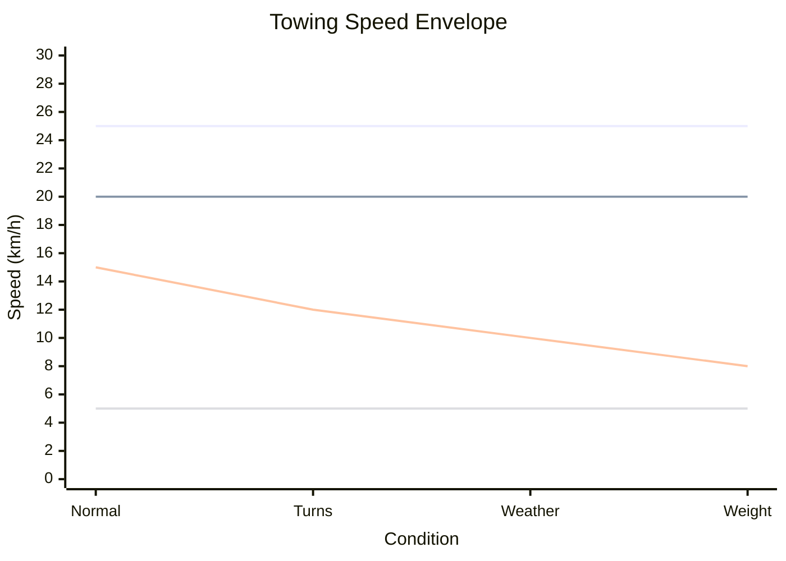
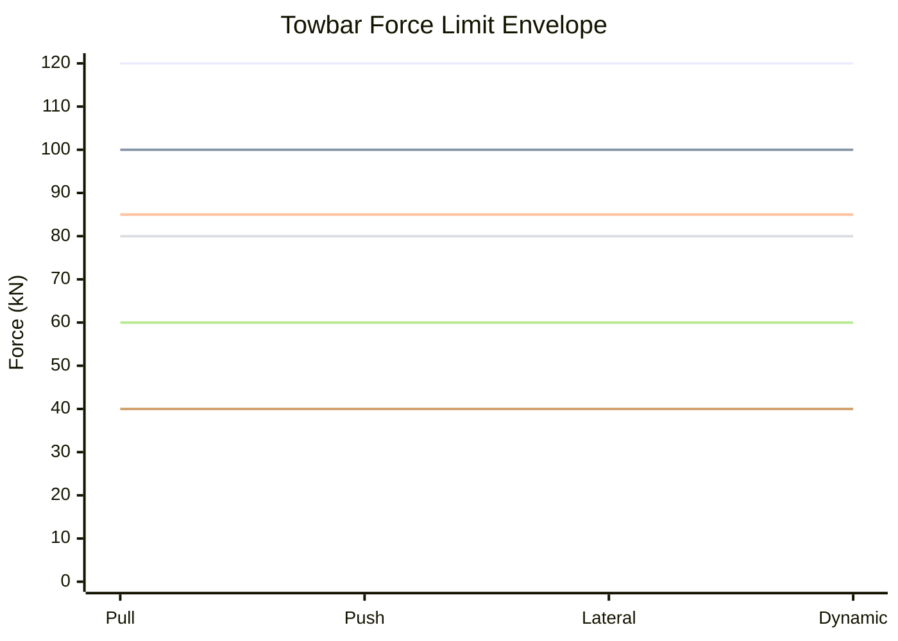
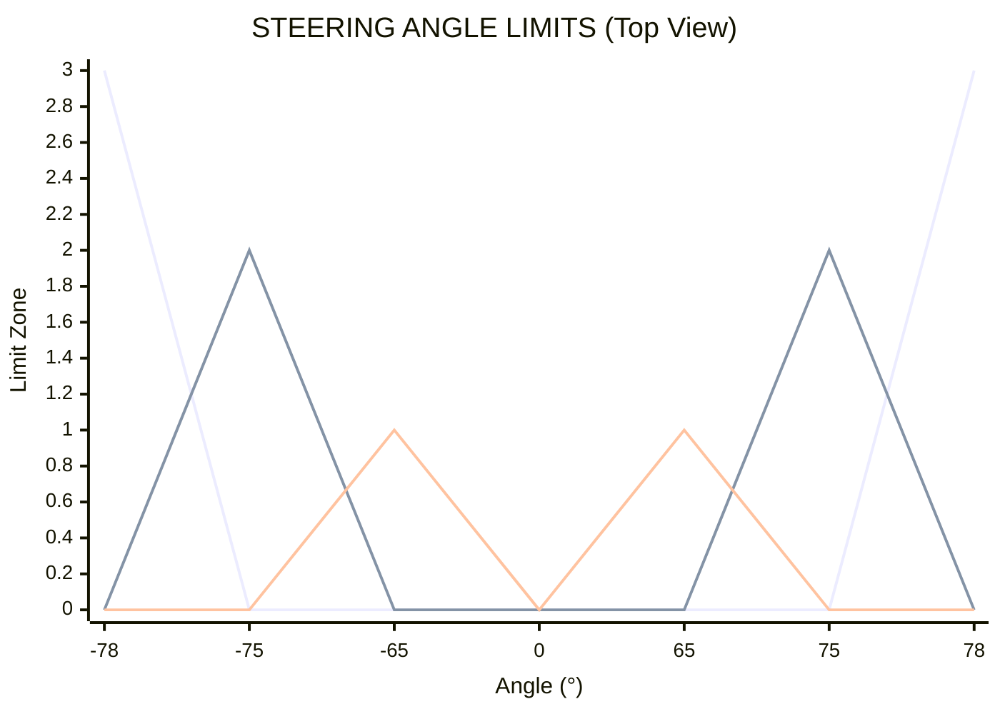
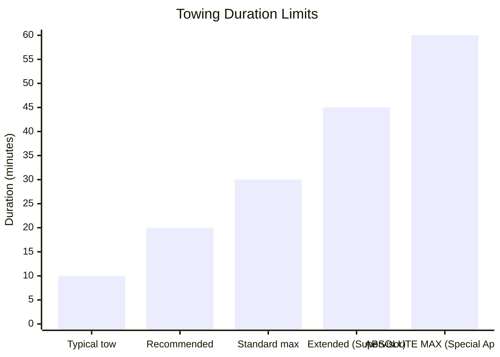
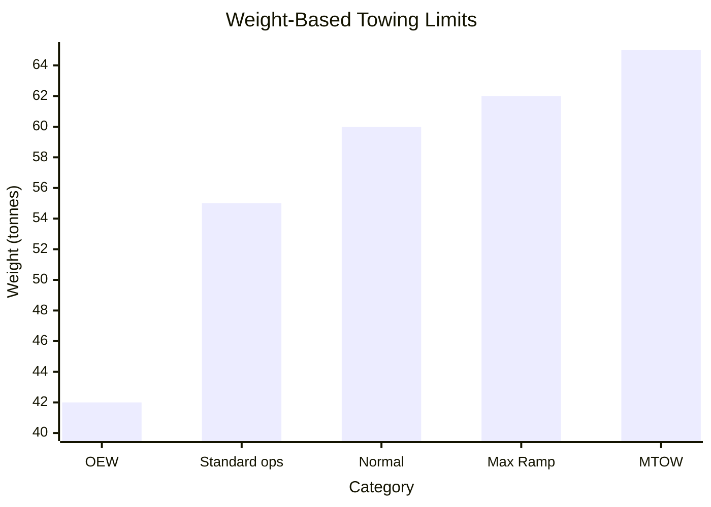
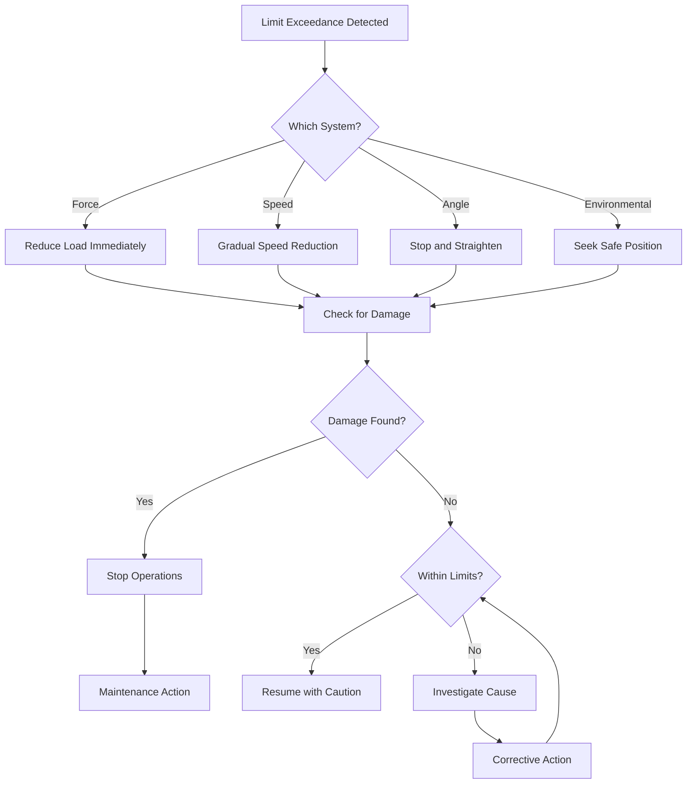

# 00-30-10-02 Towing Limits

**ATA Chapter:** 00 - General  
**Section:** 30 - Ground Handling  
**Subsection:** 10 - Towing Procedures  
**Topic:** 02 - Towing Limits  

**GQOIS ID:** GQOIS-Q-AIR-BWBQ100-00-30-10-02  
**Version:** 1.0.0  
**Status:** Initial Release  
**Date:** 2025-01-20  
**Author:** GAIA-QAO Technical Documentation Team

### 🏢 TEAM ASSIGNMENTS

| Lead Team | Support Teams | Integration |
|-----------|---------------|-------------|
| **Q-MECHANICS** | Q-AIR, Q-SCIRES | Primary responsibility for limit definition |
| **Q-SCIRES** | Q-HPC | Real-time monitoring and enforcement |
| **Q-AIR** | Q-MECHANICS | Structural limit validation |

### 📊 RACI MATRIX - Towing Limits

| Activity | Q-MECHANICS | Q-AIR | Q-SCIRES | Q-HPC | Q-DATAGOV |
|----------|-------------|-------|----------|-------|-----------|
| Limit Definition | **R** | **A** | C | I | I |
| Structural Analysis | C | **R/A** | I | C | I |
| Monitoring Systems | C | I | **R/A** | C | I |
| Exceedance Response | **A** | R | R | I | C |
| Documentation | **R** | C | C | I | A |

---

## Table of Contents

1. [Introduction](#1-introduction)
2. [Speed Limits](#2-speed-limits)
3. [Load Limits](#3-load-limits)
4. [Steering Angle Limits](#4-steering-angle-limits)
5. [Environmental Limits](#5-environmental-limits)
6. [Distance and Duration Limits](#6-distance-and-duration-limits)
7. [Weight and Balance Limits](#7-weight-and-balance-limits)
8. [Quantum Monitoring Thresholds](#8-quantum-monitoring-thresholds)
9. [Limit Exceedance Procedures](#9-limit-exceedance-procedures)
10. [References](#10-references)

---

## 1. Introduction

### 1.1 Purpose

This document defines all operational limits for towing the AMPEL360 BWB-Q100, incorporating the unique structural characteristics of the Blended Wing Body design and quantum monitoring capabilities.

### 1.2 Scope

Establishes limits for:
- Maximum towing speeds
- Structural load limits
- Steering angle restrictions
- Environmental conditions
- Operational durations
- Monitoring thresholds

### 1.3 Limit Philosophy

> 📐 **Q-AIR STRUCTURAL NOTE**: BWB aircraft have different load paths than conventional designs. These limits include additional safety margins to account for the distributed load structure.

---

## 2. Speed Limits

### 2.1 Standard Speed Limits

**🔧 Q-MECHANICS Operational Limits:**



### 2.2 Conditional Speed Matrix

| Condition | Max Speed | Notes |
|-----------|-----------|-------|
| Straight towing | 25 km/h | Normal conditions |
| Wide turns (R>50m) | 15 km/h | Reduced for stability |
| Medium turns (35-50m) | 10 km/h | BWB minimum radius |
| Tight turns (R=35m) | 5 km/h | Absolute minimum |
| Wet surface | 15 km/h | -40% reduction |
| Ice/snow | 8 km/h | Requires approval |
| Night operations | 20 km/h | Enhanced lighting required |
| Crosswind >15 kts | 15 km/h | Monitor lateral loads |

### 2.3 Distance-Based Speed Limits

```yaml
speed_vs_distance:
  0_to_100m:
    max_speed: 10 km/h
    reason: "Initial acceleration phase"
    
  100_to_500m:
    max_speed: 20 km/h
    reason: "Standard short tow"
    
  500_to_1000m:
    max_speed: 25 km/h
    reason: "Long tow - monitor temps"
    
  over_1000m:
    max_speed: 20 km/h
    reason: "Extended tow - heat buildup"
    mandatory_stops: "Every 500m"
```

---

## 3. Load Limits

### 3.1 Towbar Force Limits

**🔬 Q-SCIRES Monitored Limits:**



### 3.2 Detailed Load Limits

| Load Type | Limit | Warning | Alarm | Action |
|-----------|-------|---------|-------|--------|
| Static Pull | 100 kN | 80 kN | 85 kN | Reduce speed |
| Static Push | 80 kN | 65 kN | 70 kN | Check brakes |
| Lateral | 40 kN | 30 kN | 35 kN | Stop turn |
| Dynamic Peak | 120 kN | 95 kN | 100 kN | Emergency stop |
| Sustained (>5s) | 60 kN | 50 kN | 55 kN | Reduce load |

### 3.3 Nose Gear Load Limits

**✈️ Q-AIR Structural Limits:**

```python
class NoseGearLoadLimits:
    """BWB-specific nose gear limitations"""
    
    # Maximum static loads
    VERTICAL_MAX = 5500  # kg
    DRAG_LOAD_MAX = 11000  # kg (at attachment)
    SIDE_LOAD_MAX = 4400  # kg
    
    # Dynamic factors
    DYNAMIC_FACTOR = 1.5  # For impact loads
    FATIGUE_FACTOR = 0.7  # For repeated loads
    
    def check_combined_load(self, vertical, drag, side):
        """Check combined load case per Q-AIR analysis"""
        # Von Mises equivalent stress approach
        combined = sqrt(vertical**2 + drag**2 + side**2)
        limit = self.VERTICAL_MAX * 1.2  # Combined limit
        
        return {
            'combined_load': combined,
            'limit': limit,
            'margin': (limit - combined) / limit * 100,
            'acceptable': combined < limit
        }
```

---

## 4. Steering Angle Limits

### 4.1 Steering Envelope



### 4.2 Speed vs Steering Angle

**🔧 Q-MECHANICS Operating Envelope:**

| Steering Angle | Max Tow Speed | Turn Radius | Notes |
|----------------|---------------|-------------|-------|
| 0° - 30° | 25 km/h | >100m | Normal operation |
| 30° - 45° | 15 km/h | 70-100m | Caution zone |
| 45° - 65° | 10 km/h | 50-70m | Slow maneuvering |
| 65° - 75° | 5 km/h | 35-50m | Minimum radius |
| >75° | 0 km/h | Static only | Positioning only |

### 4.3 Quantum Monitoring of Steering

```yaml
steering_monitoring:
  sensors:
    type: "Quantum hall effect + optical encoder"
    accuracy: "±0.1°"
    update_rate: "1000 Hz"
    
  alerts:
    approaching_limit:
      threshold: 70°
      action: "Audio warning + speed reduction"
      
    at_limit:
      threshold: 75°
      action: "Auto speed limit to 3 km/h"
      
    exceeded:
      threshold: 76°
      action: "Emergency stop + alarm"
      
  protection:
    mechanical_stops: 78° (physical limit)
    software_limit: 75° (operational limit)
    quantum_prediction: 72° (predictive warning)
```

---

## 5. Environmental Limits

### 5.1 Weather Limitations

**🌤️ Environmental Operating Envelope:**

```
| Condition       | Limit      | Action         |
|-----------------|------------|---------------|
| Wind Speed      | 35 kts     | Suspend ops   |
| Crosswind       | 25 kts     | Reduce speed  |
| Tailwind (push) | 15 kts     | Extra crew    |
| Visibility      | 200 m      | Wing walkers  |
| Lightning       | 10 km      | Seek shelter  |
| Temperature     | -40/+50°C  | See notes     |
| Precipitation   | Heavy      | Reduce 40%    |
| Surface Ice     | Any        | Special proc  |
```

### 5.2 Surface Conditions

| Surface Type | Dry Limit | Wet Limit | Contaminated | Special Requirements |
|--------------|-----------|-----------|--------------|---------------------|
| Concrete | 25 km/h | 15 km/h | 8 km/h | Standard |
| Asphalt | 25 km/h | 15 km/h | 8 km/h | Standard |
| Gravel | 15 km/h | 10 km/h | N/A | FOD check |
| Grass | 10 km/h | 5 km/h | N/A | Firm surface only |
| Snow (<25mm) | 8 km/h | 5 km/h | 5 km/h | Chains required |
| Ice | N/A | N/A | 5 km/h | Special approval |

### 5.3 Temperature Considerations

**♻️ Q-GREENTECH Temperature Management:**

```python
def calculate_temperature_limits():
    """Temperature-based operational adjustments"""
    
    temp_limits = {
        'extreme_cold': {
            'threshold': -30,  # °C
            'adjustments': {
                'tire_pressure': '+10%',  # Cold compensation
                'hydraulic_warmup': '10 min',
                'speed_reduction': '20%',
                'quantum_recalibration': True
            }
        },
        'extreme_hot': {
            'threshold': 45,  # °C
            'adjustments': {
                'brake_cooling': 'Mandatory 5 min stops',
                'tire_pressure_check': 'Every 30 min',
                'speed_reduction': '15%',
                'hydration_breaks': 'Every 20 min'
            }
        }
    }
    return temp_limits
```

---

## 6. Distance and Duration Limits

### 6.1 Continuous Towing Limits



### 6.2 Distance-Based Requirements

**🔧 Q-MECHANICS Maintenance Points:**

| Total Distance | Required Stops | Checks Required |
|----------------|----------------|-----------------|
| 0-500m | None | Visual monitoring |
| 500-1000m | 1 stop | Brake temp, tire condition |
| 1000-1500m | 2 stops | + Towbar attachment |
| 1500-2000m | 3 stops | + Hydraulic pressure |
| >2000m | Every 500m | Full inspection |

### 6.3 Cumulative Limits

```yaml
cumulative_tracking:
  daily_limits:
    total_distance: 10 km
    total_duration: 4 hours
    number_of_tows: 20
    
  component_life:
    towbar_cycles: 10000
    shear_pin_replacement: 5000 cycles or overload
    tire_rotation: Every 1000 km towed
    
  quantum_sensor_calibration:
    interval: 100 tow cycles
    drift_allowance: 0.5%
    full_recalibration: 500 cycles
```

---

## 7. Weight and Balance Limits

### 7.1 Weight Limits for Towing

**✈️ Q-AIR Weight Restrictions:**



### 7.2 CG Limits During Towing

| CG Position | Towing Permitted | Special Requirements |
|-------------|------------------|---------------------|
| 24-28% MAC | Yes - Normal | Standard procedures |
| 22-24% MAC | Yes - Caution | Reduce nose gear angle |
| 28-30% MAC | Yes - Caution | Monitor tail clearance |
| <22% MAC | Yes - Restricted | Additional ballast/crew |
| >30% MAC | No | Rebalance required |

### 7.3 Lateral Balance Requirements

**🔬 Q-SCIRES Quantum Balance Monitoring:**

```python
class LateralBalanceMonitor:
    """Real-time lateral balance enforcement"""
    
    LIMITS = {
        'static': 500,      # kg max imbalance
        'moving': 300,      # kg during tow
        'turning': 200,     # kg in turns
    }
    
    def check_balance(self, left_weight, right_weight, mode):
        imbalance = abs(left_weight - right_weight)
        limit = self.LIMITS.get(mode, 300)
        
        status = {
            'imbalance': imbalance,
            'limit': limit,
            'percentage': (imbalance / limit) * 100,
            'action': self.get_action(imbalance, limit)
        }
        
        return status
    
    def get_action(self, imbalance, limit):
        if imbalance > limit:
            return "STOP - Rebalance required"
        elif imbalance > limit * 0.8:
            return "WARNING - Approaching limit"
        else:
            return "OK - Continue operation"
```

---

## 8. Quantum Monitoring Thresholds

### 8.1 Real-Time Monitoring Parameters

**🔬 Q-SCIRES / 🖥️ Q-HPC Integration:**

```
| Parameter        | Current   | Limit   | Status |
|------------------|-----------|---------|--------|
| Towbar Force     | 45.2 kN   | 80 kN   | ✅     |
| Lateral Load     | 12.1 kN   | 40 kN   | ✅     |
| Steering Angle   | 42.3°     | 65°     | ✅     |
| Speed            | 12 km/h   | 15*     | ✅     |
| Nose Gear Load   | 4,850 kg  | 5,500   | ✅     |
| Q-Coherence      | 97.2%     | >95%    | ✅     |
| Strain Index     | 0.312     | <0.5    | ✅     |
| Predictive Risk  | 0.089     | <0.2    | ✅     |
```

### 8.2 Alarm Thresholds

```yaml
quantum_alarm_matrix:
  level_1_advisory:
    towbar_force: 65 kN (80% of limit)
    steering_angle: 60° (92% of limit)
    action: "Visual alert + log entry"
    
  level_2_caution:
    towbar_force: 72 kN (90% of limit)
    steering_angle: 68° (90% of limit)
    action: "Audio alert + speed reduction"
    
  level_3_warning:
    towbar_force: 76 kN (95% of limit)
    steering_angle: 72° (96% of limit)
    action: "Strobe light + auto speed limit"
    
  level_4_critical:
    towbar_force: 80 kN (100% of limit)
    steering_angle: 75° (100% of limit)
    action: "Emergency stop + lockout"
```

### 8.3 Predictive Analytics

**🤖 Q-ROBOTICS Predictive System:**

```python
def quantum_limit_prediction():
    """Predict limit exceedance 5 seconds ahead"""
    
    # Quantum state vector of current conditions
    psi_current = qpu.get_system_state()
    
    # Evolve state forward in time
    psi_future = qpu.evolve_state(psi_current, dt=5.0)
    
    # Calculate probability of exceeding limits
    predictions = {
        'force_exceedance_prob': qpu.measure(psi_future, 'force_limit'),
        'angle_exceedance_prob': qpu.measure(psi_future, 'angle_limit'),
        'combined_risk': qpu.measure(psi_future, 'any_limit'),
        'recommended_action': qpu.optimize_action(psi_future)
    }
    
    return predictions
```

---

## 9. Limit Exceedance Procedures

### 9.1 Immediate Response Matrix



### 9.2 Documentation Requirements

**📊 Q-DATAGOV Exceedance Reporting:**

| Exceedance Type | Required Data | Report To | Timeline |
|-----------------|---------------|-----------|----------|
| Minor (<105%) | Quantum log auto-saved | Supervisor | End of shift |
| Moderate (105-110%) | Full telemetry + video | Q-MECHANICS | Within 2 hours |
| Major (>110%) | Complete data package | Safety dept | Immediately |
| Structural limit | All data + inspection | Q-AIR | Stop operation |

### 9.3 Return to Service

```yaml
return_to_service_after_exceedance:
  minor_exceedance:
    - Review quantum data
    - Visual inspection
    - Supervisor approval
    - Continue with monitoring
    
  moderate_exceedance:
    - Download full telemetry
    - Detailed inspection per Q-MECHANICS
    - Component function test
    - Q-SCIRES sensor validation
    - Engineering review
    
  major_exceedance:
    - Aircraft grounded
    - NDT inspection required
    - Full system calibration
    - Q-AIR structural analysis
    - Test tow required
    - Chief Engineer approval
```

---

## 10. References

### 10.1 Primary Standards
- **Q-AIR**: BWB-Q100 Structural Design Criteria (SDC-Q100)
- **Q-MECHANICS**: Ground Handling Limits Manual (GHLM-2025)
- **Q-SCIRES**: Quantum Monitoring Specifications (QMS-TOW-002)
- **Q-HPC**: Real-time Processing Standards (RPS-GAIA-001)

### 10.2 Related Documents
- [00-30-10-00 Towing Procedures General](./00-30-10-00-General.md)
- [00-30-10-01 Towbar Attachment](./00-30-10-01-TowbarAttachment.md)
- [00-30-10-03 Turn Radius](./00-30-10-03-TurnRadius.md)

### 10.3 Regulatory References
- EASA CS-25.509 - Towing loads
- EASA CS-25.511 - Ground load conditions
- SAE ARP5283 - Towbarless towing limits
- ISO 20683-2 - Aircraft GSE requirements

### 10.4 Training Requirements

| Course | Description | Duration | Team |
|--------|-------------|----------|------|
| LIM-001 | Understanding BWB Limits | 2 hours | Q-MECHANICS |
| LIM-002 | Quantum Monitoring Systems | 4 hours | Q-SCIRES |
| LIM-003 | Exceedance Response | 2 hours | All teams |
| LIM-004 | Environmental Factors | 1 hour | Q-GREENTECH |

---

**Document Control:**
- Review Cycle: 6 months or after any exceedance
- Primary Owner: Q-MECHANICS
- Technical Authority: Q-AIR
- Monitoring Authority: Q-SCIRES
- Data Compliance: Q-DATAGOV

**Critical Notice:**
> ⚠️ **These limits are based on extensive analysis and testing. Any operation outside these limits requires written approval from both Q-MECHANICS Chief Engineer and Q-AIR Structures Team Leader.**

**Revision History:**
| Version | Date | Changes | Author | Approver |
|---------|------|---------|--------|----------|
| 1.0.0 | 2025-01-20 | Initial Release | Q-MECHANICS | Q-AIR |

---

*End of Document 00-30-10-02*
