# 00-30-10-03 Turn Radius

**ATA Chapter:** 00 - General  
**Section:** 30 - Ground Handling  
**Subsection:** 10 - Towing Procedures  
**Topic:** 03 - Turn Radius  

**GQOIS ID:** GQOIS-Q-AIR-BWBQ100-00-30-10-03  
**Version:** 1.0.0  
**Status:** Initial Release  
**Date:** 2025-01-20  
**Author:** GAIA-QAO Technical Documentation Team

### 🏢 TEAM ASSIGNMENTS

| Lead Team | Support Teams | Integration |
|-----------|---------------|-------------|
| **Q-MECHANICS** | Q-AIR, Q-ROBOTICS | Primary responsibility for turn procedures |
| **Q-AIR** | Q-MECHANICS | BWB structural considerations |
| **Q-ROBOTICS** | Q-HPC | Automated path planning |
| **Q-SCIRES** | Q-MECHANICS | Real-time monitoring |

### 📊 RACI MATRIX - Turn Radius Operations

| Activity | Q-MECHANICS | Q-AIR | Q-ROBOTICS | Q-SCIRES | Q-DATAGOV |
|----------|-------------|-------|------------|----------|-----------|
| Turn Procedures | **R/A** | C | C | I | I |
| Radius Calculations | **R** | **A** | C | I | I |
| Path Planning | C | I | **R/A** | C | I |
| Stress Monitoring | C | C | I | **R/A** | C |
| Documentation | **R** | C | C | I | A |

---

## Table of Contents

1. [Introduction](#1-introduction)
2. [BWB Turn Radius Fundamentals](#2-bwb-turn-radius-fundamentals)
3. [Minimum Turn Radius](#3-minimum-turn-radius)
4. [Turn Radius vs Speed](#4-turn-radius-vs-speed)
5. [Turn Procedures](#5-turn-procedures)
6. [Quantum Monitoring During Turns](#6-quantum-monitoring-during-turns)
7. [Special Considerations](#7-special-considerations)
8. [Automated Turn Guidance](#8-automated-turn-guidance)
9. [Emergency Procedures](#9-emergency-procedures)
10. [References](#10-references)

---

## 1. Introduction

### 1.1 Purpose

This document defines turn radius requirements and procedures for the AMPEL360 BWB-Q100, accounting for the unique challenges of the Blended Wing Body configuration with its 48-meter wingspan and specific ground handling characteristics.

### 1.2 Scope

Covers all turning operations during:
- Pushback operations
- Taxiway navigation
- Hangar maneuvering
- Parking alignment
- Emergency situations

### 1.3 Critical Design Factors

> ⚠️ **BWB-SPECIFIC WARNING**: The BWB-Q100's wide span and low wingtip clearance create a larger turning footprint than conventional aircraft. Wing walkers are mandatory for all turns <50m radius.

---

## 2. BWB Turn Radius Fundamentals

### 2.1 Aircraft Geometry

**✈️ Q-AIR Design Parameters:**

```mermaid
flowchart TD
    WINGL["● Left Wingtip<br/>"]
    WINGR["● Right Wingtip<br/>"]
    FUSE["FUSELAGE<br/>BLEND"]
    NOSEGEAR["NOSE GEAR\n(Pivot Point)"]
    MAINGEARL["● Main Gear L"]
    MAINGEARR["● Main Gear R"]

    WINGL -. "48.0m wingspan" .- WINGR
    WINGL --> FUSE
    WINGR --> FUSE
    FUSE --> NOSEGEAR
    NOSEGEAR --> MAINGEARL
    NOSEGEAR --> MAINGEARR

    %% Key Dimensions
    key["Key Dimensions:
• Wheelbase: 14.2m
• Track width: 8.5m
• Nose gear to wingtip: 26.8m
• Main gear to wingtip: 21.3m"]
    key -.-> FUSE

    %% Styling
    classDef gear fill:#fffbe6,stroke:#bfa500,stroke-width:2px;
    classDef fuse fill:#e0ecff,stroke:#2980b9,stroke-width:2px;
    classDef tip fill:#eaffea,stroke:#388e3c,stroke-width:2px;

    class NOSEGEAR,MAINGEARL,MAINGEARR gear
    class FUSE fuse
    class WINGL,WINGR tip
```



### 2.2 Turn Radius Definitions

```yaml
turn_radius_definitions:
  minimum_static:
    description: "Absolute minimum with full steering"
    value: 35.0m
    conditions: "Stationary pivot, 78° steering"
    
  minimum_dynamic:
    description: "Minimum while moving"
    value: 37.5m
    conditions: "5 km/h max, 75° steering"
    
  operational_minimum:
    description: "Normal operations minimum"
    value: 50.0m
    conditions: "Standard towing, 65° steering"
    
  recommended:
    description: "Comfort and safety"
    value: 75.0m
    conditions: "Efficient operations"
```

### 2.3 Critical Clearance Points

**🔧 Q-MECHANICS Clearance Matrix:**

| Reference Point | Radius from Pivot | Critical During | Min Clearance |
|-----------------|-------------------|-----------------|---------------|
| Nose gear | 0m (pivot point) | All turns | N/A |
| Main gear outer | 4.25m | Tight turns | 1.5m |
| Fuselage corner | 18.5m | All turns | 3.0m |
| Wingtip trailing | 26.8m | All turns | 4.5m |
| Wingtip leading | 24.2m | All turns | 4.5m |

---

## 3. Minimum Turn Radius

### 3.1 Calculation Method

**✈️ Q-AIR Structural Analysis:**

```python
def calculate_minimum_turn_radius():
    """Calculate BWB-Q100 minimum turn radius"""
    
    # Aircraft geometry
    wheelbase = 14.2  # m
    max_steering_angle = 75  # degrees (operational)
    
    # Ackermann steering geometry
    min_radius_centerline = wheelbase / tan(radians(max_steering_angle))
    
    # Critical points check
    critical_points = {
        'centerline': min_radius_centerline,
        'outer_main_gear': sqrt(min_radius_centerline**2 + 4.25**2),
        'outer_wingtip': sqrt(min_radius_centerline**2 + 26.8**2),
        'inner_wingtip': abs(min_radius_centerline - 21.3)
    }
    
    # Governing radius (outermost point)
    min_operational_radius = max(critical_points.values()) + 2.0  # safety margin
    
    return {
        'theoretical_minimum': min_radius_centerline,
        'operational_minimum': min_operational_radius,
        'critical_point': max(critical_points, key=critical_points.get),
        'all_clearances': critical_points
    }
```

### 3.2 Turn Radius Envelope

```mermaid
flowchart TD
  subgraph Envelope["TURN RADIUS CLEARANCE ENVELOPE"]
    INNER["Inner Swept Path<br/>(R = 35m min)"]:::inpath
    FOOTPRINT["AIRCRAFT<br/>FOOTPRINT<br/>● (Pivot)"]:::plane
    OUTER["Outer Swept Path<br/>(R = 62m for 35m turn)"]:::outpath

    INNER --> FOOTPRINT
    FOOTPRINT --> OUTER
  end

  classDef inpath fill:#e0ecff,stroke:#3498db,stroke-width:2px
  classDef outpath fill:#ffe6cc,stroke:#f39c12,stroke-width:2px
  classDef plane fill:#fffbe6,stroke:#bfa500,stroke-width:2px,font-weight:bold

  %% Optional: Style for box/area separation      
```



### 3.3 Minimum Turn Radius Summary

| Condition | Turn Radius | Total Swept Width | Speed Limit |
|-----------|-------------|-------------------|-------------|
| Absolute minimum | 35.0m | 27.0m | Stationary |
| Emergency only | 37.5m | 25.0m | 3 km/h |
| Operational min | 50.0m | 20.0m | 5 km/h |
| Standard ops | 75.0m | 15.0m | 10 km/h |
| High speed | >100m | 12.0m | 15 km/h |

---

## 4. Turn Radius vs Speed

### 4.1 Speed-Radius Relationship

**🔧 Q-MECHANICS Operating Envelope:**


### 4.2 Operational Matrix

| Turn Radius | Max Safe Speed | Steering Angle | Lateral G | Wing Walker |
|-------------|----------------|----------------|-----------|-------------|
| 35-40m | 3 km/h | 75° | 0.08g | 2 + spotter |
| 40-50m | 5 km/h | 65° | 0.10g | 2 required |
| 50-75m | 10 km/h | 45° | 0.15g | 2 required |
| 75-100m | 15 km/h | 35° | 0.20g | 1 required |
| 100-150m | 20 km/h | 25° | 0.22g | 1 optional |
| >150m | 25 km/h | <20° | 0.25g | Monitor only |

### 4.3 Dynamic Load Factors

```python
def calculate_turn_loads(speed_kmh, radius_m):
    """Calculate loads during turn - Q-SCIRES monitoring"""
    
    # Convert to m/s
    speed_ms = speed_kmh / 3.6
    
    # Centripetal acceleration
    lateral_g = (speed_ms ** 2) / (radius_m * 9.81)
    
    # BWB-specific factors
    cg_height = 3.2  # m above ground
    track_width = 8.5  # m
    
    # Weight transfer
    weight_transfer = lateral_g * cg_height / track_width
    
    # Tire side load
    side_load_factor = lateral_g * 1.3  # BWB correction
    
    return {
        'lateral_g': round(lateral_g, 3),
        'weight_transfer': round(weight_transfer, 3),
        'outer_gear_load': round(1 + weight_transfer, 3),
        'inner_gear_load': round(1 - weight_transfer, 3),
        'tire_side_load': round(side_load_factor, 3),
        'safe': lateral_g < 0.25 and weight_transfer < 0.15
    }
```

---

## 5. Turn Procedures

### 5.1 Standard Turn Sequence


### 5.2 Turn Execution Checklist

**Pre-Turn (T-30 seconds):**
- [ ] Identify turn requirement and radius
- [ ] Calculate speed reduction needed
- [ ] Position wing walkers
- [ ] Verify quantum monitoring active
- [ ] Clear turn path of obstacles

**During Turn:**
- [ ] Maintain constant slow speed
- [ ] Monitor steering angle <75°
- [ ] Watch lateral load <35 kN
- [ ] Observe wingtip clearances
- [ ] Check quantum predictions

**Post-Turn:**
- [ ] Center steering gradually
- [ ] Verify straight tracking
- [ ] Resume normal speed
- [ ] Log turn in GOMS

### 5.3 Communication Protocol


---

## 6. Quantum Monitoring During Turns

### 6.1 Real-Time Turn Monitoring

**🔬 Q-SCIRES Turn Analysis Display:**

```mermaid
flowchart TD
  QTM["QUANTUM TURN MONITOR v2.0"]

  STATUS["Turn Status: ACTIVE - RIGHT TURN"]:::blk

  METRICS["Current Radius: 52.3m [████████░░] 52/50<br/>Speed: 4.8 km/h [████░░░░░░] OK<br/>Steering: 62.1° [████████░░] 62/65"]:::blk

  LOADS["Loads:<br/>• Lateral Force: 28.7 kN (72% limit)<br/>• Weight Transfer: 12.3% to left<br/>• Tire Slip Angle: 4.2° (safe)"]:::blk

  CLEAR["Clearances:<br/>• Left Wingtip: 5.2m ✓<br/>• Right Wingtip: 8.7m ✓<br/>• Tail: >10m ✓"]:::blk

  QPRED["Quantum Prediction (5 sec):<br/>• Path Clear ✓<br/>• No limit exceedance predicted<br/>• Optimal speed: Maintain 5 km/h"]:::blk

  QTM --> STATUS
  STATUS --> METRICS
  METRICS --> LOADS
  LOADS --> CLEAR
  CLEAR --> QPRED

  classDef blk fill:#e0ecff,stroke:#2980b9,stroke-width:2px
```



### 6.2 Strain Distribution Monitoring

```python
class TurnStrainMonitor:
    """Q-SCIRES quantum strain monitoring during turns"""
    
    def __init__(self):
        self.sensor_array = QuantumStrainArray()
        self.threshold_matrix = self.load_bwb_limits()
        
    def monitor_turn_strain(self, turn_data):
        # Get real-time strain field
        strain_field = self.sensor_array.get_3d_strain_map()
        
        # Identify high-stress regions
        hotspots = self.identify_stress_concentrations(strain_field)
        
        # Quantum prediction of fatigue accumulation
        fatigue_increment = self.qpu.calculate_damage(
            strain_field,
            turn_data['radius'],
            turn_data['speed']
        )
        
        # Generate warnings
        warnings = []
        for spot in hotspots:
            if spot['stress'] > self.threshold_matrix[spot['location']] * 0.8:
                warnings.append({
                    'location': spot['location'],
                    'severity': 'HIGH' if spot['stress'] > 0.9 else 'MEDIUM',
                    'action': 'Increase turn radius' if spot['stress'] > 0.9 else 'Monitor'
                })
                
        return {
            'safe_to_continue': len([w for w in warnings if w['severity'] == 'HIGH']) == 0,
            'warnings': warnings,
            'fatigue_used': fatigue_increment,
            'remaining_life': self.calculate_remaining_life()
        }
```

### 6.3 Predictive Path Planning

**🤖 Q-ROBOTICS Integration:**

```yaml
quantum_path_optimization:
  inputs:
    - current_position
    - target_position
    - obstacle_map
    - aircraft_state
    
  quantum_processing:
    algorithm: "QAOA"
    qubits: 32
    optimization_target: "Minimum stress path"
    constraints:
      - min_radius: 50m
      - max_lateral_g: 0.2
      - clearance: 4.5m
      
  outputs:
    optimal_path:
      - waypoints: [[x1,y1], [x2,y2], ...]
      - speed_profile: [v1, v2, ...]
      - total_time: seconds
      - stress_accumulation: fatigue_units
      
    alternative_paths:
      - count: 3
      - ranked_by: ["time", "stress", "clearance"]
```

---

## 7. Special Considerations

### 7.1 Adverse Weather Turns

**🌤️ Q-GREENTECH Environmental Factors:**

| Condition | Radius Increase | Speed Reduction | Additional Requirements |
|-----------|-----------------|-----------------|------------------------|
| Wet surface | +25% | -40% | Extra wing walker |
| Snow (<25mm) | +50% | -60% | Continuous assessment |
| Ice | +100% | -80% | Supervisor required |
| Wind >20kts | +15% | -20% | Upwind turn preferred |
| Night | +10% | -20% | Enhanced lighting |

### 7.2 Weight-Dependent Adjustments


### 7.3 Obstacle Avoidance

**🔧 Q-MECHANICS Clearance Requirements:**

```python
def calculate_turn_clearance(turn_radius, obstacle_position):
    """Calculate clearance during turn maneuver"""
    
    # BWB-Q100 critical points
    critical_points = [
        {'name': 'Left wingtip', 'offset': (-24.0, 2.5)},
        {'name': 'Right wingtip', 'offset': (24.0, 2.5)},
        {'name': 'Nose', 'offset': (0, 16.0)},
        {'name': 'Tail', 'offset': (0, -16.0)},
        {'name': 'Engine 1', 'offset': (-8.0, -5.0)},
        {'name': 'Engine 2', 'offset': (8.0, -5.0)}
    ]
    
    min_clearance = float('inf')
    critical_point = None
    
    for point in critical_points:
        # Calculate point trajectory during turn
        clearance = calculate_point_clearance(
            turn_radius,
            point['offset'],
            obstacle_position
        )
        
        if clearance < min_clearance:
            min_clearance = clearance
            critical_point = point['name']
            
    return {
        'minimum_clearance': min_clearance,
        'critical_point': critical_point,
        'safe': min_clearance > 4.5,  # BWB requirement
        'recommended_action': get_clearance_action(min_clearance)
    }
```

---

## 8. Automated Turn Guidance

### 8.1 Q-ROBOTICS Turn Assist System


### 8.2 HUD Display Elements

```mermaid
flowchart TD
  HUD["TURN GUIDANCE HUD OVERLAY"]

  STATUS["⬅️ LEFT TURN IN PROGRESS"]:::primary

  PATH["<b>Actual Path:</b> ████<br/><b>Target Path:</b> ░░░░░<br/><br/>● (aircraft on path)"]:::path

  DATA["Radius: 58.2m (Target: 60m)<br/>Speed: 5.2 km/h ▼ (Reduce to 5.0)<br/>Steering: 58° → (Target: 60°)"]:::data

  TIME["Time to Complete: 45 sec"]:::data

  HUD --> STATUS --> PATH --> DATA --> TIME

  classDef primary fill:#e0ecff,stroke:#2980b9,stroke-width:2px
  classDef path fill:#f1eaff,stroke:#b18cd9,stroke-width:2px
  classDef data fill:#f6ffe5,stroke:#81b74c,stroke-width:2px     
```



### 8.3 Autonomous Turn Parameters

**🤖 Q-ROBOTICS Autonomous Capabilities:**

```yaml
autonomous_turn_modes:
  level_1_assisted:
    description: "Visual guidance only"
    operator_control: "Full manual"
    system_provides: ["Path display", "Speed advisory"]
    
  level_2_supervised:
    description: "Semi-automatic execution"
    operator_control: "Override capability"
    system_provides: ["Auto speed", "Steering assist"]
    
  level_3_autonomous:
    description: "Full autonomous turn"
    operator_control: "Monitor only"
    system_provides: ["Complete control", "Obstacle avoidance"]
    requirements:
      - clear_path_verified: true
      - quantum_confidence: ">98%"
      - weather_limits: "Within normal"
      - supervisor_approval: true
```

---

## 9. Emergency Procedures

### 9.1 Turn Radius Exceedance

**IMMEDIATE ACTIONS:**
```
1. STOP - All movement immediately
2. ASSESS - Current position and clearances
3. ANNOUNCE - "TURN LIMIT EXCEEDED"
4. SECURE - Set parking brake
5. EVALUATE - Options:
   - Back out of turn (preferred)
   - Complete with spotters
   - Call for assistance
```

### 9.2 Obstacle Conflict During Turn


### 9.3 System Failures During Turn

| Failure Type | Immediate Action | Recovery Procedure |
|--------------|------------------|-------------------|
| Steering lock | STOP - Do not force | Hydraulic check |
| Q-sensor failure | Reduce to 3 km/h | Manual spotting |
| Brake drag | STOP - Cool brakes | 15 min minimum |
| Towbar binding | STOP - Check angle | May need disconnect |
| Power loss | Set parking brake | Emergency tow |

---

## 10. References

### 10.1 Primary Documentation
- **Q-AIR**: BWB-Q100 Ground Maneuvering Analysis (GMA-Q100)
- **Q-MECHANICS**: Turn Radius Calculation Manual (TRCM-2025)
- **Q-ROBOTICS**: Autonomous Path Planning Guide (APG-BWB)
- **Q-SCIRES**: Turn Monitoring Specifications (TMS-Q100)

### 10.2 Related Procedures
- [00-30-10-00 Towing Procedures General](./00-30-10-00-General.md)
- [00-30-10-02 Towing Limits](./00-30-10-02-TowingLimits.md)
- [09-20-10-02 Turn Guidance](../../../ATA-09-Towing/09-20-10-02-TurnGuidance.md)

### 10.3 Training Requirements

| Course Code | Title | Duration | Team |
|-------------|-------|----------|------|
| TRN-001 | BWB Turn Fundamentals | 4 hours | Q-MECHANICS |
| TRN-002 | Advanced Maneuvering | 8 hours | Q-MECHANICS |
| TRN-003 | Q-System Monitoring | 2 hours | Q-SCIRES |
| TRN-004 | Autonomous Features | 4 hours | Q-ROBOTICS |

### 10.4 Quick Reference Card

```mermaid
flowchart TD
  QR["BWB-Q100 TURN RADIUS<br/>QUICK REF"]
  MIN["Absolute Minimum:<br/>35m (EMERGENCY)"]:::crit
  OPMIN["Operational Min:<br/>50m (5 km/h max)"]:::main
  STD["Standard Turns:<br/>75m (10 km/h)"]:::main

  CRIT["Critical Points:<br/>• Wingtip sweep: R + 27m<br/>• Always use wing walkers <75m<br/>• Monitor lateral loads"]:::notes

  EMERG["Emergency:<br/>+34-XXX-XXX-XXXX"]:::contact

  QR --> MIN --> OPMIN --> STD --> CRIT --> EMERG

  classDef crit fill:#ffeaea,stroke:#e64646,stroke-width:2px
  classDef main fill:#e0ecff,stroke:#2980b9,stroke-width:2px
  classDef notes fill:#fffbe6,stroke:#bfa500,stroke-width:2px
  classDef contact fill:#eaffea,stroke:#388e3c,stroke-width:2px
```



---

**Document Control:**
- Review Cycle: 6 months
- Primary Owner: Q-MECHANICS  
- Technical Authority: Q-AIR
- Monitoring Systems: Q-SCIRES
- Automation Features: Q-ROBOTICS
- Compliance: Q-DATAGOV

**Safety Notice:**
> 🚨 **The BWB-Q100's 48m wingspan requires special attention during all turning operations. When in doubt, use a larger radius.**

**Revision History:**
| Version | Date | Changes | Author | Reviewer |
|---------|------|---------|--------|----------|
| 1.0.0 | 2025-01-20 | Initial Release | Q-MECHANICS | Q-AIR |

---

*End of Document 00-30-10-03*
```
