# AMPEL360 BWB-Q100 Servicing Overview
## ATA 00-40-00-00

**Document ID:** GAIA-QAO-AMPEL360-00-40-00-00  
**Version:** 2.0.0  
**Classification:** Technical Documentation  
**Date:** 2025-01-20  
**Author:** GAIA-QAO Technical Documentation Team

---

## 1. Introduction

### 1.1 Purpose
This document provides a comprehensive overview of the servicing philosophy, requirements, and procedures for the AMPEL360 BWB-Q100 quantum-enhanced aircraft. It establishes the foundational principles for all maintenance and servicing activities, integrating traditional aerospace practices with quantum-augmented diagnostic and monitoring capabilities.

### 1.2 Scope
This overview covers:
- Servicing philosophy and principles
- Integration with quantum diagnostic systems (QDS)
- Servicing access provisions
- Ground support equipment requirements
- Environmental and safety considerations
- Interface with the Central Maintenance System (CMS)

### 1.3 Document Structure
This document follows the GAIA-QAO standardized format and interfaces with:
- ATA 05: Time Limits/Maintenance Checks
- ATA 12: Servicing - Routine Maintenance
- ATA 45: Central Maintenance System
- ATA 46: Information Systems (Quantum-Enhanced)

---

## 2. Servicing Philosophy

### 2.1 Core Principles
The AMPEL360 servicing philosophy is built on five fundamental principles:

1. **Predictive Maintenance First**: Leverage quantum sensors and AI analytics to predict maintenance needs before failures occur
2. **Minimal Environmental Impact**: All servicing procedures designed for zero-waste operations
3. **Quantum-Enhanced Diagnostics**: Utilize QDS for ultra-precise system health monitoring
4. **Modular Architecture**: Enable rapid component replacement through standardized LRU interfaces
5. **Digital Thread Integration**: Maintain complete digital traceability throughout the service lifecycle

### 2.2 Quantum Advantage
The integration of quantum technologies provides:
- **10x improvement** in fault detection sensitivity
- **Real-time** structural health monitoring via quantum sensors
- **Predictive accuracy** exceeding 95% for critical systems
- **Secure data transmission** via quantum key distribution (QKD)

---

## 3. Servicing Categories

### 3.1 Line Maintenance
#### 3.1.1 Pre-flight Servicing
- **Duration**: 45-60 minutes (standard turnaround)
- **Quantum Systems Check**: 5-minute automated QDS sweep
- **Access Points**: 12 primary servicing panels (see Section 4)
- **GSE Required**: Standard + Quantum Interface Unit (QIU-100)

#### 3.1.2 Transit Servicing
- **Duration**: 20-30 minutes
- **Focus**: Fluid replenishment, tire pressure, quantum system status
- **Automated Systems**: 70% of checks performed by onboard diagnostics

#### 3.1.3 Post-flight Servicing
- **Duration**: 30-45 minutes
- **Data Download**: Quantum sensor data via high-speed optical link
- **Predictive Analysis**: AI-driven maintenance forecasting

### 3.2 Base Maintenance
#### 3.2.1 A-Check Equivalent (Quantum-Enhanced)
- **Interval**: 600 flight hours or 90 days
- **Quantum Calibration**: Required for all QDS nodes
- **Duration**: 8-12 hours with quantum system optimization

#### 3.2.2 C-Check Equivalent (Deep Quantum Analysis)
- **Interval**: 6000 flight hours or 18 months
- **Comprehensive QSM**: Full structural scan using quantum sensors
- **Component Life Analysis**: Quantum-computed RUL predictions

---

## 4. Servicing Access Provisions

### 4.1 Primary Access Points
The BWB configuration requires specialized access considerations:

| Location | Panel ID | Systems Accessed | Quantum Interface |
|----------|----------|------------------|-------------------|
| Forward Lower | FWD-L1 to L4 | Avionics, QPU Cooling | Yes - QKD secured |
| Center Lower | CTR-L1 to L6 | Fuel, Hydraulics, Batteries | Yes - QSM nodes |
| Aft Lower | AFT-L1 to L4 | APU, Propulsion Controls | Yes - QASM interface |
| Upper Surface | UPR-S1 to S8 | ECS, Passenger Services | No |

### 4.2 Quantum System Access
Special provisions for quantum components:
- **Vibration-isolated compartments** for QPU access
- **Magnetically shielded panels** for quantum sensor maintenance
- **Temperature-controlled access zones** (maintained at 20°C ±0.5°C)

---

## 5. Ground Support Equipment (GSE)

### 5.1 Standard GSE Requirements
- Conventional servicing carts and equipment per ATA 12
- Nitrogen servicing unit (OBIGGS replenishment)
- Hydraulic test stands (5000 psi capability)
- Electrical power units (400Hz, 115/200V AC)

### 5.2 Quantum-Specific GSE
#### 5.2.1 Quantum Interface Unit (QIU-100)
- **Function**: Interface with onboard quantum systems
- **Capabilities**: 
  - QPU state verification
  - Quantum sensor calibration
  - QKD key exchange for secure data transfer
- **Power**: 28V DC, 10A max
- **Data Interface**: Optical fiber, 100 Gbps

#### 5.2.2 Quantum Diagnostic Cart (QDC-200)
- **Function**: Mobile quantum system testing
- **Features**:
  - Portable dilution refrigerator for QPU testing
  - Quantum state tomography capability
  - Integrated classical computing for hybrid algorithms

### 5.3 Digital Twin Interface Station (DTIS-300)
- **Function**: Real-time synchronization with aircraft digital twin
- **Updates**: Quantum sensor data integration
- **Predictive Modeling**: AI-driven maintenance scheduling

---

## 6. Servicing Fluids and Materials

### 6.1 Conventional Fluids
| Fluid Type | Specification | Quantum Compatibility | Environmental Rating |
|------------|---------------|----------------------|---------------------|
| Hydraulic Fluid | MIL-PRF-87257 | Verified - No interference | Biodegradable |
| Engine Oil | SAE AS5780 Type IV | Verified | Low toxicity |
| Coolant (QPU) | GAIA-QCS-100 | Required for quantum systems | Zero ozone depletion |

### 6.2 Quantum System Specific Materials
- **Cryogenic Fluids**: Liquid helium for QPU cooling (when required)
- **Optical Cleaning**: IPA 99.9% for quantum optical components
- **Magnetic Shielding Paste**: μ-metal compound for field-sensitive areas

---

## 7. Environmental Considerations

### 7.1 Waste Management
- **Zero-waste target**: 100% fluid recovery and recycling
- **Quantum waste**: Specialized handling for quantum materials
- **Carbon tracking**: Real-time emissions monitoring during servicing

### 7.2 Noise Reduction
- **Servicing equipment**: Maximum 65 dB(A) at 10 meters
- **Quantum systems**: Silent operation (no mechanical pumps during standby)

### 7.3 Energy Efficiency
- **GSE power**: 50% from renewable sources minimum
- **Quantum advantage**: 30% reduction in diagnostic time = lower energy use

---

## 8. Safety Requirements

### 8.1 Personnel Safety
#### 8.1.1 Conventional Hazards
- Standard PPE requirements per aerospace industry standards
- Lockout/tagout procedures for all systems
- Fall protection for upper surface access

#### 8.1.2 Quantum-Specific Hazards
- **Magnetic Fields**: Areas marked for pacemaker warnings
- **Cryogenic Exposure**: Special training required for QPU servicing
- **Laser Safety**: Class 3B laser protection for optical quantum systems

### 8.2 Quantum Security Protocols
- **Access Control**: Quantum-secured authentication for sensitive systems
- **Data Protection**: All maintenance data encrypted via QKD
- **Tampering Detection**: Quantum seals on critical components

---

## 9. Training Requirements

### 9.1 Basic Servicing Certification
- **Duration**: 40 hours initial + 8 hours annual recurrent
- **Topics**: BWB-specific procedures, sustainability practices
- **Certification**: GAIA-QAO Level 1 Technician

### 9.2 Quantum Systems Specialist
- **Prerequisites**: Level 1 + 2 years experience
- **Duration**: 80 hours specialized training
- **Topics**: Quantum mechanics basics, QPU operation, QDS calibration
- **Certification**: GAIA-QAO Quantum Specialist (QS)

---

## 10. Integration with Central Maintenance System

### 10.1 Real-Time Data Flow

```mermaid
flowchart TD
  SYS["Aircraft Systems"]
  QSENS["Quantum Sensors"]
  QDS["QDS Processing"]
  CMS["CMS Integration"]
  MAINT["Maintenance Planning"]
  GS["Ground Station"]
  PRED["Predictive Analytics"]
  AI["AI Engine"]

  SYS --> QSENS --> QDS --> CMS --> MAINT

  QDS -->|↓| GS
  CMS -->|↓| PRED
  PRED -->|←| GS
  AI -->|→| PRED
```



### 10.2 Automated Servicing Triggers
- **Fluid Levels**: Auto-alert when below 20% reserve
- **Component Life**: Quantum-computed RUL alerts
- **Anomaly Detection**: AI-flagged deviations from quantum baseline

---

## 11. Records and Documentation

### 11.1 Digital Records
- **Blockchain Integration**: Immutable maintenance records
- **Quantum Signatures**: Cryptographically secure service logs
- **Cloud Sync**: Real-time updates to GAIA-QAO maintenance cloud

### 11.2 Compliance Tracking
- **Regulatory Compliance**: Automated AD/SB tracking
- **Quantum Calibration Records**: Maintained for 10 years minimum
- **Environmental Impact**: Carbon footprint per servicing event

---

## 12. Future Developments

### 12.1 Autonomous Servicing
- **Target**: 50% autonomous servicing by 2030
- **Technologies**: Robotic systems with quantum sensing
- **Human Oversight**: Always maintained for safety-critical tasks

### 12.2 Advanced Quantum Integration
- **Room-Temperature QPU**: Eliminate cryogenic servicing needs
- **Distributed Quantum Network**: Aircraft-to-ground quantum entanglement
- **Self-Healing Materials**: Quantum-monitored adaptive structures

---

## 13. References

1. GAIA-QAO-AMPEL360-05-00-00-00: Time Limits and Maintenance Checks
2. GAIA-QAO-AMPEL360-12-00-00-00: Servicing Procedures
3. GAIA-QAO-AMPEL360-45-00-00-00: Central Maintenance System
4. GAIA-QAO-AMPEL360-46-00-00-00: Information Systems
5. GAIA-QAO-QDS-SPEC-001: Quantum Diagnostic Systems Specification
6. GAIA-QAO-GSE-CATALOG-2025: Ground Support Equipment Catalog

---

## 14. Revision History

| Version | Date | Author | Description |
|---------|------|--------|-------------|
| 1.0.0 | 2024-06-15 | QAO Tech Team | Initial Release |
| 1.1.0 | 2024-09-20 | Dr. M. Chen | Added quantum servicing procedures |
| 2.0.0 | 2025-01-20 | QAO Tech Team | Major update: Enhanced quantum integration |

---

## 15. Appendices

### Appendix A: Servicing Panel Locations (Diagrams)
[Reference to detailed technical drawings]

### Appendix B: Quantum System Servicing Flowcharts
[Reference to procedural flowcharts]

### Appendix C: GSE Compatibility Matrix
[Reference to equipment compatibility tables]

### Appendix D: Environmental Impact Calculations
[Reference to sustainability metrics]

---# Appendix A: Servicing Panel Locations
## AMPEL360 BWB-Q100 Technical Reference

**Document ID:** GAIA-QAO-AMPEL360-00-40-00-00-APP-A  
**Version:** 2.0.0  
**Classification:** Technical Reference  
**Date:** 2025-01-20  
**Scale:** All dimensions in meters unless specified

---

## A.1 Aircraft Coordinate System


## A.2 Overall Panel Layout - Plan View


---

## A.3 Panel Location Details - Side View


---

## A.4 Detailed Panel Specifications

### A.4.1 Forward Section Panels (ZONE 1)

#### FWD-L1: Forward Avionics Bay Access
- **Location**: X: 3.5-5.0, Y: -2.0, Z: -1.2
- **Dimensions**: 1.5m × 1.0m
- **Access Type**: Hinged, hydraulic assist
- **Systems Accessed**:
  - Primary Flight Computers
  - QPU Cooling System Interface
  - Quantum Navigation System (QNS) 
  - Weather Radar Electronics
- **Quantum Interface**: QKD-secured data port
- **GSE Required**: QIU-100, Standard electrical cart
- **Access Code**: FOXTROT-LIMA-01

#### FWD-L2: Forward Electrical Center
- **Location**: X: 3.5-5.0, Y: 2.0, Z: -1.2
- **Dimensions**: 1.5m × 1.0m
- **Access Type**: Hinged, hydraulic assist
- **Systems Accessed**:
  - Electrical Distribution Panels
  - Battery Compartment 1
  - Quantum Power Management Unit (QPMU)
  - Circuit Breaker Panels
- **Quantum Interface**: Power monitoring nodes
- **GSE Required**: GPU, Battery cart
- **Access Code**: FOXTROT-LIMA-02

#### FWD-L3: Nose Landing Gear Bay
- **Location**: X: 6.0-8.0, Y: -1.0, Z: -1.5
- **Dimensions**: 2.0m × 2.0m
- **Access Type**: Hydraulic bi-fold doors
- **Systems Accessed**:
  - NLG Mechanism
  - Hydraulic Lines
  - Wheel Well Quantum Sensors
  - Anti-skid System
- **Quantum Interface**: QSM strain sensors
- **GSE Required**: Hydraulic test stand, Jack
- **Access Code**: FOXTROT-LIMA-03

#### FWD-L4: Environmental Control Access
- **Location**: X: 6.0-8.0, Y: 1.0, Z: -1.5
- **Dimensions**: 2.0m × 2.0m
- **Access Type**: Removable panel, quick-release
- **Systems Accessed**:
  - ECS Pack 1
  - Air Cycle Machine
  - Quantum Air Quality Sensors
  - Cabin Pressure Controller
- **Quantum Interface**: Environmental monitoring grid
- **GSE Required**: Pressure test unit
- **Access Code**: FOXTROT-LIMA-04

### A.4.2 Center Section Panels (ZONE 2)

#### CTR-L1: Port Wing Root Systems
- **Location**: X: 26.0-28.0, Y: -12.0, Z: -0.8
- **Dimensions**: 2.0m × 1.5m
- **Access Type**: Sliding panel, powered
- **Systems Accessed**:
  - Fuel System Valves
  - Hydraulic Distribution
  - Flight Control Actuators
  - Quantum Fuel Monitoring
- **Quantum Interface**: Fuel quantum sensors
- **GSE Required**: Fuel truck interface
- **Access Code**: CHARLIE-LIMA-01

#### CTR-L2: Port Battery Bay
- **Location**: X: 28.5-30.5, Y: -10.0, Z: -0.8
- **Dimensions**: 2.0m × 1.5m
- **Access Type**: Hinged, interlocked
- **Systems Accessed**:
  - Main Battery Pack 2
  - Battery Management System
  - Quantum Thermal Monitoring
  - Emergency Power Unit
- **Quantum Interface**: Battery health QPU
- **GSE Required**: Battery cart, thermal camera
- **Access Code**: CHARLIE-LIMA-02

#### CTR-L3: Center Cargo Systems
- **Location**: X: 31.0-34.0, Y: -2.0, Z: -1.0
- **Dimensions**: 3.0m × 2.0m
- **Access Type**: Powered cargo door
- **Systems Accessed**:
  - Cargo Loading System
  - Lower Lobe Air Conditioning
  - Quantum Cargo Monitoring
  - Fire Suppression System
- **Quantum Interface**: Cargo security QKD
- **GSE Required**: Cargo loader
- **Access Code**: CHARLIE-LIMA-03

#### CTR-L4: Main Landing Gear Bay Port
- **Location**: X: 35.0-38.0, Y: -8.0, Z: -1.5
- **Dimensions**: 3.0m × 3.0m
- **Access Type**: Hydraulic clamshell doors
- **Systems Accessed**:
  - MLG Port Mechanism
  - Brake System
  - Quantum Brake Monitoring
  - Tire Pressure System
- **Quantum Interface**: Landing stress QSM
- **GSE Required**: MLG jack, brake cart
- **Access Code**: CHARLIE-LIMA-04

#### CTR-L5: Main Landing Gear Bay Starboard
- **Location**: X: 35.0-38.0, Y: 8.0, Z: -1.5
- **Dimensions**: 3.0m × 3.0m
- **Access Type**: Hydraulic clamshell doors
- **Systems Accessed**:
  - MLG Starboard Mechanism
  - Brake System
  - Quantum Brake Monitoring
  - Tire Pressure System
- **Quantum Interface**: Landing stress QSM
- **GSE Required**: MLG jack, brake cart
- **Access Code**: CHARLIE-LIMA-05

#### CTR-L6: Starboard Wing Root Systems
- **Location**: X: 26.0-28.0, Y: 12.0, Z: -0.8
- **Dimensions**: 2.0m × 1.5m
- **Access Type**: Sliding panel, powered
- **Systems Accessed**:
  - Fuel System Valves
  - Hydraulic Distribution
  - Flight Control Actuators
  - Quantum Fuel Monitoring
- **Quantum Interface**: Fuel quantum sensors
- **GSE Required**: Fuel truck interface
- **Access Code**: CHARLIE-LIMA-06

### A.4.3 Aft Section Panels (ZONE 3)

#### AFT-L1: APU Compartment
- **Location**: X: 65.0-67.0, Y: 0.0, Z: -1.0
- **Dimensions**: 2.0m × 2.0m
- **Access Type**: Hydraulic lift door
- **Systems Accessed**:
  - Auxiliary Power Unit
  - APU Generator
  - Fire Detection/Suppression
  - Quantum APU Monitoring
- **Quantum Interface**: APU health QPU
- **GSE Required**: APU test cart
- **Access Code**: ALPHA-LIMA-01

#### AFT-L2: Port Engine Interface
- **Location**: X: 62.0-64.0, Y: -6.0, Z: -0.5
- **Dimensions**: 2.0m × 1.5m
- **Access Type**: Quick-release panels
- **Systems Accessed**:
  - Engine Control Cables
  - Fuel Lines
  - Quantum Engine Interface
  - Thrust Reverser Controls
- **Quantum Interface**: Engine QPU link
- **GSE Required**: Engine trim box
- **Access Code**: ALPHA-LIMA-02

#### AFT-L3: Starboard Engine Interface
- **Location**: X: 62.0-64.0, Y: 6.0, Z: -0.5
- **Dimensions**: 2.0m × 1.5m
- **Access Type**: Quick-release panels
- **Systems Accessed**:
  - Engine Control Cables
  - Fuel Lines
  - Quantum Engine Interface
  - Thrust Reverser Controls
- **Quantum Interface**: Engine QPU link
- **GSE Required**: Engine trim box
- **Access Code**: ALPHA-LIMA-03

#### AFT-L4: Aft Electrical Bay
- **Location**: X: 68.0-70.0, Y: 0.0, Z: -1.0
- **Dimensions**: 2.0m × 1.5m
- **Access Type**: Hinged, key-locked
- **Systems Accessed**:
  - Aft Electrical Distribution
  - Emergency Locator Transmitter
  - Quantum Communications Array
  - Tail Navigation Lights
- **Quantum Interface**: QKD communications
- **GSE Required**: Electrical test unit
- **Access Code**: ALPHA-LIMA-04

### A.4.4 Upper Surface Panels (UPR-S1 through UPR-S8)

#### UPR-S1-S4: Forward Upper Access
- **Location Zone**: X: 15.0-25.0, Y: -10.0 to 10.0, Z: +4.5
- **Dimensions**: 2.0m × 1.0m each
- **Access Type**: Flush-mounted, cam-lock
- **Systems Accessed**:
  - Passenger Service Units
  - Overhead Bins Mechanisms
  - Emergency Oxygen System
  - Upper Deck Lighting
- **Quantum Interface**: None
- **GSE Required**: Elevated platform
- **Special Requirements**: Fall protection mandatory

#### UPR-S5-S8: Aft Upper Access
- **Location Zone**: X: 45.0-55.0, Y: -10.0 to 10.0, Z: +4.5
- **Dimensions**: 2.0m × 1.0m each
- **Access Type**: Flush-mounted, cam-lock
- **Systems Accessed**:
  - Aft Cabin Systems
  - Smoke Detection Grid
  - Cabin Pressure Relief Valves
  - Entertainment System Nodes
- **Quantum Interface**: Cabin environment QSM
- **GSE Required**: Elevated platform
- **Special Requirements**: Fall protection mandatory

---

## A.5 Quantum Interface Points Map

```mermaid
flowchart LR
    %% Interfaces principales
    Q1["Q₁<br/>Primary Interface<br/>(FWD-L1)"]:::main
    Q2["Q₂<br/>Secondary Interface<br/>(AFT-L4)"]:::main

    %% Acceso diagnóstico
    Q3["Q₃<br/>QPU Diagnostic<br/>(CTR-L2)"]:::diag
    Q4["Q₄<br/>QPU Diagnostic<br/>(CTR-L5)"]:::diag

    %% Monitoreo estructural
    Q5["Q₅<br/>QSM Net<br/>(AFT-L1)"]:::qsm
    Q6["Q₆<br/>QSM Net<br/>(AFT-L1)"]:::qsm

    %% Canales etiquetados
    Q1 -- "QKD SECURE CHANNEL" --> Q2
    Q3 -- "QPU DIAGNOSTIC BUS" --> Q4
    Q5 -- "QSM NETWORK" --> Q6

    %% Distribución física (paneles)
    PANELFWD["● FWD-L1"]
    PANELCTR2["● CTR-L2"]
    PANELCTR5["● CTR-L5"]
    PANELAFT1["● AFT-L1"]

    Q1 --> PANELFWD
    Q2 --> PANELAFT1
    Q3 --> PANELCTR2
    Q4 --> PANELCTR5
    Q5 --> PANELAFT1
    Q6 --> PANELAFT1

    %% Estilos
    classDef main fill:#e0ecff,stroke:#00315c,stroke-width:2px
    classDef diag fill:#f6ffc7,stroke:#858a00,stroke-width:2px
    classDef qsm fill:#e9eaff,stroke:#7844ab,stroke-width:2px
```



---

## A.6 Access Requirements Matrix

| Panel ID | Ladder | Platform | Power Off | Fuel Defuel | Special PPE | Min Crew |
|----------|---------|----------|-----------|-------------|-------------|----------|
| FWD-L1   | No      | No       | Yes*      | No          | ESD strap   | 2        |
| FWD-L2   | No      | No       | Yes       | No          | Arc flash   | 2        |
| FWD-L3   | Yes     | No       | No        | No          | None        | 1        |
| FWD-L4   | No      | No       | No        | No          | None        | 1        |
| CTR-L1   | Yes     | Yes      | No        | Yes†        | Fuel resist | 2        |
| CTR-L2   | Yes     | No       | Yes       | No          | Arc flash   | 2        |
| CTR-L3   | No      | No       | No        | No          | None        | 1        |
| CTR-L4   | Yes     | Yes      | No        | No          | None        | 2        |
| CTR-L5   | Yes     | Yes      | No        | No          | None        | 2        |
| CTR-L6   | Yes     | Yes      | No        | Yes†        | Fuel resist | 2        |
| AFT-L1   | Yes     | No       | APU Off   | No          | Hearing     | 2        |
| AFT-L2   | Yes     | No       | No        | No          | None        | 1        |
| AFT-L3   | Yes     | No       | No        | No          | None        | 1        |
| AFT-L4   | Yes     | No       | Partial‡  | No          | ESD strap   | 2        |
| UPR-S1-8 | Special | Yes      | No        | No          | Fall arrest | 3        |

*QPU systems only  
†For fuel system access only  
‡QKD system isolation required

---

## A.7 Panel Opening Sequences

### A.7.1 Standard Mechanical Panels
1. Verify aircraft safety (chocks, ground power if required)
2. Check panel access code authorization
3. Release panel locks (quarter-turn fasteners)
4. Open panel using prescribed method
5. Install panel support strut if equipped
6. Verify systems safe for access

### A.7.2 Quantum-Secured Panels
1. Complete standard mechanical panel steps 1-2
2. Connect QIU-100 to quantum interface port
3. Initiate QKD authentication sequence
4. Wait for quantum handshake (5-10 seconds)
5. Green LED confirms access granted
6. Proceed with mechanical opening sequence
7. Note: Panel will auto-lock after 60 minutes

### A.7.3 Powered/Hydraulic Panels
1. Verify hydraulic/electrical power available
2. Clear area of personnel and equipment
3. Press and hold OPEN button for 3 seconds
4. Monitor panel movement (15-20 seconds typical)
5. Verify FULL OPEN indication
6. Install safety lock pin before entry

---

## A.8 Special Considerations for BWB Configuration

### A.8.1 Pressure Vessel Integrity
- All panels penetrating the pressure vessel have dual seals
- Pressure test required after panel R&R
- Maximum 15 panels may be open simultaneously
- Cabin pressure must be 0 PSID for panels marked with ▲

### A.8.2 Structural Loading
- BWB structure requires even weight distribution
- Use of multiple access stands recommended
- Maximum point load on upper surface: 150 kg/m²
- Designated walkways marked with green striping

### A.8.3 Electromagnetic Compatibility
- Quantum systems sensitive to EMI
- Maintain 2-meter separation from quantum panels when using:
  - Radio transmitters
  - Arc welding equipment
  - Motor-driven tools
- Use only certified non-magnetic tools near Q-marked panels

---

## A.9 Emergency Access Procedures

### A.9.1 Rapid Access Panels (Emergency Response)
- **Panels**: FWD-L1, CTR-L3, AFT-L1
- **Feature**: Red emergency release handles
- **Activation**: Pull handle with 40 lbs force
- **Result**: Panel jettisons outward
- **Caution**: Stand clear - panel weighs 25-35 kg

### A.9.2 Fire Suppression Access
- **Primary**: Through nearest L-series panel
- **Integrated ports**: Every 10 meters along lower lobe
- **Halon/Water injection**: Standard AN fittings
- **Quantum safe**: Fire suppression compatible with quantum systems

---

## A.10 Panel Maintenance

### A.10.1 Scheduled Inspections
| Inspection Type | Interval | Items Checked |
|----------------|----------|---------------|
| Visual | Pre-flight | Latches, seals, damage |
| Functional | A-Check | Hinges, actuators, locks |
| Detailed | C-Check | Seal replacement, NDT |
| Quantum Cal | 90 days | Q-interface verification |

### A.10.2 Common Discrepancies
1. **Seal Degradation**: UV/ozone damage to door seals
2. **Latch Wear**: Quarter-turn fastener thread wear
3. **Quantum Drift**: QKD synchronization errors
4. **Hinge Binding**: Lack of lubrication on powered panels

---

## A.11 Reference Documents

1. AMPEL360-SRM-53-40-00: Panel Structural Repair Manual
2. AMPEL360-WDM-20-10-00: Standard Wiring Practices
3. GAIA-QAO-QSS-001: Quantum System Safety Manual
4. AMPEL360-MM-12-20-00: Servicing Equipment Manual

---

## A.12 Panel Identification Placard Example

```mermaid
flowchart TD
  PANEL["PANEL ID: FWD-L1<br/>QUANTUM SECURE ACCESS"]
  WARN["⚠ WARNINGS:<br/>• ESD SENSITIVE EQUIPMENT<br/>• QPU POWER OFF REQUIRED<br/>• TWO-PERSON OPERATION"]:::warn
  SYS["SYSTEMS:<br/>• FLIGHT COMPUTERS<br/>• QPU COOLING<br/>• QNS INTERFACE"]:::sys
  PART["QR: [QR CODE]<br/>P/N: 360-53-001"]:::ref

  PANEL --> WARN
  WARN --> SYS
  SYS --> PART

  classDef warn fill:#fffbe6,stroke:#e6b800,stroke-width:2px
  classDef sys fill:#e0ecff,stroke:#2980b9,stroke-width:2px
  classDef ref fill:#eaffea,stroke:#388e3c,stroke-width:2px
```



---

**END OF APPENDIX A**

*Drawings current as of Version 2.0.0. For latest revisions, consult GAIA-QAO Digital Technical Library.*

### Appendix B: Quantum System Servicing Flowcharts
[Reference to procedural flowcharts]  pppp0

```mermaid
graph LR
    %% Critical Parameters Dashboard
    subgraph Dashboard [" "]
        direction TB
        Title["<b>QUANTUM SYSTEMS DASHBOARD</b><br/>━━━━━━━━━━━━━━━━━━━━━━"]
        
        subgraph Parameters [" "]
            direction LR
            
            subgraph QPU ["<b>QPU</b>"]
                direction TB
                QPU1["🌡️ Temperature<br/>━━━━━━━<br/>✅ 15 mK<br/>⚠️ 20 mK<br/>🚫 50 mK"]
                QPU2["⏱️ Coherence<br/>━━━━━━━<br/>✅ >100 ms<br/>⚠️ >80 ms<br/>🚫 <50 ms"]
            end
            
            subgraph QNS ["<b>QNS</b>"]
                direction TB
                QNS1["📐 Drift Rate<br/>━━━━━━━<br/>✅ <0.001°/hr<br/>⚠️ <0.01°/hr<br/>🚫 >0.1°/hr"]
            end
            
            subgraph QSM ["<b>QSM</b>"]
                direction TB
                QSM1["📊 Noise Floor<br/>━━━━━━━<br/>✅ <1 pT/√Hz<br/>⚠️ <10 pT/√Hz<br/>🚫 >100 pT/√Hz"]
            end
            
            subgraph QKD ["<b>QKD</b>"]
                direction TB
                QKD1["🔐 Key Rate<br/>━━━━━━━<br/>✅ >1 Mb/s<br/>⚠️ >100 kb/s<br/>🚫 <10 kb/s"]
            end
        end
        
        subgraph Times ["<b>RESPONSE TIMES</b>"]
            direction TB
            T1["System | Cold | Warm | E-Stop<br/>━━━━━━━━━━━━━━━━<br/>QPU | 45min | 5min | <1s<br/>QNS | 15min | 2min | <1s<br/>QSM | 30sec | 5sec | 0s<br/>QKD | 2min | 10sec | 0s"]
        end
        
        subgraph Tools ["<b>REQUIRED TOOLS</b>"]
            direction TB
            Tool1["<b>QIU-100</b><br/>Quantum Interface<br/>• Diagnostics<br/>• Calibration<br/>• Data Download"]
            Tool2["<b>QDC-200</b><br/>Diagnostic Cart<br/>• Mobile Testing<br/>• State Analysis<br/>• Calibration"]
            Tool3["<b>DTIS-300</b><br/>Digital Twin<br/>• Real-time Sync<br/>• AI Analytics<br/>• Predictions"]
        end
    end
    
    %% Troubleshooting Guide
    subgraph Trouble ["<b>QUICK TROUBLESHOOTING</b>"]
        direction TB
        
        T1["<b>QPU Won't Start</b><br/>━━━━━━━━━<br/>☑ Check Cryo Temp<br/>☑ Verify Mag Shield<br/>☑ Test Vib Mounts"]
        
        T2["<b>QNS Drift High</b><br/>━━━━━━━━━<br/>☑ Recalibrate<br/>☑ Check Mag Fields<br/>☑ Laser Stability"]
        
        T3["<b>QSM Node Down</b><br/>━━━━━━━━━<br/>☑ Optical Connect<br/>☑ Power Check<br/>☑ Alt Fiber Test"]
        
        T4["<b>QKD Rate Low</b><br/>━━━━━━━━━<br/>☑ Clean Optics<br/>☑ Detector Check<br/>☑ Time Sync"]
    end
    
    %% Style for dashboard look
    classDef dashTitle fill:#2C3E50,color:#ECF0F1,stroke:none,font-weight:bold,font-size:16px
    classDef param fill:#34495E,color:#ECF0F1,stroke:#2C3E50,stroke-width:2px
    classDef good fill:#27AE60,color:#fff,stroke:none
    classDef warn fill:#F39C12,color:#000,stroke:none
    classDef bad fill:#E74C3C,color:#fff,stroke:none
    classDef info fill:#3498DB,color:#fff,stroke:none
    classDef tool fill:#9B59B6,color:#fff,stroke:none
    classDef trouble fill:#E67E22,color:#fff,stroke:none
    
    class Title,Trouble dashTitle
    class QPU1,QPU2,QNS1,QSM1,QKD1 param
    class T1 info
    class Tool1,Tool2,Tool3 tool
    class T1,T2,T3,T4 trouble
```

```mermaid
graph TD
    %% QKD Maintenance - Security Focus
    subgraph QKD [" "]
        direction TB
        QKDTitle["<b>QKD MAINTENANCE</b><br/>━━━━━━━━━━━━━━━<br/>⚠️ SECURITY PROTOCOL<br/>QS + 2 Person Required"]
        
        QKDTitle --> Auth[Both Technicians:<br/>Biometric + Token<br/>Authentication]
        
        Auth --> AuthOK{Auth<br/>OK?}
        AuthOK -->|NO| Abort[❌ ABORT<br/>Security Alert]
        AuthOK -->|YES| Maint[Enable<br/>Maintenance Mode]
        
        Maint --> Tests["Run Tests:<br/>━━━━━━━<br/>📍 Photon Sources<br/>📍 Detectors<br/>📍 Key Gen Rate"]
        
        Tests --> Results{All<br/>Pass?}
        Results -->|NO| Fix[Clean Optics<br/>or<br/>Align System]
        Results -->|YES| Final[Generate Test Keys<br/>Verify Random<br/>Clear & Exit]
        
        Fix --> Tests
        Final --> QKDDone([✓ SECURE])
    end
    
    %% Emergency Recovery - Clear Steps
    subgraph Recovery [" "]
        direction TB
        RecTitle["<b>EMERGENCY RECOVERY</b><br/>━━━━━━━━━━━━━━━<br/>After Q-System E-Stop<br/>QS + 2P Required"]
        
        RecTitle --> R1[1. Verify Emergency<br/>Cleared]
        R1 --> R2[2. Document:<br/>• Cause<br/>• Duration<br/>• Systems]
        
        R2 --> R3[3. Inspect for<br/>Physical Damage]
        
        R3 --> RCheck{Damage?}
        RCheck -->|YES| RFix[Replace<br/>Components]
        RCheck -->|NO| R4[4. Reset<br/>E-Stop Button]
        
        RFix --> R4
        R4 --> R5[5. Normal<br/>Power-Up]
        R5 --> R6[6. Extended Test<br/>2x Duration]
        R6 --> RDone([✓ READY])
    end
    
    %% Node Replacement - Workflow
    subgraph Node [" "]
        direction TB
        NodeTitle["<b>QSM NODE REPLACEMENT</b><br/>━━━━━━━━━━━━━━━<br/>QS Required"]
        
        NodeTitle --> N1[1. Mark Location<br/>in Digital Twin]
        N1 --> N2[2. Isolate Node<br/>via CMS]
        
        N2 --> NType{Type?}
        NType -->|Embedded| NEm[Remove 1″<br/>Composite Cover]
        NType -->|Surface| NSur[Heat Gun<br/>60°C Remove]
        
        NEm --> N3[3. Clean Surface<br/>with IPA]
        NSur --> N3
        
        N3 --> N4[4. Apply Q-Compatible<br/>Adhesive]
        N4 --> N5[5. Install New Node<br/>Align Optics]
        N5 --> N6[6. Cure 24hr<br/>@ 20°C]
        N6 --> N7[7. Reconnect &<br/>Calibrate]
        N7 --> NDone([✓ ONLINE])
    end
    
    %% Enhanced styling for ergonomics
    classDef title fill:#1A1A2E,color:#EEE,stroke:none,font-weight:bold,font-size:14px
    classDef complete fill:#16C79A,color:#fff,stroke:none,font-weight:bold
    classDef decision fill:#F8B500,color:#000,stroke:#000,stroke-width:3px,font-weight:bold
    classDef process fill:#0F4C75,color:#fff,stroke:none
    classDef warning fill:#E74C3C,color:#fff,stroke:none,font-weight:bold
    classDef substep fill:#BBE1FA,color:#000,stroke:#1B262C
    
    class QKDTitle,RecTitle,NodeTitle title
    class QKDDone,RDone,NDone complete
    class AuthOK,Results,RCheck,NType decision
    class Auth,Maint,Tests,Final,R1,R2,R3,R4,R5,R6,N1,N2,N3,N4,N5,N6,N7 process
    class Abort warning
    class Fix,RFix,NEm,NSur substep
```

```mermaid
graph TB
    %% QIU-100 Operation Flow
    subgraph QIU [QIU-100 Quantum Interface Unit Operation]
        QIUStart([QIU-100 OPERATION<br/>QS Required])
        QIUStart --> PowerOn[Power On QIU-100<br/>Green LED = Ready]
        
        PowerOn --> ConnectCable[Connect Optical<br/>Cable to Q-Port<br/>Click = Secured]
        
        ConnectCable --> QKDHandshake{QKD<br/>Handshake OK?}
        QKDHandshake -->|FAIL| CheckCable[Check Cable<br/>Clean Connectors]
        QKDHandshake -->|PASS| SelectFunction[Select Function:<br/>1. Diagnostics<br/>2. Calibration<br/>3. Data Download<br/>4. Firmware Update]
        
        CheckCable --> ConnectCable
        
        SelectFunction --> Function{Which<br/>Function?}
        
        Function -->|Diagnostics| RunDiag[Run System<br/>Diagnostics<br/>15 min typical]
        Function -->|Calibration| RunCal[Execute<br/>Calibration<br/>Sequence]
        Function -->|Data Download| SecureDownload[Download via<br/>QKD Secure Link<br/>100 Gbps]
        Function -->|Firmware| UpdateFirm[Update Quantum<br/>Control Firmware<br/>Verify Checksums]
        
        RunDiag --> CompleteOp
        RunCal --> CompleteOp
        SecureDownload --> CompleteOp
        UpdateFirm --> CompleteOp[Operation<br/>Complete]
        
        CompleteOp --> Disconnect[Disconnect Cable<br/>Power Down Unit]
        Disconnect --> QIUEnd([COMPLETE])
    end
    
    %% System Response Times
    subgraph ResponseTimes [Quantum System Response Times]
        RT1[QPU System<br/>━━━━━━━━━━<br/>Cold Start: 45 min<br/>Warm Start: 5 min<br/>E-Stop: <1 sec<br/>Recovery: 60 min]
        
        RT2[QNS System<br/>━━━━━━━━━━<br/>Cold Start: 15 min<br/>Warm Start: 2 min<br/>E-Stop: <1 sec<br/>Recovery: 20 min]
        
        RT3[QSM Network<br/>━━━━━━━━━━<br/>Cold Start: 30 sec<br/>Warm Start: 5 sec<br/>E-Stop: Instant<br/>Recovery: 1 min]
        
        RT4[QKD System<br/>━━━━━━━━━━<br/>Cold Start: 2 min<br/>Warm Start: 10 sec<br/>E-Stop: Instant<br/>Recovery: 5 min]
    end
    
    %% Critical Parameters Dashboard
    subgraph CriticalParams [Critical Parameters Quick Reference]
        subgraph QPUParams [QPU Parameters]
            QPUTemp[Temperature<br/>━━━━━━━━<br/>✅ Nominal: 15 mK<br/>⚠️ Warning: 20 mK<br/>🚫 Critical: 50 mK]
            
            QPUCoher[Coherence<br/>━━━━━━━━<br/>✅ Nominal: >100 ms<br/>⚠️ Warning: >80 ms<br/>🚫 Critical: <50 ms]
        end
        
        subgraph QNSParams [QNS Parameters]
            QNSDrift[Drift Rate<br/>━━━━━━━━<br/>✅ Nominal: <0.001°/hr<br/>⚠️ Warning: <0.01°/hr<br/>🚫 Critical: >0.1°/hr]
        end
        
        subgraph QSMParams [QSM Parameters]
            QSMNoise[Noise Floor<br/>━━━━━━━━<br/>✅ Nominal: <1 pT/√Hz<br/>⚠️ Warning: <10 pT/√Hz<br/>🚫 Critical: >100 pT/√Hz]
        end
        
        subgraph QKDParams [QKD Parameters]
            QKDRate[Key Rate<br/>━━━━━━━━<br/>✅ Nominal: >1 Mb/s<br/>⚠️ Warning: >100 kb/s<br/>🚫 Critical: <10 kb/s]
        end
    end
    
    %% Troubleshooting Decision Tree
    subgraph Troubleshoot [Quick Troubleshooting Guide]
        TStart{System<br/>Issue?}
        
        TStart -->|QPU Won't<br/>Initialize| QPUIssue[Check:<br/>• Cryo temp<br/>• Mag shielding<br/>• Vib mounts]
        
        TStart -->|QNS Excessive<br/>Drift| QNSIssue[Check:<br/>• Recalibrate<br/>• Local mag fields<br/>• Laser stability]
        
        TStart -->|QSM Node<br/>Offline| QSMIssue[Check:<br/>• Optical connections<br/>• Power at node<br/>• Alt fiber test]
        
        TStart -->|QKD Low<br/>Key Rate| QKDIssue[Check:<br/>• Clean optics<br/>• Detector efficiency<br/>• Time sync]
    end
    
    %% Tool Requirements Matrix
    subgraph ToolMatrix [Tool Requirements by Procedure]
        direction LR
        Procedures[Procedure Type]
        
        Procedures --> QPUServ[QPU Service<br/>━━━━━━━<br/>✅ QIU-100<br/>✅ QDC-200<br/>✅ DTIS-300<br/>🔧 Cryo tools]
        
        Procedures --> QNSCal[QNS Calibration<br/>━━━━━━━<br/>✅ QIU-100<br/>✅ QDC-200<br/>❌ DTIS-300<br/>🔧 Compass rose]
        
        Procedures --> QSMTest[QSM Testing<br/>━━━━━━━<br/>✅ QIU-100<br/>❌ QDC-200<br/>✅ DTIS-300<br/>🔧 None]
        
        Procedures --> QKDMaint[QKD Maintenance<br/>━━━━━━━<br/>✅ QIU-100<br/>✅ QDC-200<br/>❌ DTIS-300<br/>🔧 Optical kit]
    end
    
    %% Style definitions
    classDef startEnd fill:#90EE90,stroke:#006400,stroke-width:3px
    classDef process fill:#87CEEB,stroke:#4682B4,stroke-width:2px
    classDef decision fill:#FFD700,stroke:#DAA520,stroke-width:2px
    classDef param fill:#F0E68C,stroke:#BDB76B,stroke-width:2px
    classDef time fill:#DDA0DD,stroke:#8B008B,stroke-width:2px
    classDef tool fill:#FFB6C1,stroke:#FF1493,stroke-width:2px
    
    class QIUStart,QIUEnd startEnd
    class PowerOn,ConnectCable,SelectFunction,RunDiag,RunCal,SecureDownload,UpdateFirm,CompleteOp,Disconnect process
    class QKDHandshake,Function decision
    class QPUTemp,QPUCoher,QNSDrift,QSMNoise,QKDRate param
    class RT1,RT2,RT3,RT4 time
    class QPUServ,QNSCal,QSMTest,QKDMaint tool
```







### Appendix C: GSE Compatibility Matrix
[Reference to equipment compatibility tables]

# Appendix C: GSE Compatibility Matrix
## AMPEL360 BWB-Q100 Technical Reference

**Document ID:** GAIA-QAO-AMPEL360-00-40-00-00-APP-C  
**Version:** 2.0.0  
**Classification:** Technical Reference - GSE  
**Date:** 2025-01-20

---

## C.1 Matrix Overview and Legend

### C.1.1 Compatibility Ratings
- **✅ Fully Compatible**: Direct connection, no adapters needed
- **🔧 Compatible with Adapter**: Requires interface adapter or modification
- **⚠️ Conditional**: Special procedures or limitations apply
- **❌ Not Compatible**: Do not use with this system/panel
- **🚫 Prohibited**: Safety hazard - never use together

### C.1.2 Special Symbols
- **[Q]**: Quantum system - requires certified operator
- **[2P]**: Two-person operation required
- **[MAG]**: Magnetic sensitivity - use non-magnetic tools only
- **[CRYO]**: Cryogenic hazard present
- **[HV]**: High voltage - lockout/tagout required
- **[CLEAN]**: Clean room protocols required

---

## C.2 Primary GSE to Aircraft Panel Compatibility

| GSE Equipment | FWD-L1 [Q] | FWD-L2 | FWD-L3 | FWD-L4 | CTR-L1-6 | AFT-L1-4 | UPR-S1-8 |
|--------------|------------|---------|---------|---------|----------|----------|-----------|
| **Conventional GSE** |
| GPU (28V DC) | ✅ | ✅ | ✅ | ✅ | ✅ | ✅ | ❌ |
| GPU (115/200V AC) | 🔧 | ✅ | ❌ | ✅ | ✅ | ✅ | ❌ |
| Hydraulic Cart (5000psi) | ❌ | ❌ | ✅ | ❌ | ✅ | 🔧 | ❌ |
| Nitrogen Cart | ❌ | ❌ | 🔧 | ✅ | ✅ | ✅ | ❌ |
| Fuel Truck | ❌ | ❌ | ❌ | ❌ | ✅ | ❌ | ❌ |
| Air Start Unit | ❌ | ❌ | ❌ | ❌ | ❌ | ✅ | ❌ |
| Battery Cart | 🔧 | ✅ | ❌ | ❌ | ✅ | 🔧 | ❌ |
| **Quantum GSE** |
| QIU-100 | ✅ | ❌ | ❌ | ❌ | ⚠️ | ✅ | ❌ |
| QDC-200 | ✅ | ❌ | ❌ | ❌ | ❌ | ⚠️ | ❌ |
| DTIS-300 | ✅ | 🔧 | 🔧 | 🔧 | ✅ | ✅ | 🔧 |
| Cryo Service Unit | ✅ | ❌ | ❌ | ❌ | ❌ | ❌ | ❌ |
| Mag Field Meter | ✅ | ⚠️ | ⚠️ | ⚠️ | ⚠️ | ✅ | ❌ |
| **Test Equipment** |
| Avionics Test Set | ✅ | ✅ | ❌ | ❌ | ❌ | ✅ | ❌ |
| Engine Trim Box | ❌ | ❌ | ❌ | ❌ | ❌ | ✅ | ❌ |
| Leak Test Unit | ❌ | ❌ | ❌ | ✅ | ✅ | ❌ | ✅ |
| NDT Equipment | ⚠️ | ✅ | ✅ | ✅ | ✅ | ✅ | ✅ |

**Notes:**
- FWD-L1: Primary quantum interface - all quantum GSE must authenticate via QKD
- CTR-L1-6: Fuel system access requires defueling before other GSE connection
- UPR-S1-8: Elevated platform required for all operations

---

## C.3 Quantum GSE Detailed Specifications

### C.3.1 QIU-100 (Quantum Interface Unit)

| Specification | Value | Notes |
|--------------|-------|-------|
| **Power Requirements** | 28V DC, 10A max | Aircraft power or GPU |
| **Data Interface** | Optical fiber, 100 Gbps | Single-mode fiber only |
| **Environmental** | 15-25°C, <60% RH | Temperature critical |
| **Magnetic Tolerance** | <50 μT ambient | Auto-shutdown if exceeded |
| **Compatible Systems** | QPU, QNS, QKD, QSM | Requires system-specific licenses |
| **Security** | QKD authentication | 256-bit quantum keys |
| **Dimensions** | 45×35×20 cm | Portable with handles |
| **Weight** | 12 kg | Two-person lift recommended |

**Compatible Connectors:**
- Q-Port Type A (QPU systems): 24-pin quantum interface
- Q-Port Type B (QNS/QSM): 12-pin optical/power hybrid
- Q-Port Type C (QKD): 8-channel photonic interface

### C.3.2 QDC-200 (Quantum Diagnostic Cart)

| Specification | Value | Notes |
|--------------|-------|-------|
| **Power Requirements** | 115V AC, 20A | Requires ground fault protection |
| **Cooling System** | Integrated dilution unit | He3/He4 closed cycle |
| **Operating Temp** | QPU mode: 15 mK | 4-hour cooldown required |
| **Magnetic Shielding** | 5-layer μ-metal | -80 dB at 50 Hz |
| **Test Capabilities** | State tomography, Bell test | 99.9% fidelity measurement |
| **Data Storage** | 10 TB quantum memory | Encrypted, volatile |
| **Dimensions** | 120×80×150 cm | Requires 2m clearance |
| **Weight** | 280 kg | Integrated casters, motorized |

### C.3.3 DTIS-300 (Digital Twin Interface Station)

| Specification | Value | Notes |
|--------------|-------|-------|
| **Computing Power** | 128-core CPU + 4 QPUs | Hybrid classical-quantum |
| **Network Interface** | 10 GbE + quantum channel | Dual redundant links |
| **AI Capabilities** | Real-time anomaly detection | <100ms response time |
| **Data Sync Rate** | 1000 Hz all sensors | Prioritized data streams |
| **Visualization** | 4K holographic display | Optional AR headset interface |
| **Power Requirements** | 220V AC, 30A | UPS integrated (2 hr) |
| **Environmental** | Standard datacenter | 18-22°C, 45-55% RH |

---

## C.4 GSE Power Compatibility Matrix

| Power Source | Voltage | Frequency | Phase | Compatible GSE | Incompatible GSE |
|-------------|---------|-----------|-------|----------------|------------------|
| Aircraft APU | 115/200V AC | 400 Hz | 3φ | Avionics test sets, QIU-100* | Standard shop equipment |
| GPU (AC) | 115/200V AC | 400 Hz | 3φ | All aircraft systems | QDC-200, DTIS-300 |
| GPU (DC) | 28V DC | - | - | QIU-100, battery cart | All AC equipment |
| Hangar Power | 208/480V AC | 60 Hz | 3φ | QDC-200, DTIS-300, shop tools | Aircraft systems (need converter) |
| Battery Cart | 24-28V DC | - | - | Emergency systems only | Quantum systems |
| UPS Systems | Various | 50/60 Hz | 1φ/3φ | Critical quantum systems | High-power equipment |

*QIU-100 includes internal frequency converter

---

## C.5 Hydraulic System GSE Compatibility

### C.5.1 Hydraulic Fluid Compatibility

| GSE Unit | Fluid Type | Compatible Panels | Max Pressure | Filter Rating |
|----------|------------|-------------------|--------------|---------------|
| HYD-5000 Cart | MIL-PRF-87257 | FWD-L3, CTR-L4/L5 | 5000 psi | 3 micron |
| HYD-3000 Cart | MIL-PRF-87257 | AFT-L2/L3 | 3000 psi | 5 micron |
| Hand Pump HP-500 | MIL-PRF-87257 | Emergency only | 500 psi | 10 micron |
| Test Stand TS-6000 | MIL-PRF-87257 | All hydraulic | 6000 psi | 3 micron |

### C.5.2 Special Requirements
- **Temperature**: Fluid must be 15-40°C
- **Cleanliness**: NAS 1638 Class 5 maximum
- **Quantum Panels**: No hydraulic connections near quantum interfaces

---

## C.6 Environmental Control GSE

| Equipment | Function | Compatible Systems | Restrictions |
|-----------|----------|-------------------|--------------|
| ACM Test Cart | Air cycle machine test | FWD-L4 only | Max 50 psig |
| Temp Control Unit | Cabin temp simulation | All ECS ports | -40 to +60°C |
| Pressure Test Set | Cabin pressure test | All panels* | Max 12 psi differential |
| HEPA Air Supply | Clean air for quantum | FWD-L1, AFT-L4 | Class 100 minimum |
| Nitrogen Generator | OBIGGS service | CTR zones | 95% purity minimum |

*Requires dual seal verification on BWB pressure boundary

---

## C.7 Fuel System GSE Compatibility

### C.7.1 Fuel Equipment Matrix

| Equipment | SAF Compatible | Panels | Special Requirements |
|-----------|----------------|--------|---------------------|
| Fuel Truck FT-10K | ✅ | CTR-L1, CTR-L6 | Deadman control |
| Defuel Cart DC-500 | ✅ | CTR-L1, CTR-L6 | Explosion-proof |
| Fuel Quality Test | ✅ | Sample ports only | Clean sample bottles |
| Boost Pump BP-100 | ✅ | Emergency only | Bonding required |

### C.7.2 Safety Requirements
- **Bonding**: Resistance <10 ohms to aircraft
- **Fire Equipment**: Within 50 feet
- **No-Fuel Zones**: All quantum panels (200mm minimum)
- **Weather**: No fueling if lightning within 5 miles

---

## C.8 Specialized Test Equipment Compatibility

### C.8.1 Avionics Test Equipment

| Test Set | Compatible Systems | Interface | Limitations |
|----------|-------------------|-----------|-------------|
| IFR-6000 | Standard avionics | ARINC 429/664 | No quantum interfaces |
| QAV-1000 | Quantum + classical | Hybrid optical/electrical | Requires QIU-100 |
| NAV-4000 | Navigation systems | Multi-protocol | GPS simulator included |
| COM-2000 | Communication | VHF/UHF/SATCOM | No quantum channels |

### C.8.2 Structural Test Equipment

| Equipment | Application | Panels | Quantum Safe |
|-----------|-------------|---------|--------------|
| Ultrasonic C-scan | Composite inspection | All | ⚠️ (keep 1m from Q) |
| Eddy Current | Metal crack detection | Metallic only | ❌ (magnetic field) |
| Tap Hammer | Composite delam | All composite | ✅ |
| Borescope | Internal inspection | Access ports | ✅ |
| Quantum Strain Monitor | Real-time SHM | Via QSM network | ✅ |

---

## C.9 Software/Firmware Compatibility

### C.9.1 Loader Compatibility

| Loader Type | Version | Compatible Systems | Update Method |
|-------------|---------|-------------------|---------------|
| ARINC 615A | 3.0+ | Classical avionics | Ethernet/AFDX |
| QSL-100 | 2.5+ | Quantum systems | Optical + QKD |
| Portable DL | 4.1+ | All systems | Multi-protocol |
| OTA-Secure | 1.0+ | Non-critical only | Quantum encrypted |

### C.9.2 Version Requirements

| System | Min Firmware | Current | GSE Software |
|--------|--------------|---------|--------------|
| QPU Control | 5.2.0 | 5.4.1 | QCS 5.4+ |
| QNS | 3.8.0 | 3.9.2 | QNAV 3.9+ |
| QSM Network | 2.4.0 | 2.5.0 | NetMon 2.5+ |
| QKD | 4.6.0 | 4.7.3 | QKD-Suite 4.7+ |

---

## C.10 GSE Calibration Requirements

### C.10.1 Calibration Intervals

| Equipment | Interval | Standard | Quantum Specific |
|-----------|----------|----------|------------------|
| Pressure Gauges | 90 days | NIST traceable | N/A |
| Torque Wrenches | 1 year | ISO 6789 | Non-magnetic cert |
| Digital Multimeters | 1 year | ISO/IEC 17025 | Low-noise models only |
| QIU-100 | 180 days | GAIA-QC-001 | Optical power cal |
| QDC-200 | 90 days | GAIA-QC-002 | Cryo temp cal |
| Mag Field Meter | 30 days | NIST magnetic | <1 nT accuracy |

### C.10.2 Calibration Documentation
- All calibration certificates stored in Digital Twin
- QR codes on equipment link to current cal status
- Automatic lockout if calibration expired
- Quantum equipment requires double verification

---

## C.11 GSE Storage and Handling

### C.11.1 Environmental Requirements

| GSE Category | Temp Range | Humidity | Special Requirements |
|-------------|------------|----------|---------------------|
| Conventional | -20 to +50°C | 10-90% RH | Standard warehouse |
| Quantum-General | +15 to +25°C | 30-60% RH | Climate controlled |
| QDC-200 | +18 to +22°C | 45-55% RH | Vibration isolated |
| Optical Components | +20 ±2°C | <50% RH | Clean room storage |
| Cryogenic | +15 to +30°C | <60% RH | Upright position only |

### C.11.2 Transport Requirements

| Equipment | Transport Method | Shock Limit | Orientation |
|-----------|-----------------|-------------|-------------|
| QIU-100 | Padded case | <5g | Any |
| QDC-200 | Air-ride truck | <2g | Upright only |
| DTIS-300 | Standard truck | <3g | Do not tilt |
| Optical Cables | Protective reels | <10g | Min bend radius 50mm |

---

## C.12 Emergency GSE Procedures

### C.12.1 GSE Failure During Servicing

```
GSE FAILURE RESPONSE MATRIX

Equipment Failed → Required Action → Backup Method
━━━━━━━━━━━━━━━━━━━━━━━━━━━━━━━━━━━━━━━━━━
GPU (AC) → Switch to APU → Battery cart (limited)
QIU-100 → Safe quantum state → Manual procedures
Hydraulic Cart → Depressurize → Hand pump available
QDC-200 → Maintain cryo → Portable dewar (2hr)
DTIS-300 → Local recording → Upload when restored
```

### C.12.2 Incompatible GSE Connection Prevention

| Panel | Mechanical Key | Electrical Key | Software Key |
|-------|----------------|----------------|--------------|
| Quantum Ports | Unique D-shape | 24V pilot | QKD handshake |
| Fuel Ports | J-slot bayonet | None | Flow meter ID |
| Hydraulic | Pressure class color | None | Pressure limit |
| Electrical | Pin count/spacing | Voltage sense | Digital ID |

---

## C.13 GSE Operator Certification Matrix

| Equipment | Basic Cert | Advanced Cert | Quantum Specialist |
|-----------|------------|---------------|-------------------|
| Standard GPU | ✅ | - | - |
| Hydraulic Cart | ✅ | - | - |
| Fuel Equipment | ✅* | - | - |
| NDT Equipment | - | ✅ | - |
| QIU-100 | - | - | ✅ |
| QDC-200 | - | - | ✅ |
| DTIS-300 | - | ✅ | ✅** |

*Additional fuel handling certification required  
**Both certifications required for full functionality

---

## C.14 Quick Reference Cards

### C.14.1 GSE Selection Guide

```
NEED TO SERVICE → USE THIS GSE
━━━━━━━━━━━━━━━━━━━━━━━━━━
QPU System → QIU-100 + QDC-200
QNS Calibration → QIU-100 + Compass Rose
QSM Network → QIU-100 + DTIS-300
QKD System → QIU-100 + Optical Kit
Avionics → IFR-6000 or QAV-1000
Hydraulics → HYD-5000 Cart
Fuel System → FT-10K (bonded)
Battery → Battery Cart BC-28
```

### C.14.2 GSE Incompatibility Warnings

```
⚠️ NEVER USE TOGETHER:
• Magnetic tools + Any quantum panel
• 60Hz power + 400Hz equipment (without converter)
• Hydraulic cart + Fuel operations
• Eddy current tester + Quantum systems
• High-pressure air + Composite panels

🚫 PROHIBITED COMBINATIONS:
• Metal tools within 1m of QPU access
• Fuel truck + Electrical work
• Uncalibrated GSE + Flight critical systems
• Standard multimeter + Quantum measurements
• Non-ESD tools + Avionics bays
```

---

## C.15 GSE Modification Record

| GSE Type | Modification | Date | Approval |
|----------|--------------|------|----------|
| QIU-100 | Added AFT-L4 interface | 2024-08-15 | Eng/QA |
| HYD-5000 | Quantum-safe hoses | 2024-09-20 | Eng/Safety |
| GPU-AC | 400Hz filter upgrade | 2024-10-01 | Eng |
| QDC-200 | Extended cryo hold | 2024-11-15 | Eng/QS |
| All Carts | Non-magnetic wheels | 2024-12-01 | QS/Safety |

---

## C.16 Future GSE Requirements

### C.16.1 Planned Additions (2025-2026)

| Equipment | Purpose | Target Date | Status |
|-----------|---------|-------------|---------|
| QIU-200 | Faster quantum interface | Q3 2025 | Design phase |
| Autonomous Service Bot | Routine inspections | Q4 2025 | Prototype |
| Room-Temp QPU Cart | No cryo needed | Q2 2026 | Research |
| Quantum Battery Tester | In-situ analysis | Q3 2025 | Development |

### C.16.2 Obsolescence Planning

| Equipment | End of Support | Replacement | Migration Plan |
|-----------|----------------|-------------|----------------|
| QIU-050 | 2025-12-31 | QIU-100 | Adapter available |
| HYD-3000 | 2026-06-30 | HYD-5000 | Training required |
| Legacy GPU | 2025-09-30 | Smart GPU | Software update |

---

**END OF APPENDIX C**

*For GSE technical support:*  
- Standard Equipment: +1-555-GSE-HELP  
- Quantum Equipment: +1-555-QAO-QGSE  
- Emergency AOG: +1-555-AOG-NOW1

*This matrix is updated quarterly. Always verify current version in the Digital Technical Library.*

# Appendix D: Environmental Impact Calculations
## AMPEL360 BWB-Q100 Sustainability Metrics

**Document ID:** GAIA-QAO-AMPEL360-00-40-00-00-APP-D  
**Version:** 2.0.0  
**Classification:** Environmental Impact Assessment  
**Date:** 2025-01-20  
**Carbon Calculator Version:** GAIA-CALC v3.2

---

## D.1 Executive Summary - Environmental Performance

### D.1.1 Key Sustainability Achievements
```
┌─────────────────────────────────────────────────────────────┐
│          AMPEL360 ENVIRONMENTAL SCORECARD                   │
├─────────────────────────────────────────────────────────────┤
│ Metric                │ Target      │ Current    │ Status   │
├───────────────────────┼─────────────┼────────────┼──────────┤
│ Carbon Per Service    │ <50 kg CO₂e │ 42 kg CO₂e │ ✅       │
│ Waste Diversion       │ >95%        │ 97.3%      │ ✅       │
│ Energy Efficiency     │ 30% better  │ 34% better │ ✅       │
│ Water Recycling       │ >90%        │ 92.5%      │ ✅       │
│ Noise Reduction       │ <65 dB(A)   │ 62 dB(A)   │ ✅       │
│ SAF Compatibility     │ 100%        │ 100%       │ ✅       │
│ Quantum Advantage*    │ 25% saving  │ 28% saving │ ✅       │
└─────────────────────────────────────────────────────────────┘
*Time reduction from quantum diagnostics = lower resource use
```

### D.1.2 Comparison with Conventional Aircraft
- **43% lower** carbon footprint per turnaround
- **67% less** water consumption
- **89% reduction** in hazardous waste
- **28% faster** servicing = less equipment runtime

---

## D.2 Carbon Footprint Calculations

### D.2.1 Turnaround Service Carbon Analysis

```
STANDARD TURNAROUND (45-60 minutes)
━━━━━━━━━━━━━━━━━━━━━━━━━━━━━━

Activity                    Duration  Power(kW)  CO₂e(kg)  Notes
─────────────────────────────────────────────────────────────
GPU Operation              45 min    90 kW      15.2      50% renewable
QIU-100 Quantum Check      5 min     0.3 kW     0.02      Negligible
Fuel Truck (SAF)          15 min    45 kW      3.8       100% SAF credit
Lavatory Service          10 min    5 kW       0.4       Electric pump
Catering Truck            15 min    20 kW      2.1       Hybrid vehicle
Potable Water             8 min     3 kW       0.2       Recycled water
Cargo Loading             20 min    15 kW      2.5       Electric loader
Pushback Tug              5 min     30 kW      1.2       Electric tug
A/C Pre-conditioning      30 min    60 kW      10.1      Ground source
Misc. Equipment           Various   20 kW      6.5       Average

TOTAL EMISSIONS:                               42.0 kg CO₂e
Conventional Aircraft Equivalent:              74.2 kg CO₂e
REDUCTION:                                     43.4%
```

### D.2.2 Base Maintenance Carbon Impact

```
A-CHECK EQUIVALENT (8-12 hours)
━━━━━━━━━━━━━━━━━━━━━━━━━━

Category               Energy(kWh)  Fuel(L)  Water(L)  CO₂e(kg)
────────────────────────────────────────────────────────────
Hangar Operations        450        0        200       156.8
- Lighting (LED)         120        0        0         41.8
- Ventilation           180        0        0         62.6
- Tool Operation        150        0        0         52.2

Quantum Systems          80         0        0         27.8
- QPU Cooling           40         0        0         13.9
- QDC-200 Operation     25         0        0         8.7
- DTIS-300 Running      15         0        0         5.2

Cleaning Operations      50         0        1800      17.4
- Pressure Washing      30         0        1500      10.4
- Vacuum Systems        20         0        300       7.0

NDT Operations          35         0        50        12.2
- Ultrasonic Testing    20         0        50        7.0
- Thermography          15         0        0         5.2

Waste Processing        25         10       100       45.6
- Compaction            15         0        0         5.2
- Transport             10         10       0         40.4

TOTAL A-CHECK:                                        259.8 kg CO₂e
Conventional Aircraft:                                385.5 kg CO₂e
REDUCTION:                                           32.6%
```

### D.2.3 Emissions Factors Used

| Source | Factor | Unit | Reference |
|--------|--------|------|-----------|
| Grid Electricity | 0.348 | kg CO₂e/kWh | Regional average |
| Diesel Fuel | 2.68 | kg CO₂e/L | IPCC 2019 |
| Natural Gas | 2.04 | kg CO₂e/m³ | IPCC 2019 |
| SAF (100%) | 0.43 | kg CO₂e/L | 80% lifecycle reduction |
| Water Treatment | 0.149 | kg CO₂e/m³ | Local utility data |

---

## D.3 Waste Management Metrics

### D.3.1 Waste Stream Analysis

```
ANNUAL WASTE GENERATION (Per Aircraft)
━━━━━━━━━━━━━━━━━━━━━━━━━━━━━━━━

Waste Category          Generated  Recycled  Landfill  Diversion
────────────────────────────────────────────────────────────────
Fluids (L)                2,450     2,380      70      97.1%
- Hydraulic Oil             850       850       0     100.0%
- Engine Oil                600       600       0     100.0%
- Coolants                  450       430      20      95.6%
- Fuel (defuel)             400       400       0     100.0%
- Other Fluids              150       100      50      66.7%

Solids (kg)               3,200     3,150      50      98.4%
- Composite Trim            450       445       5      98.9%
- Metal Shavings            850       850       0     100.0%
- Used Filters              280       265      15      94.6%
- Contaminated Rags         320       300      20      93.8%
- Packaging                 800       800       0     100.0%
- Electronic Waste          150       150       0     100.0%
- Quantum Components*        50        50       0     100.0%
- General Waste             300       290      10      96.7%

Hazardous (kg)              85        78       7      91.8%
- Batteries                  30        30       0     100.0%
- Solvents                   25        23       2      92.0%
- Paint/Sealants             20        17       3      85.0%
- Mercury Items               5         5       0     100.0%
- Other Hazmat                5         3       2      60.0%

TOTAL DIVERSION RATE:                                  97.3%
```
*Quantum components require specialized recycling for rare materials

### D.3.2 Circular Economy Implementation

```
MATERIAL RECOVERY FLOWCHART

Used Hydraulic Fluid ──→ Filtration ──→ Re-refined ──→ Reuse (95%)
                           └→ Energy Recovery ──→ Heat (5%)

Composite Trim ──→ Shredding ──→ Fiber Recovery ──→ New Parts (70%)
                     └→ Filler Material ──→ Construction (30%)

Metal Shavings ──→ Collection ──→ Sorting ──→ Recycling (100%)
   • Aluminum ──→ Aerospace alloy production
   • Titanium ──→ Powder metallurgy
   • Steel ──→ General recycling

Quantum Materials ──→ Secure Collection ──→ Element Recovery
   • Rare Earth ──→ Purification ──→ New quantum devices
   • Superconductors ──→ Material recovery ──→ Research use
   • Optical Components ──→ Cleaning ──→ Reuse/Recycle
```

---

## D.4 Energy Consumption Analysis

### D.4.1 Energy Use by Category

```
MONTHLY ENERGY CONSUMPTION BREAKDOWN
━━━━━━━━━━━━━━━━━━━━━━━━━━━━━

                    Standard Aircraft    AMPEL360      Savings
Category            (MWh/month)         (MWh/month)   (%)
────────────────────────────────────────────────────────────
Line Maintenance      45.2               32.5         28.1%
- GPU Usage           25.0               18.0         28.0%
- GSE Operation       15.2               10.5         30.9%
- Facility            5.0                4.0          20.0%

Base Maintenance      82.5               48.3         41.5%
- Hangar Operation    40.0               28.0         30.0%
- Test Equipment      25.5               12.3         51.8%
- Support Systems     17.0               8.0          52.9%

Quantum Systems       0.0                15.2         N/A
- Cryogenic Cooling   0.0                8.5          
- Computing           0.0                4.2
- Diagnostics         0.0                2.5

Digital Twin          0.0                3.5          N/A
- Servers             0.0                2.0
- Networking          0.0                1.5

TOTAL:               127.7               99.5         22.1%

With Quantum Efficiency Factor*:         71.6         43.9%
```
*Quantum diagnostics reduce maintenance time by 28%, proportionally reducing energy use

### D.4.2 Renewable Energy Integration

```
ENERGY SOURCE MIX
━━━━━━━━━━━━━━━

Source              Current Mix    2025 Target    2030 Target
─────────────────────────────────────────────────────────────
Grid Renewable         45%           60%            80%
On-site Solar          15%           25%            35%
Battery Storage        10%           20%            30%
Fuel Cells             5%            10%            15%
Grid Non-renewable     25%           10%            0%

CARBON INTENSITY:
2024: 0.348 kg CO₂e/kWh
2025: 0.250 kg CO₂e/kWh (target)
2030: 0.100 kg CO₂e/kWh (target)
```

---

## D.5 Water Management

### D.5.1 Water Consumption and Recovery

```
WATER USAGE PER AIRCRAFT (Annual)
━━━━━━━━━━━━━━━━━━━━━━━━━━━

Application         Usage(m³)  Recycled(m³)  Fresh(m³)  Recovery%
────────────────────────────────────────────────────────────────
Aircraft Washing      850        780          70         91.8%
- Rinse Water         500        450          50         90.0%
- Wash Water          350        330          20         94.3%

Engine Wash           120        108          12         90.0%
- Compressor Wash      80         72           8         90.0%
- External Rinse       40         36           4         90.0%

Component Cleaning    200        190          10         95.0%
- Ultrasonic Baths    100         98           2         98.0%
- Pressure Washing    100         92           8         92.0%

Potable Water         450          0         450          0.0%
- Replenishment       450          0         450          0.0%

Cooling Systems        50         45           5         90.0%
- Quantum Cooling*     20         20           0        100.0%
- Standard Cooling     30         25           5         83.3%

Test Operations        80         72           8         90.0%
- Leak Tests           50         45           5         90.0%
- System Flush         30         27           3         90.0%

TOTAL:              1,750      1,195         555         68.3%
Gray Water Reuse:                            +320        92.5%
NET FRESH WATER:                             235 m³/year
```
*Quantum cooling uses closed-loop systems

### D.5.2 Water Treatment Systems

```
WATER TREATMENT PROCESS FLOW

Wash Water Collection
         ↓
Primary Filtration (Solids Removal)
         ↓
Oil/Water Separation
         ↓
Chemical Treatment (pH Adjustment)
         ↓
Biological Treatment (Optional)
         ↓
Fine Filtration (5 micron)
         ↓
UV Disinfection
         ↓
Quality Testing ──→ Fail ──→ Retreat
         ↓ Pass
Storage for Reuse
```

---

## D.6 Noise Impact Assessment

### D.6.1 Noise Levels by Operation

```
NOISE EMISSION COMPARISON
━━━━━━━━━━━━━━━━━━━━

Operation              Conventional   AMPEL360    Reduction
                       dB(A)@10m     dB(A)@10m   dB(A)
────────────────────────────────────────────────────────
APU Operation          85-90         75-80       10
GPU (Diesel)           80-85         N/A         -
GPU (Electric)         65-70         62-65       3-5
Hydraulic Pumps        75-80         70-72       5-8
Pneumatic Tools        85-95         65-70*      20-25
Cargo Loaders          70-75         60-65       10
Pushback Tug           75-80         55-60       20
Fuel Trucks            70-75         65-70       5
Quantum Systems        N/A           <45         N/A

AVERAGE REDUCTION:                               35%
```
*Electric alternatives used where possible

### D.6.2 Noise Mitigation Measures
- Electric GSE priority (70% of fleet)
- Sound barriers around fixed equipment
- Restricted hours for noisy operations
- Real-time noise monitoring network
- Quantum systems inherently quiet (<45 dB)

---

## D.7 Hazardous Materials Management

### D.7.1 Hazmat Inventory Reduction

```
HAZARDOUS MATERIAL COMPARISON
━━━━━━━━━━━━━━━━━━━━━━━━

Material Type        Conventional   AMPEL360    Reduction
                     (kg/year)      (kg/year)   (%)
────────────────────────────────────────────────────────
Solvents               450           125        72.2%
- MEK                  200            0         100.0%
- Acetone              150           75         50.0%
- IPA                  100           50         50.0%

Paints/Coatings        300           150        50.0%
- Chrome Primers       150            0         100.0%
- Standard Paints      150           150         0.0%

Hydraulic Fluids       850           850         0.0%
- Phosphate Ester      850           850         0.0%

Oils/Lubricants        600           400        33.3%
- Engine Oil           400           300        25.0%
- Gear Oil             200           100        50.0%

Batteries               80            50        37.5%
- Lead-Acid             50             0       100.0%
- Lithium               30            50       -66.7%*

Quantum Materials        0            15         N/A
- Liquid Helium          0            10
- Specialty Gases        0             5

TOTAL:               2,280         1,590        30.3%
```
*Increase due to more electronics, but safer chemistry

### D.7.2 Safer Alternatives Implementation
- Water-based cleaners replace 70% of solvents
- Chrome-free primers throughout
- Bio-based hydraulic fluids under evaluation
- Quantum systems use inert materials
- Closed-loop handling for all quantum fluids

---

## D.8 Lifecycle Assessment Summary

### D.8.1 Servicing Equipment Lifecycle

```
GSE LIFECYCLE COMPARISON (20-year analysis)
━━━━━━━━━━━━━━━━━━━━━━━━━━━━━━━━━━

Phase               Standard GSE    Quantum GSE    Delta
                    (tCO₂e)        (tCO₂e)        (%)
────────────────────────────────────────────────────────
Manufacturing         125            145          +16.0%
- Materials            75             85
- Production           50             60

Operation (20yr)    2,850          1,450         -49.1%
- Energy Use        2,500          1,200
- Maintenance         350            250

End-of-Life           -25            -35         +40.0%
- Recycling Credit    -30            -45
- Disposal              5             10

TOTAL LIFECYCLE:    2,950          1,560         -47.1%

Payback Period:                   3.2 years
```

### D.8.2 Aircraft Servicing Lifecycle Impact

```
SERVICING IMPACT OVER AIRCRAFT LIFETIME (30 years)
━━━━━━━━━━━━━━━━━━━━━━━━━━━━━━━━━━━━━━

                    Conventional   AMPEL360     Savings
────────────────────────────────────────────────────────
Turnarounds (8/day)
- Count              87,600        87,600        0
- CO₂e (tonnes)       6,500         3,680      43.4%
- Water (m³)         35,000        12,250      65.0%
- Waste (tonnes)        875            24      97.3%

Base Maintenance
- Count                 360           260*      27.8%
- CO₂e (tonnes)         139            67      51.8%
- Water (m³)          7,200         2,340      67.5%
- Waste (tonnes)         72             5      93.1%

Total Impact
- CO₂e (tonnes)       6,639         3,747      43.6%
- Water (m³)         42,200        14,590      65.4%
- Waste (tonnes)        947            29      96.9%
```
*Reduced frequency due to quantum health monitoring

---

## D.9 Sustainability Technologies Impact

### D.9.1 Quantum Advantage Quantification

```
QUANTUM SYSTEMS ENVIRONMENTAL BENEFIT
━━━━━━━━━━━━━━━━━━━━━━━━━━━━━

Technology          Time Saved   Energy Saved   CO₂e Avoided
                    (%)          (%)            (kg/year)
────────────────────────────────────────────────────────────
QPU Optimization     15%          12%            450
- Route Planning      8%           6%            220
- Load Planning       7%           6%            230

QNS Navigation       10%           8%            300
- Precision Approach  5%           4%            150
- Taxi Optimization   5%           4%            150

QSM Monitoring       25%          30%            850
- Predictive Maint.  20%          25%            700
- Real-time Alerts    5%           5%            150

QKD Security          3%           2%             75
- Fast Authentication 3%           2%             75

TOTAL QUANTUM:       53%          52%          1,675
```

### D.9.2 Digital Twin Environmental Benefits
- 40% reduction in unnecessary maintenance
- 60% better spare parts forecasting
- 80% reduction in paperwork (digital processes)
- 25% improvement in resource allocation

---

## D.10 Regulatory Compliance

### D.10.1 Environmental Standards Met/Exceeded

| Regulation | Requirement | AMPEL360 Performance | Margin |
|------------|-------------|---------------------|---------|
| ICAO CORSIA | Carbon neutral growth | 43% below baseline | +43% |
| EU Taxonomy | Sustainable aviation | Fully aligned | ✅ |
| ISO 14001 | Environmental management | Certified | ✅ |
| Airport Carbon Accreditation | Level 3+ | Level 4+ achieved | Exceeded |
| REACH Compliance | Chemical restrictions | Full compliance | ✅ |
| Noise Chapter 14 | Noise limits | 15 dB margin | +15 dB |

### D.10.2 Sustainability Certifications
- Carbon Neutral Ground Operations (verified)
- Zero Waste to Landfill (97.3% diversion)
- Water Positive Operations (by 2027)
- Science Based Targets initiative (SBTi) approved

---

## D.11 Future Sustainability Roadmap

### D.11.1 2025-2030 Targets

```
SUSTAINABILITY EVOLUTION
━━━━━━━━━━━━━━━━━━

Metric              2024    2025    2027    2030
                  (Base)  (Target)(Target)(Target)
───────────────────────────────────────────────
Carbon Intensity    100      75      50      25
(Index)

Renewable Energy     60%     75%     90%    100%

Water Recycling      92%     95%     98%    100%

Waste Diversion      97%     98%     99%    99.5%

Noise Reduction       0%     10%     20%     30%
(from 2024 base)

Quantum Efficiency   28%     35%     45%     60%
(time savings)
```

### D.11.2 Innovation Pipeline
- **2025**: Autonomous electric GSE (50% of fleet)
- **2026**: Room-temperature quantum systems (no cryo)
- **2027**: Hydrogen fuel cell GPU units
- **2028**: Self-healing materials (reduce maintenance 40%)
- **2029**: Fully circular material economy
- **2030**: Net-positive environmental impact

---

## D.12 Cost-Benefit Analysis

### D.12.1 Environmental Economics

```
SUSTAINABILITY INVESTMENT RETURN
━━━━━━━━━━━━━━━━━━━━━━━━

Investment Area     Cost        Annual Saving   Payback
                   ($M)        ($M/year)       (years)
────────────────────────────────────────────────────────
Electric GSE        12.5         3.8            3.3
Quantum Systems     45.0         15.2           3.0
Water Recycling      5.5         1.2            4.6
Solar Installation   8.0         2.1            3.8
Waste Management     3.0         0.8            3.8
Digital Twin        15.0         5.5            2.7

TOTAL:              89.0        28.6            3.1

Carbon Credit Value (projected):
2024: $85/tonne
2025: $100/tonne
2030: $150/tonne

Annual Carbon Savings: 2,892 tonnes
Carbon Credit Revenue: $246K (2024) → $434K (2030)
```

### D.12.2 Intangible Benefits
- Enhanced corporate reputation
- Regulatory compliance assurance
- Employee satisfaction and retention
- Community relations improvement
- Future-proofing against regulations

---

## D.13 Reporting and Transparency

### D.13.1 Environmental KPI Dashboard

```
REAL-TIME SUSTAINABILITY METRICS
━━━━━━━━━━━━━━━━━━━━━━━━━

╔═══════════════════════════════════════════════════╗
║           DAILY ENVIRONMENTAL IMPACT              ║
╠═══════════════════════════════════════════════════╣
║ CO₂ Emissions:    ████████░░ 156 kg (Target: 200)║
║ Energy Use:       ███████░░░ 2.8 MWh (Target: 4) ║
║ Water Consumed:   █████░░░░░ 850 L (Target: 1500)║
║ Waste Diverted:   █████████░ 98.2% (Target: 95%) ║
║ Quantum Savings:  ████████░░ 32% time reduction  ║
╚═══════════════════════════════════════════════════╝

Updated: Real-time via Digital Twin
Access: sustainability.gaia-qao.aero/ampel360
```

### D.13.2 Stakeholder Reporting
- Monthly sustainability reports to airlines
- Quarterly investor ESG updates
- Annual sustainability report (GRI standards)
- Real-time data available via API
- Community impact assessments

---

## D.14 Calculation Methodologies

### D.14.1 Carbon Calculation Formula
```
Total CO₂e = Σ(Activity Data × Emission Factor × GWP)

Where:
- Activity Data = measured consumption (kWh, L, kg)
- Emission Factor = source-specific factor
- GWP = Global Warming Potential (CO₂=1, CH₄=25, N₂O=298)
```

### D.14.2 Water Footprint Methodology
- Direct consumption measured by calibrated meters
- Indirect consumption calculated using WFN methodology
- Recovery rate = (Recycled Volume / Total Usage) × 100%

### D.14.3 Circular Economy Metrics
- Material Circularity Indicator (MCI) per Ellen MacArthur Foundation
- Waste Diversion Rate = (Recycled + Composted) / Total Waste
- Lifecycle Assessment per ISO 14040/14044

---

## D.15 Continuous Improvement Process

### D.15.1 Environmental Management System

```
PLAN-DO-CHECK-ACT CYCLE
━━━━━━━━━━━━━━━━━━

PLAN                          DO
- Set targets                 - Implement projects
- Identify opportunities      - Train personnel
- Allocate resources         - Monitor progress
         ↓                            ↓
         └──────────┬─────────────────┘
                    │
                    ↓
ACT                          CHECK
- Update procedures          - Measure results
- Scale successes           - Audit compliance
- Address gaps              - Stakeholder feedback
         ↑                            ↑
         └──────────┴─────────────────┘
```

### D.15.2 Innovation Triggers
- Any metric >10% off target triggers root cause analysis
- Quarterly innovation workshops
- Employee suggestion program ($1000 awards)
- Partnership with universities for research
- Participation in industry sustainability initiatives

---

**END OF APPENDIX D**

*Environmental data updated monthly. For real-time metrics access:*  
Portal: https://sustainability.gaia-qao.aero  
API: https://api.gaia-qao.aero/environmental  
Support: sustainability@gaia-qao.aero

*"Every calculation counts toward our zero-impact future" - GAIA-QAO Environmental Team*

**END OF DOCUMENT**

*This document is part of the GAIA-QAO AMPEL360 BWB-Q100 Technical Documentation Suite. For questions or updates, contact the GAIA-QAO Technical Publications Department.*
