# Service Points General
## AMPEL360 BWB-Q100

**Document ID:** GAIA-QAO-AMPEL360-00-40-10-00  
**Version:** 2.0.0  
**ATA Chapter:** 00-40-10 (Service Points)  
**Classification:** Technical Documentation  
**Date:** 2025-01-20  
**Author:** GAIA-QAO Technical Documentation Team

---

## Table of Contents

1. [Introduction](#1-introduction)
2. [Service Point Identification System](#2-service-point-identification-system)
3. [Service Point Locations Overview](#3-service-point-locations-overview)
4. [Fuel Service Points](#4-fuel-service-points)
5. [Oil Service Points](#5-oil-service-points)
6. [Hydraulic Service Points](#6-hydraulic-service-points)
7. [Water and Waste Service Points](#7-water-and-waste-service-points)
8. [Electrical Service Points](#8-electrical-service-points)
9. [Pneumatic Service Points](#9-pneumatic-service-points)
10. [Quantum System Service Points](#10-quantum-system-service-points)
11. [Environmental Control Service Points](#11-environmental-control-service-points)
12. [Safety and Interlock Systems](#12-safety-and-interlock-systems)
13. [Service Point Maintenance](#13-service-point-maintenance)
14. [References](#14-references)

---

## 1. Introduction

### 1.1 Purpose
This document provides comprehensive information on all service points for the AMPEL360 BWB-Q100 aircraft, including conventional servicing connections and quantum system-specific interfaces. It serves as the primary reference for ground crews performing routine servicing operations.

### 1.2 Scope
- All external service point locations and specifications
- Connection procedures and safety requirements
- Quantum system service point special considerations
- Integration with ground support equipment (GSE)

### 1.3 Safety Notice
⚠️ **WARNING**: Always verify aircraft is properly grounded and chocked before connecting any service equipment. Quantum service points require additional safety protocols as specified in Section 10.

---

## 2. Service Point Identification System

### 2.1 Coding System
Each service point is identified by a unique code:

```
XX-YY-ZZ-NNN
│  │  │   └── Sequential number
│  │  └────── Function code
│  └────────── System type
└───────────── Location zone
```

### 2.2 Location Zones
- **FWD**: Forward section (X: 0-20m)
- **CTR**: Center section (X: 20-50m)
- **AFT**: Aft section (X: 50-78.5m)
- **LH**: Left hand (port) side
- **RH**: Right hand (starboard) side

### 2.3 System Types
- **FL**: Fuel
- **OL**: Oil
- **HY**: Hydraulic
- **WW**: Water/Waste
- **EL**: Electrical
- **PN**: Pneumatic
- **QS**: Quantum Systems
- **EC**: Environmental Control

### 2.4 Visual Identification
All service points feature:
- Color-coded panels per system type
- Illuminated identification placards
- QR codes for digital identification
- Quantum points: Holographic security seals

---

## 3. Service Point Locations Overview

### 3.1 Service Point Distribution Map

```mermaid
flowchart LR
    %% Zonas principales alineadas horizontalmente
    FWD["FWD<br/>Section"]:::zone
    CTR["CTR<br/>Section"]:::zone
    AFT["AFT<br/>Section"]:::zone

    %% Puntos por zona (nombres clave)
    subgraph FWD_PANEL [ ]
        FWD_FL["● FL"]:::fl
        FWD_OL["● OL"]:::ol
        FWD_WW["● WW"]:::ww
        FWD_EL["● EL"]:::el
        FWD_PN["● PN"]:::pn
        FWD_HY["● HY"]:::hy
        FWD_QS["● QS"]:::qs
        FWD_EC["● EC"]:::ec
    end

    subgraph CTR_PANEL [ ]
        CTR_FL["● FL"]:::fl
        CTR_OL["● OL"]:::ol
        CTR_WW["● WW"]:::ww
        CTR_EL["● EL"]:::el
        CTR_PN["● PN"]:::pn
        CTR_HY["● HY"]:::hy
        CTR_QS["● QS"]:::qs
        CTR_EC["● EC"]:::ec
    end

    subgraph AFT_PANEL [ ]
        AFT_FL["● FL"]:::fl
        AFT_OL["● OL"]:::ol
        AFT_WW["● WW"]:::ww
        AFT_EL["● EL"]:::el
        AFT_PN["● PN"]:::pn
        AFT_HY["● HY"]:::hy
        AFT_QS["● QS"]:::qs
        AFT_EC["● EC"]:::ec
    end

    FWD --> FWD_PANEL
    CTR --> CTR_PANEL
    AFT --> AFT_PANEL

    FWD_PANEL -.-> CTR_PANEL
    CTR_PANEL -.-> AFT_PANEL

    %% Leyenda
    Legend["Legend:<br/>
    ● Service Point Location<br/>
    FL=Fuel, OL=Oil, HY=Hydraulic, WW=Water/Waste<br/>
    EL=Electrical, PN=Pneumatic, QS=Quantum, EC=Environmental"]:::legend

    AFT_PANEL -.-> Legend

    %% Clases de color para cada tipo de punto
    classDef zone fill:#e0ecff,stroke:#2980b9,stroke-width:2px
    classDef fl fill:#fffbe6,stroke:#bfa500
    classDef ol fill:#ffe6cc,stroke:#e67e22
    classDef hy fill:#f1eaff,stroke:#7844ab
    classDef ww fill:#eaffea,stroke:#34ae70
    classDef el fill:#e8f4fc,stroke:#1f6db6
    classDef pn fill:#fdeaff,stroke:#be54cd
    classDef qs fill:#d7fafd,stroke:#009e9f
    classDef ec fill:#ffffe6,stroke:#b6b600
    classDef legend fill:#f5f5f5,stroke:#cccccc
```




### 3.2 Service Point Summary Table

| System | Quantity | Primary Location | Secondary Location | Quantum-Enhanced |
|--------|----------|------------------|-------------------|------------------|
| Fuel | 4 | CTR-LH/RH | FWD/AFT Emergency | Yes |
| Oil | 4 | FWD-LH/RH | AFT-LH/RH | No |
| Hydraulic | 4 | CTR-LH/RH | FWD/AFT Backup | No |
| Water | 2 | FWD-RH | AFT-RH | Yes* |
| Waste | 2 | FWD-LH | AFT-LH | No |
| Electrical | 4 | FWD/AFT | CTR Emergency | Yes |
| Pneumatic | 2 | FWD-LH/RH | - | No |
| Quantum | 4 | FWD/AFT | CTR Diagnostic | Yes |
| Environmental | 2 | CTR-LH/RH | - | Yes |

*Quantum sensors monitor water quality

---

## 4. Fuel Service Points

### 4.1 Primary Fuel Service Points

#### CTR-FL-PR-001 (Port Wing Root)
- **Location**: X: 28.5m, Y: -15.2m, Z: 0.0m
- **Type**: Pressure refuel/defuel receptacle
- **Connector**: NATO STANAG 3105 compatible
- **Flow Rate**: Max 1,100 L/min (290 gpm)
- **Pressure Limits**: 50 psi max
- **Features**:
  - Automatic shutoff at 98% capacity
  - Quantum fuel quality sensor
  - SAF (Sustainable Aviation Fuel) compatible
  - Integrated bonding point

#### CTR-FL-PR-002 (Starboard Wing Root)
- **Location**: X: 28.5m, Y: +15.2m, Z: 0.0m
- **Specifications**: Identical to CTR-FL-PR-001
- **Note**: Simultaneous dual-point refueling capable

### 4.2 Gravity Fuel Points

#### FWD-FL-GR-001/002 (Emergency Fill)
- **Location**: Top of forward fuel tank
- **Access**: Via panels UPR-S2/S3
- **Type**: 3-inch gravity filler
- **Use**: Emergency/remote location only
- **Capacity**: 100 L/min maximum

### 4.3 Fuel System Service Features
- **Surge Protection**: Integrated surge suppressor
- **Static Dissipation**: <1 megohm to aircraft ground
- **Quantum Monitoring**: Real-time fuel composition analysis
- **Automatic Features**:
  - Fuel temperature compensation
  - Density correction
  - Contamination detection

### 4.4 Fuel Service Procedures

```
FUEL SERVICE CHECKLIST
━━━━━━━━━━━━━━━━

Pre-Service:
□ Verify fuel type matches aircraft requirement
□ Check quantum fuel sensor status (green LED)
□ Confirm bonding wire connected (<10Ω)
□ Clear 3m radius of ignition sources

During Service:
□ Monitor flow rate and pressure
□ Observe quantum contamination alerts
□ Maintain continuous attendance

Post-Service:
□ Verify caps/panels secure
□ Download fuel quality report via QR code
□ Update digital fuel log
```

---

## 5. Oil Service Points

### 5.1 Engine Oil Service Points

#### FWD-OL-EN-001 (Engine 1 Oil)
- **Location**: Left engine nacelle, forward access
- **Panel**: Hinged door, 45×30 cm
- **Filler Type**: Bayonet cap with dipstick
- **Capacity**: 25 liters (6.6 gal)
- **Oil Type**: SAE AS5780 Type IV
- **Features**:
  - Overflow prevention valve
  - Temperature indicator strip
  - Magnetic chip detector access

#### FWD-OL-EN-002 (Engine 2 Oil)
- **Location**: Right engine nacelle, forward access
- **Specifications**: Mirror of Engine 1

### 5.2 APU Oil Service

#### AFT-OL-AP-001 (APU Oil)
- **Location**: APU compartment, left side
- **Access**: Through panel AFT-L1
- **Capacity**: 8 liters (2.1 gal)
- **Special**: Remote fill option available

### 5.3 Hydraulic Pump Oil Service

#### CTR-OL-HY-001/002 (EDP Oil)
- **Location**: Center hydraulic bay
- **Type**: Integrated with engine-driven pumps
- **Service Interval**: With engine oil
- **Monitoring**: Continuous level sensing

### 5.4 Oil Service Safety
- **Hot Surface Warning**: Allow 30 min cooldown
- **Spill Kit Location**: Adjacent to each service point
- **Environmental Mat**: Required during service
- **Quantum Enhancement**: None (conventional system)

---

## 6. Hydraulic Service Points

### 6.1 Primary Hydraulic Service

#### CTR-HY-PR-001 (System 1 - Port)
- **Location**: Port hydraulic bay, center fuselage
- **Reservoir Access**: Top-mounted filler
- **Filter Access**: Side-mounted, no-spill design
- **Capacity**: 45 liters (11.9 gal)
- **Fluid**: MIL-PRF-87257
- **Pressure**: 0 psi for service (depressurized)
- **Features**:
  - Automatic air bleed
  - Temperature-compensated sight gauge
  - Quick-disconnect ground test port

#### CTR-HY-PR-002 (System 2 - Starboard)
- **Location**: Starboard hydraulic bay
- **Specifications**: Identical to System 1
- **Independence**: Fully segregated system

### 6.2 Backup Hydraulic Service

#### AFT-HY-BK-001 (Backup System)
- **Location**: Aft equipment bay
- **Type**: Electric pump system
- **Capacity**: 15 liters (4.0 gal)
- **Access**: Through dedicated service door

### 6.3 Hydraulic Ground Test Connections

#### CTR-HY-GT-001/002 (Ground Test Ports)
- **Type**: AS5202 test connector
- **Pressure Rating**: 5,000 psi
- **Features**:
  - Pressure/return/case drain
  - Built-in pressure relief
  - Contamination indicators

### 6.4 Hydraulic Service Procedures
1. Verify system depressurized (<50 psi)
2. Install drip pans and absorbent materials
3. Check fluid compatibility label
4. Service only with certified equipment
5. Perform air bleed if required
6. Verify no leaks before pressurization

---

## 7. Water and Waste Service Points

### 7.1 Potable Water Service

#### FWD-WW-PW-001 (Potable Water Fill)
- **Location**: Forward right fuselage, Z: 0.5m
- **Connector**: 1.5" cam-lock fitting
- **Capacity**: 450 liters (119 gal)
- **Features**:
  - Integrated filter (5 micron)
  - UV-C sterilization chamber
  - Quantum water quality monitor
  - Overflow/vent system
- **Fill Rate**: 75 L/min maximum
- **Special**: Auto-chlorination system

### 7.2 Waste Service Points

#### FWD-WW-WS-001 (Forward Lavatory Waste)
- **Location**: Forward left fuselage, Z: -0.5m
- **Connector**: 4" ARINC 1828 interface
- **Tank Capacity**: 280 liters (74 gal)
- **Features**:
  - Rinse ring for tank cleaning
  - Level indication (external)
  - Vacuum test port
  - Heat traced in cold weather zones

#### AFT-WW-WS-002 (Aft Lavatory Waste)
- **Location**: Aft left fuselage
- **Capacity**: 380 liters (100 gal)
- **Type**: Identical interface to forward

### 7.3 Water/Waste System Integration
- **Control Panel**: Located between service points
- **Features**:
  - Digital quantity display
  - Service in progress indicators
  - Automatic valve sequencing
  - QR code for service history

### 7.4 Quantum Water Monitoring
```
QUANTUM WATER QUALITY PARAMETERS
━━━━━━━━━━━━━━━━━━━━━━━━━━

Monitored in Real-time:
• Bacterial count: <1 CFU/100mL
• Chemical contamination: <1 ppb
• pH level: 6.5-8.5
• Turbidity: <0.1 NTU
• Temperature: 15-25°C

Alerts:
→ Amber: Parameter approaching limit
→ Red: Do not use - contamination detected
→ Green: All parameters nominal
```

---

## 8. Electrical Service Points

### 8.1 Primary Electrical Service

#### FWD-EL-PR-001 (Forward Power Receptacle)
- **Location**: Forward right fuselage, nose gear bay
- **Type**: ARINC 802 six-pin connector
- **Voltage**: 115/200V AC, 400 Hz, 3-phase
- **Current**: 260A maximum per phase
- **Features**:
  - Motorized protective door
  - Phase sequence protection
  - Ground fault monitoring
  - Quantum surge protection

#### AFT-EL-PR-002 (Aft Power Receptacle)
- **Location**: Aft fuselage, right side
- **Type**: Identical to forward
- **Use**: Backup or dual-feed operations

### 8.2 DC Power Service

#### FWD-EL-DC-001 (28V DC Receptacle)
- **Location**: Forward avionics bay access
- **Type**: MS3509 compatible
- **Current**: 1,600A maximum
- **Protection**: Reverse polarity protected
- **Special**: Quantum battery management interface

### 8.3 Quantum Power Interface

#### FWD-EL-QP-001 (Quantum Systems Power)
- **Location**: Forward quantum bay
- **Type**: Proprietary GAIA-QPC-100
- **Features**:
  - Ultra-stable power supply
  - <0.001% ripple
  - Magnetic field compensation
  - Isolated ground system
- **Access**: Requires QS certification

### 8.4 Ground Power Safety Interlocks
1. Landing gear WOW signal required
2. Parking brake set confirmation
3. No-back pressure on engines
4. Quantum systems in ground mode
5. Phase rotation verification

---

## 9. Pneumatic Service Points

### 9.1 High-Pressure Pneumatic Service

#### FWD-PN-HP-001 (HP Air Service)
- **Location**: Forward left, near nose gear
- **Connector**: AS1228 high-pressure fitting
- **Pressure**: 3,000 psi maximum
- **Use**: Nitrogen bottle service, emergency gear extension
- **Safety**: Pressure relief at 3,300 psi

#### FWD-PN-HP-002 (HP Backup)
- **Location**: Forward right
- **Type**: Identical to HP-001
- **Independence**: Separate system

### 9.2 Low-Pressure Pneumatic Service

#### FWD-PN-LP-001 (Engine Start Air)
- **Location**: Forward fuselage, between engines
- **Connector**: 4" TEMA flange
- **Pressure**: 45 psi nominal
- **Temperature**: 200°C maximum
- **Flow Rate**: 150 PPM
- **Features**:
  - Over-temperature protection
  - Automatic pressure regulation
  - Flow check valve

### 9.3 Pneumatic System Integration
- **Control**: Automated via CMS
- **Monitoring**: Real-time pressure/temperature
- **Safety**: Automatic disconnection on overpressure
- **Special**: No pneumatic near quantum bays

---

## 10. Quantum System Service Points

### 10.1 Quantum Processing Unit Service

#### FWD-QS-QP-001 (QPU Cryogenic Service)
- **Location**: Forward quantum bay, Panel FWD-L1
- **Type**: Specialized cryo-coupling
- **Coolant**: Liquid helium (He-4)
- **Temperature**: 4.2K service temperature
- **Features**:
  - Automated cooldown sequence
  - Magnetic shielding chamber
  - Vibration isolation mounts
  - Emergency warm-up capability
- **Safety Requirements**:
  - QS certification mandatory
  - Cryogenic PPE required
  - Two-person operation
  - Magnetic field <50 nT

### 10.2 Quantum Navigation Service

#### FWD-QS-QN-001 (QNS Calibration Port)
- **Location**: Forward avionics bay
- **Interface**: Optical fiber bundle
- **Connectors**: 12-channel photonic
- **Features**:
  - Automated alignment system
  - Reference laser input
  - Atomic clock synchronization
  - Environmental chamber access

### 10.3 Quantum Sensor Network Service

#### CTR-QS-SN-001/002 (QSM Network Access)
- **Location**: Center fuselage, left/right
- **Type**: Distributed sensor interface
- **Connections**: 48 fiber channels each
- **Bandwidth**: 100 Gbps per channel
- **Features**:
  - Hot-swappable nodes
  - Real-time diagnostic readout
  - Automatic network reconfiguration

### 10.4 Quantum Key Distribution Service

#### AFT-QS-QK-001 (QKD Ground Interface)
- **Location**: Aft communications bay
- **Type**: Quantum optical ground link
- **Security**: Hardware encryption module
- **Protocol**: BB84 with decoy states
- **Features**:
  - Automated key generation
  - Tamper-evident seals
  - Two-person integrity protocol
  - Secure key storage (10GB)

### 10.5 Quantum Service Safety Protocols

```
QUANTUM SYSTEM SERVICE REQUIREMENTS
━━━━━━━━━━━━━━━━━━━━━━━━━━━

Before Service:
□ Verify quantum systems in ground mode
□ Check magnetic field levels (<50 nT)
□ Confirm temperature stability (±0.1°C)
□ Establish QKD secure connection
□ Two QS-certified technicians present

During Service:
□ Continuous decoherence monitoring
□ Vibration levels <0.1g RMS
□ No ferromagnetic tools within 2m
□ Maintain clean room protocols

After Service:
□ Quantum system health check
□ Coherence time verification
□ Update quantum maintenance log
□ Seal integrity verification
```

---

## 11. Environmental Control Service Points

### 11.1 Air Conditioning Service

#### CTR-EC-AC-001/002 (Pack Cooling Service)
- **Location**: Center lower fuselage
- **Type**: Liquid coolant connection
- **Coolant**: GAIA-EC-100 (Propylene glycol based)
- **Capacity**: 50 liters per pack
- **Features**:
  - Quick-disconnect fittings
  - Integrated leak detection
  - Temperature/pressure gauges
  - Quantum heat load prediction

### 11.2 Cabin Pressure Test Port

#### CTR-EC-PT-001 (Pressure Test Connection)
- **Location**: Center fuselage, right side
- **Connector**: 2" AN fitting with cap
- **Pressure Range**: 0-15 psi differential
- **Use**: Cabin leak testing
- **Safety**: Dual pressure relief valves

### 11.3 Environmental Monitoring Interface

#### CTR-EC-QM-001 (Quantum Environmental Monitor)
- **Location**: ECS bay
- **Type**: Multi-sensor array interface
- **Parameters Monitored**:
  - Air quality (ppb resolution)
  - Biological contamination
  - Radiation levels
  - Pressure distribution
- **Data Rate**: 1000 samples/second

---

## 12. Safety and Interlock Systems

### 12.1 Master Service Panel

**Location**: Forward fuselage, right side near main door
**Features**:
- Service mode selector switch
- System isolation controls
- Emergency stop button
- Ground power available light
- Quantum systems status display

### 12.2 Interlock Matrix

| Service Operation | Required Conditions | Inhibited Systems |
|------------------|--------------------|--------------------|
| Fuel Service | WOW + Park Brake + No APU | Ignition sources |
| Hydraulic Service | Depressurized + Chocked | Flight controls |
| Electrical Service | Batteries OFF + Tagged | Avionics power |
| Quantum Service | All systems safe + QS auth | Adjacent quantum |
| Pneumatic Service | Engines OFF + Covers | Bleed valves |

### 12.3 Emergency Shutdown System
- **Red Button Locations**: Every 30m along fuselage
- **Functions**:
  - Immediate fuel shutoff
  - Electrical isolation
  - Hydraulic depressurization
  - Quantum safe mode
  - Fire suppression arm

### 12.4 Service Point Lighting
- **Normal**: White LED perimeter
- **In Use**: Flashing amber
- **Fault**: Steady red
- **Quantum Active**: Blue strobe
- **Complete**: Steady green

---

## 13. Service Point Maintenance

### 13.1 Daily Inspections
- Visual check for damage or leaks
- Verify caps and covers secure
- Check identification placards legible
- Test lighting systems
- Confirm interlock function

### 13.2 Periodic Maintenance

#### 90-Day Service
- Lubricate hinges and latches
- Check electrical connections
- Calibrate quantum sensors
- Verify bonding resistance
- Update software/firmware

#### Annual Service
- NDT of pressure connections
- Replace seals and gaskets
- Recertify quantum interfaces
- Full functional test
- Repaint identification markings

### 13.3 Service Point Records
- All maintenance logged in Digital Twin
- QR code updates automatically
- Quantum signature verification
- Trend analysis for predictive maintenance

### 13.4 Common Issues and Solutions

| Issue | Likely Cause | Solution |
|-------|--------------|----------|
| Connector won't mate | Contamination/damage | Clean/inspect/replace |
| Slow flow rate | Filter clogged | Replace filter element |
| Quantum sync fail | Temperature drift | Recalibrate after stabilization |
| Interlock fault | Sensor misalignment | Adjust and test |
| Leak at connection | Worn seal | Replace per CMM |

---

## 14. References

### 14.1 Related Documentation
1. GAIA-QAO-AMPEL360-12-00-00-00: Servicing Procedures
2. GAIA-QAO-AMPEL360-20-00-00-00: Standard Practices
3. GAIA-QAO-AMPEL360-24-00-00-00: Electrical System
4. GAIA-QAO-AMPEL360-28-00-00-00: Fuel System
5. GAIA-QAO-AMPEL360-29-00-00-00: Hydraulic System
6. GAIA-QAO-AMPEL360-45-00-00-00: Central Maintenance System
7. GAIA-QAO-AMPEL360-46-80-00-00: Quantum Systems

### 14.2 Abbreviations
- **CFU**: Colony Forming Units
- **NTU**: Nephelometric Turbidity Units
- **PPM**: Pounds Per Minute (airflow)
- **QS**: Quantum Specialist
- **RMS**: Root Mean Square
- **WOW**: Weight on Wheels

### 14.3 Service Point Quick Reference

```
SERVICE POINT QUICK LOCATOR
━━━━━━━━━━━━━━━━━━━━

FUEL:        CTR-FL-PR-001/002 (Wing roots)
OIL:         FWD-OL-EN-001/002 (Engine nacelles)
HYDRAULIC:   CTR-HY-PR-001/002 (Center bay)
WATER:       FWD-WW-PW-001 (Forward right)
WASTE:       FWD-WW-WS-001 (Forward left)
ELECTRICAL:  FWD-EL-PR-001 (Nose gear area)
PNEUMATIC:   FWD-PN-LP-001 (Between engines)
QUANTUM:     FWD-QS-QP-001 (Quantum bay)
ENVIRONM:    CTR-EC-AC-001/002 (Center lower)
```

---

## Revision History

| Version | Date | Author | Description |
|---------|------|--------|-------------|
| 1.0.0 | 2024-06-15 | QAO Tech Team | Initial Release |
| 1.5.0 | 2024-10-30 | J. Martinez | Added quantum service points |
| 2.0.0 | 2025-01-20 | QAO Tech Team | Major update: Full QS integration |

---

**END OF DOCUMENT**

*This document is part of the GAIA-QAO AMPEL360 BWB-Q100 Technical Documentation Suite. For service point support, contact the GAIA-QAO Ground Operations Center.*

**24/7 Support Hotline**: +1-555-QAO-SERV  
**Email**: service.support@gaia-qao.aero  
**Digital Twin Access**: https://dt.gaia-qao.aero/ampel360/service-points
