# Q-AIR Technical Architecture
## System Design and Implementation Specifications

**Document Version:** 2.1.0  
**Last Updated:** 2025-06-21  
**Classification:** Technical Specification  

---

## 📋 Table of Contents
- [System Overview](#system-overview)
- [Component Architecture](#component-architecture)
- [Integration Patterns](#integration-patterns)
- [Safety & Compliance](#safety--compliance)
- [Performance Specifications](#performance-specifications)
- [Deployment Architecture](#deployment-architecture)

---

## 🏗️ System Overview

### Architecture Principles

The Q-AIR system follows a **modular, safety-first architecture** designed for:
- **Fault Tolerance**: Multiple redundancy layers for safety-critical systems
- **Scalability**: Horizontal scaling capabilities for computational workloads
- **Compliance**: Built-in adherence to aerospace safety standards
- **Interoperability**: Standardized APIs and data exchange protocols

### Core Technology Stack

```mermaid
block-beta
  columns 4
  
  Frontend["🖥️ Frontend Layer<br/>React, D3.js, Mermaid"] Quantum["⚛️ Quantum Layer<br/>Qiskit, QAOA, VQE"] Backend["🔧 Backend Layer<br/>Python, FastAPI, AsyncIO"] Data["📊 Data Layer<br/>PostgreSQL, InfluxDB, Redis"]
  
  APIs["🔗 API Gateway<br/>Authentication, Rate Limiting"] Algorithms["🧮 Algorithm Engine<br/>Optimization, Simulation"] Services["⚙️ Microservices<br/>Propulsion, Safety, Analytics"] Storage["💾 Storage Systems<br/>Time-series, Relational, Cache"]
  
  style Frontend fill:#e8eaf6,stroke:#3f51b5,stroke-width:2px
  style Quantum fill:#f3e5f5,stroke:#9c27b0,stroke-width:2px
  style Backend fill:#e8f5e8,stroke:#388e3c,stroke-width:2px
  style Data fill:#fff3e0,stroke:#f57c00,stroke-width:2px
```



---

## 🧩 Component Architecture

### 1. Propulsion Core Module

#### System Architecture

```mermaid
flowchart TD
    A[H₂ Storage System] --> B[Pressure Management]
    A --> C[Temperature Control]
    B --> D[Safety Monitoring]
    C --> D
    D --> E[Fuel Cell Stack]
    E --> F[Power Management]
    F --> G[Propulsion Control]
    
    H[Safety Protocols] --> D
    H --> E
    H --> F
    
    style A fill:#e3f2fd,stroke:#1565c0,stroke-width:2px
    style E fill:#f3e5f5,stroke:#7b1fa2,stroke-width:2px
    style H fill:#ffebee,stroke:#d32f2f,stroke-width:2px
```


#### Key Components
- **Cryogenic Storage Controller**: Multi-layer vacuum insulation management
- **HT-PEM Fuel Cell Manager**: 160-220°C temperature optimization
- **Safety Monitoring System**: Real-time hazard detection and mitigation
- **Power Distribution Network**: Efficient energy routing and load balancing

#### Technical Specifications
```python
# propulsion_core/config.py
CRYOGENIC_STORAGE = {
    "operating_pressure": 700,  # bar
    "storage_temperature": 20,  # Kelvin
    "insulation_layers": 5,
    "safety_factor": 2.5
}

HT_PEM_SPECS = {
    "operating_temp_range": (160, 220),  # Celsius
    "target_power_density": 3.0,  # kW/kg
    "efficiency_target": 0.65,
    "co_tolerance": 0.04  # 4% CO tolerance
}
```

### 2. Quantum Control Module

#### Quantum Algorithm Framework


#### Implementation Details
- **Variational Quantum Eigensolver (VQE)**: Molecular optimization for fuel efficiency
- **Quantum Approximate Optimization Algorithm (QAOA)**: Route planning and resource allocation
- **NV-Center Sensing Integration**: Quantum magnetometry for navigation enhancement
- **Classical Fallback**: Guaranteed TRL-ready operation mode

### 3. Lifecycle Dashboard Module

#### Sustainability Tracking Architecture

```mermaid
block-beta
  columns 4
  
  Design["🎨 Design Phase<br/>Material Selection<br/>LCA Modeling"] Manufacturing["🏭 Manufacturing<br/>Carbon Footprint<br/>Supply Chain"] Operation["✈️ Operation<br/>Real-time Monitoring<br/>Efficiency Tracking"] EndOfLife["♻️ End-of-Life<br/>Material Recovery<br/>Recycling Metrics"]
  
  Metrics["📊 Sustainability KPIs"] Metrics Metrics Metrics
  
  style Design fill:#e8f5e8,stroke:#2e7d32,stroke-width:2px
  style Manufacturing fill:#fff3e0,stroke:#f57c00,stroke-width:2px
  style Operation fill:#e3f2fd,stroke:#1565c0,stroke-width:2px
  style EndOfLife fill:#f1f8e9,stroke:#558b2f,stroke-width:2px
  style Metrics fill:#fce4ec,stroke:#c2185b,stroke-width:2px
```


#### Key Metrics Tracking
- **Carbon Footprint**: Lifecycle CO₂ emissions from design to disposal
- **Resource Efficiency**: Material utilization and waste minimization
- **Circular Economy Indicators**: Recyclability and reuse potential
- **Compliance Monitoring**: ICAO LTAG and EU Green Deal adherence

### 4. XAI Visualizer Module

#### Explainable AI Interface Architecture


---

## 🔗 Integration Patterns

### API-First Architecture

#### Service Communication


#### REST API Specifications
```yaml
# api/openapi.yaml
openapi: 3.0.0
info:
  title: Q-AIR System API
  version: 2.1.0
  description: Quantum-Aerospace Intelligent Assistant API

paths:
  /quantum/optimize:
    post:
      summary: Execute quantum optimization
      operationId: runQuantumOptimization
      requestBody:
        required: true
        content:
          application/json:
            schema:
              $ref: '#/components/schemas/OptimizationRequest'
      responses:
        '200':
          description: Optimization completed successfully
          content:
            application/json:
              schema:
                $ref: '#/components/schemas/OptimizationResult'
```

### Event-Driven Communication

#### Message Bus Architecture

```mermaid
block-beta
  columns 3
  
  Producer1["⚛️ Quantum Events"] arrow1<["→"]>(right) MessageBus["📬 Event Bus<br/>Apache Kafka"] arrow2<["→"]>(right) Consumer1["🔧 Propulsion Control"]
  Producer2["📊 Sensor Data"] arrow3<["→"]>(right) MessageBus Consumer2["📈 Analytics Engine"]
  Producer3["🛡️ Safety Alerts"] arrow4<["→"]>(right) MessageBus Consumer3["🎯 XAI Interface"]
  
  style MessageBus fill:#f5f5f5,stroke:#424242,stroke-width:2px
  style Producer1 fill:#f3e5f5,stroke:#9c27b0,stroke-width:2px
  style Consumer1 fill:#e8f5e8,stroke:#388e3c,stroke-width:2px
```


---

## 🛡️ Safety & Compliance

### Safety Architecture Framework

#### DO-178C Compliance Structure


#### Safety-Critical Components
- **Redundant Systems**: Triple redundancy for flight-critical functions
- **Fail-Safe Mechanisms**: Graceful degradation under fault conditions
- **Real-time Monitoring**: Continuous system health assessment
- **Emergency Protocols**: Automated safety responses and alerts

### Compliance Matrix

| Standard | Scope | Implementation Status |
|----------|-------|----------------------|
| ISO 14687 | Hydrogen Fuel Quality | ✅ Implemented |
| NFPA-2 | Hydrogen Technologies Code | ✅ Implemented |
| SAE ARP | Aerospace Recommended Practices | 🔄 In Progress |
| DO-178C | Software Considerations | 🔄 In Progress |
| ARP4754A | System Development | 📋 Planned |
| ICAO LTAG | Environmental Goals | ✅ Implemented |

---

## ⚡ Performance Specifications

### System Performance Targets

#### Computational Performance


#### Real-Time Requirements
| Component | Response Time | Throughput | Availability |
|-----------|---------------|------------|--------------|
| Safety Monitoring | <10ms | 1000 ops/sec | 99.999% |
| Quantum Optimization | <5s | 10 ops/sec | 99.9% |
| Propulsion Control | <50ms | 100 ops/sec | 99.99% |
| XAI Interface | <200ms | 50 ops/sec | 99.9% |

### Scalability Architecture

#### Horizontal Scaling Strategy

```mermaid
block-beta
  columns 4
  
  LoadBalancer["🔄 Load Balancer<br/>HAProxy"] space space space
  arrow1<["Traffic Distribution"]>(down) arrow1 arrow1 arrow1
  
  Instance1["🖥️ Q-AIR Instance 1"] Instance2["🖥️ Q-AIR Instance 2"] Instance3["🖥️ Q-AIR Instance 3"] InstanceN["🖥️ Q-AIR Instance N"]
  
  arrow2<["Data Access"]>(down) arrow2 arrow2 arrow2
  
  Database["🗄️ Distributed Database<br/>PostgreSQL Cluster"] Database Database Database
  
  style LoadBalancer fill:#f5f5f5,stroke:#424242,stroke-width:2px
  style Database fill:#fff3e0,stroke:#f57c00,stroke-width:2px
```


---

## 🚀 Deployment Architecture

### Container Orchestration

#### Kubernetes Deployment Strategy
```yaml
# k8s/deployment.yaml
apiVersion: apps/v1
kind: Deployment
metadata:
  name: qair-propulsion-core
  labels:
    app: qair
    component: propulsion-core
spec:
  replicas: 3
  selector:
    matchLabels:
      app: qair
      component: propulsion-core
  template:
    metadata:
      labels:
        app: qair
        component: propulsion-core
    spec:
      containers:
      - name: propulsion-core
        image: qair/propulsion-core:2.1.0
        ports:
        - containerPort: 8080
        env:
        - name: DATABASE_URL
          valueFrom:
            secretKeyRef:
              name: qair-secrets
              key: database-url
        resources:
          requests:
            memory: "512Mi"
            cpu: "250m"
          limits:
            memory: "1Gi"
            cpu: "500m"
```

### Cloud Infrastructure

#### Multi-Cloud Deployment Architecture

```mermaid
block-beta
  columns 3
  
  AWS["☁️ AWS<br/>Primary Region<br/>US-East-1"] Azure["☁️ Azure<br/>Secondary Region<br/>Europe-West"] GCP["☁️ GCP<br/>DR Region<br/>Asia-Pacific"]
  
  arrow1<["Replication"]>(down) arrow2<["Backup"]>(down) arrow3<["Disaster Recovery"]>(down)
  
  Services1["🔧 Core Services<br/>Production Load"] Services2["📊 Analytics Services<br/>European Data"] Services3["🔄 Backup Services<br/>Cold Storage"]
  
  style AWS fill:#ff9900,stroke:#232f3e,stroke-width:2px,color:#ffffff
  style Azure fill:#0078d4,stroke:#ffffff,stroke-width:2px,color:#ffffff
  style GCP fill:#4285f4,stroke:#ffffff,stroke-width:2px,color:#ffffff
```


### Infrastructure as Code

#### Terraform Configuration
```hcl
# infrastructure/main.tf
terraform {
  required_version = ">= 1.0"
  required_providers {
    kubernetes = {
      source  = "hashicorp/kubernetes"
      version = "~> 2.0"
    }
    helm = {
      source  = "hashicorp/helm"
      version = "~> 2.0"
    }
  }
}

module "qair_cluster" {
  source = "./modules/k8s-cluster"
  
  cluster_name = "qair-production"
  node_count   = 5
  node_type    = "n1-standard-4"
  
  enable_quantum_nodes = true
  enable_gpu_nodes     = false
  
  tags = {
    Environment = "production"
    Project     = "Q-AIR"
    Component   = "infrastructure"
  }
}
```

---

## 📊 Monitoring & Observability

### Metrics Collection

#### Prometheus Configuration
```yaml
# monitoring/prometheus.yml
global:
  scrape_interval: 15s
  evaluation_interval: 15s

scrape_configs:
  - job_name: 'qair-propulsion'
    static_configs:
      - targets: ['propulsion-core:8080']
    metrics_path: /metrics
    scrape_interval: 5s
    
  - job_name: 'qair-quantum'
    static_configs:
      - targets: ['quantum-control:8081']
    metrics_path: /metrics
    scrape_interval: 10s
```

### Alerting Framework

#### Critical System Alerts


---

## 🔧 Development Environment

### Local Development Setup

#### Docker Compose Development
```yaml
# docker-compose.dev.yml
version: '3.8'
services:
  propulsion-core:
    build: 
      context: ./propulsion-core
      dockerfile: Dockerfile.dev
    volumes:
      - ./propulsion-core:/app
      - /app/node_modules
    environment:
      - NODE_ENV=development
      - DEBUG=qair:*
    ports:
      - "8080:8080"
    
  quantum-control:
    build:
      context: ./quantum-control
      dockerfile: Dockerfile.dev
    volumes:
      - ./quantum-control:/app
    environment:
      - PYTHON_ENV=development
      - QUANTUM_BACKEND=qiskit_aer
    ports:
      - "8081:8081"
    
  database:
    image: postgres:14
    environment:
      POSTGRES_DB: qair_dev
      POSTGRES_USER: qair
      POSTGRES_PASSWORD: dev_password
    ports:
      - "5432:5432"
    volumes:
      - postgres_data:/var/lib/postgresql/data

volumes:
  postgres_data:
```

### Testing Strategy

#### Test Pyramid Architecture

```mermaid
block-beta
  columns 1
  
  E2E["🔄 End-to-End Tests<br/>Integration & System Testing<br/>~5%"]
  Integration["🔗 Integration Tests<br/>Component Interaction<br/>~15%"]
  Unit["🧪 Unit Tests<br/>Individual Functions<br/>~80%"]
  
  style E2E fill:#ffebee,stroke:#d32f2f,stroke-width:2px
  style Integration fill:#fff3e0,stroke:#f57c00,stroke-width:2px
  style Unit fill:#e8f5e8,stroke:#388e3c,stroke-width:2px
```


---

## 📋 Maintenance & Operations

### Maintenance Schedule

#### Planned Maintenance Windows


### Backup & Recovery

#### Data Protection Strategy


---

**Document Classification:** Technical Specification  
**Next Review Date:** 2025-09-21  
**Approval:** Q-AIR Technical Committee  

---

*This document represents the current technical architecture of the Q-AIR system and is subject to updates as the system evolves.*
